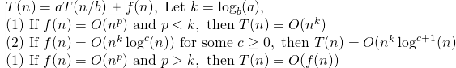
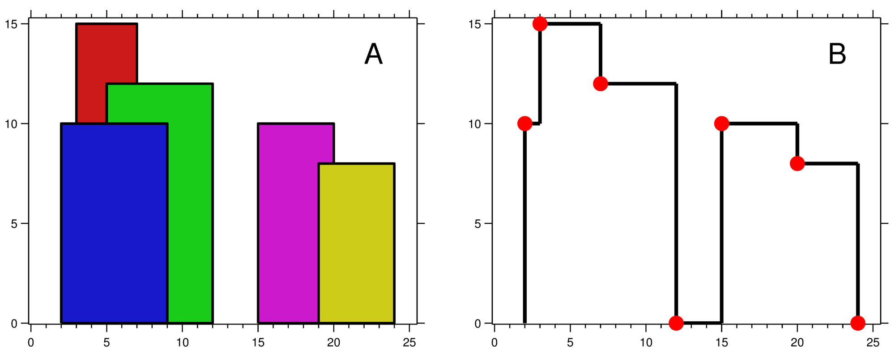
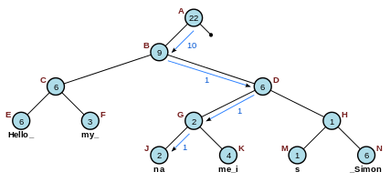

# Algorithms and Data Structures (C++/Python)

以LeetCode为主要例题来源，以C++作为编程语言，对常见的算法、数据结构、以及一些计算机原理进行汇总。

本汇总仅供学习参考，其中部分内容源自网络（见[参考资料](#参考资料)），禁止未经许可的传播或改编。

### 目录

* [算法](#算法)
  * [贪心](#贪心)
  * [双指针](#双指针)
  * [排序](#排序)
    * [常用排序算法](#常用排序算法)
    * [快速选择](#快速选择)
    * [桶排序](#桶排序)
    * [荷兰国旗问题](#荷兰国旗问题)
  * [二分查找](#二分查找)
  * [搜索](#搜索)
    * [深度优先搜索](#深度优先搜索)
    * [回溯法](#回溯法)
    * [广度优先搜索](#广度优先搜索)
  * [动态规划](#动态规划)
    * [斐波那契数列](#斐波那契数列)
    * [矩阵路径](#矩阵路径)
    * [数组区间](#数组区间)
    * [分割整数](#分割整数)
    * [最长递增子序列](#最长递增子序列)
    * [最长公共子序列](#最长公共子序列)
    * [背包问题](#背包问题)
    * [股票交易](#股票交易)
    * [字符串编辑](#字符串编辑)
  * [分治](#分治)
  * [递归](#递归)
  * [数学](#数学)
    * [素数](#素数)
    * [最大公约数](#最大公约数)
    * [进制转换](#进制转换)
    * [阶乘](#阶乘)
    * [字符串加减法](#字符串加减法)
    * [相遇问题](#相遇问题)
    * [多数投票问题](#多数投票问题)
    * [随机与取样](#随机与取样)
    * [其它数学问题](#其它数学问题)
  * [位运算](#位运算)
  * [复杂算法](#复杂算法)
    * [凸包](#凸包)
* [数据结构](#数据结构)
  * [栈和队列](#栈和队列)
    * [单调栈](#单调栈)
    * [优先队列](#优先队列)
  * [集合和映射](#集合和映射)
    * [哈希表](#哈希表)
    * [多重集合和映射](#多重集合和映射)
  * [字符串](#字符串)
  * [数组与矩阵](#数组与矩阵)
    * [积分图](#积分图)
  * [链表](#链表)
  * [树](#树)
    * [树递归](#树递归)
    * [层次遍历](#层次遍历)
    * [前中后序遍历](#前中后序遍历)
    * [二叉查找树](#二叉查找树)
    * [字典树](#字典树)
    * [线段树](#线段树)
  * [图](#图)
    * [二分图](#二分图)
    * [拓扑排序](#拓扑排序)
    * [最小生成树](#最小生成树)
    * [节点最短距离](#节点最短距离)
  * [复杂数据结构](#复杂数据结构)
    * [并查集](#并查集)
    * [绳](#绳)
    * [复合数据结构](#复合数据结构)
    * [线程安全结构](#线程安全结构)
* [参考资料](#参考资料)

# 算法

面试时，如果想不到好的思路，先考虑给出一个brute force solution。

## 贪心

贪心思想保证每次操作都是局部最优的，并且最后得到的结果是全局最优的。

**分配饼干**

[455. Assign Cookies \(Easy\)](https://leetcode.com/problems/assign-cookies/)

```markup
Input: [1,2], [1,2,3]
Output: 2

Explanation: You have 2 children and 3 cookies. The greed factors of 2 children are 1, 2.
You have 3 cookies and their sizes are big enough to gratify all of the children,
You need to output 2.
```

题目描述：每个孩子都有一个满足度，每个饼干都有一个大小，只有饼干的大小大于等于一个孩子的满足度，该孩子才会获得满足。求解最多可以获得满足的孩子数量。

因为最小的孩子最容易得到满足，因此先满足最小孩子。给一个孩子的饼干应当尽量小又能满足该孩子，这样大饼干就能拿来给满足度比较大的孩子。因此贪心策略

证明：假设在某次选择中，贪心策略选择给当前满足度最小的孩子分配第 m 个饼干，第 m 个饼干为可以满足该孩子的最小饼干。假设存在一种最优策略，给该孩子分配第 n 个饼干，并且 m &lt; n。我们可以发现，经过这一轮分配，贪心策略分配后剩下的饼干一定有一个比最优策略来得大。因此在后续的分配中，贪心策略一定能满足更多的孩子。也就是说不存在比贪心策略更优的策略，即贪心策略就是最优策略。

```cpp
int findContentChildren(vector<int>& g, vector<int>& s) {
    sort(g.begin(), g.end());
    sort(s.begin(), s.end());
    int gi = 0, si = 0;
    while (gi < g.size() && si < s.size()) {
        if (g[gi] <= s[si]) ++gi;
        ++si;
    }
    return gi;
}
```

```python
def findContentChildren(self, g: List[int], s: List[int]) -> int:
    g.sort()
    s.sort()
    g_i = 0
    g_len = len(g)
    for cookie in s:
        if g_i == g_len:
            break
        if cookie >= g[g_i]:
            g_i += 1
    return g_i
```

**分配糖果**

[135. Candy \(Hard\)](https://leetcode.com/problems/candy/)

每个孩子有一个评分，如果评分高于旁边的孩子，则被分配的糖果数量也必须更多，求最少总糖果数量，使得每个孩子都有糖果。

```
Given ratings as [1,0,2]
Candy allocation is [2, 1, 2]
```

贪心策略，从左往右和从右往左各遍历一遍。

```cpp
int candy(vector<int>& ratings) {
    int size = ratings.size();
    if (size < 2) return size;
    vector<int> num(size, 1);
    for (int i = 1; i < size; ++i)
        if (ratings[i] > ratings[i-1]) num[i] = num[i-1] + 1;
    for (int i = size - 1; i > 0; --i)
        if (ratings[i] < ratings[i-1]) num[i-1] = max(num[i-1], num[i] + 1);
    return accumulate(num.begin(), num.end(), 0);
}
```

```python
def candy(self, ratings_list: List[int]) -> int:
    n = len(ratings_list)
    candies = [1 for _ in range(n)]
    for i in range(1, n):
        if ratings_list[i] > ratings_list[i-1]:
            candies[i] = candies[i-1] + 1
    for i in range(n-2, -1, -1):
        if ratings_list[i] > ratings_list[i+1]:
            candies[i] = max(candies[i], candies[i+1] + 1)
    return sum(candies)
```

**不重叠的区间个数**

[435. Non-overlapping Intervals \(Medium\)](https://leetcode.com/problems/non-overlapping-intervals/)

```markup
Input: [[1,2], [1,2], [1,2]]
Output: 2

Explanation: You need to remove two [1,2] to make the rest of intervals non-overlapping.

Input: [[1,2], [2,3]]
Output: 0

Explanation: You don't need to remove any of the intervals since they're already non-overlapping
```

题目描述：计算让一组区间不重叠所需要移除的区间个数。

计算最多能组成的不重叠区间个数，然后用区间总个数减去不重叠区间的个数。

在每次选择中，区间的结尾最为重要，选择的区间结尾越小，留给后面的区间的空间越大，那么后面能够选择的区间个数也就越大。

按区间的结尾进行排序，每次选择结尾最小，并且和前一个区间不重叠的区间。

```cpp
int eraseOverlapIntervals(vector<vector<int>>& intervals) {
    if (intervals.empty()) return 0;
    int n = intervals.size();
    sort(intervals.begin(), intervals.end(), [](vector<int> a, vector<int> b) {
        return a[1] < b[1];
    });
    int total = 0, prev = intervals[0][1];
    for (int i = 1; i < n; ++i) {
        if (intervals[i][0] < prev) ++total;
        else prev = intervals[i][1];
    }
    return total;
}
```

```python
def eraseOverlapIntervals(self, intervals: List[List[int]]) -> int:
    if not intervals:
        return 0
    intervals.sort(key=lambda x: x[1])
    res = 0
    prev_end = intervals[0][1]
    for i in range(1, len(intervals)):
        if prev_end > intervals[i][0]:
            res += 1
        else:
            prev_end = intervals[i][1]
    return res
```

**投飞镖刺破气球**

[452. Minimum Number of Arrows to Burst Balloons \(Medium\)](https://leetcode.com/problems/minimum-number-of-arrows-to-burst-balloons/)

```text
Input: [[10,16], [2,8], [1,6], [7,12]]
Output: 2
```

题目描述：气球在一个水平数轴上摆放，可以重叠，飞镖垂直投向坐标轴，使得路径上的气球都会刺破。求解最小的投飞镖次数使所有气球都被刺破。

也是计算不重叠的区间个数，不过和 Non-overlapping Intervals 的区别在于，\[1, 2\] 和 \[2, 3\] 在本题中算是重叠区间。

```cpp
int findMinArrowShots(vector<vector<int>>& points) {
    if (points.empty()) return 0;
    int n = points.size();
    sort(points.begin(), points.end(), [](vector<int> a, vector<int> b) {
        return a[1] < b[1];
    });
    int total = 1, prev = points[0][1];
    for (int i = 1; i < n; ++i) {
        if (points[i][0] <= prev) continue;
        ++total;
        prev = points[i][1];
    }
    return total;
}
```

**根据身高和序号重组队列**

[406. Queue Reconstruction by Height\(Medium\)](https://leetcode.com/problems/queue-reconstruction-by-height/)

```markup
Input: [[7,0], [4,4], [7,1], [5,0], [6,1], [5,2]]

Output: [[5,0], [7,0], [5,2], [6,1], [4,4], [7,1]]
```

题目描述：一个学生用两个分量 \(h, k\) 描述，h 表示身高，k 表示排在前面的有 k 个学生的身高比他高或者和他一样高。

为了在每次插入操作时不影响后续的操作，身高较高的学生应该先做插入操作，否则身高较小的学生原先正确插入第 k 个位置可能会变成第 k+1 个位置。

身高降序、k 值升序，然后按排好序的顺序插入队列的第 k 个位置中。

```cpp
vector<pair<int, int>> reconstructQueue(vector<pair<int, int>>& people) {
    sort(people.begin(), people.end(), [](const pair<int, int>& p1, const pair<int, int>& p2)  {
        return p1.first > p2.first || (p1.first == p2.first && p1.second < p2.second);
    });
    vector<pair<int, int>> res;
    for (auto& p: people) res.insert(res.begin() + p.second, p);
    return res;
}
```

**分隔字符串使同种字符出现在一起**

[763. Partition Labels \(Medium\)](https://leetcode.com/problems/partition-labels/)

```markup
Input: S = "ababcbacadefegdehijhklij"
Output: [9,7,8]
Explanation:
The partition is "ababcbaca", "defegde", "hijhklij".
This is a partition so that each letter appears in at most one part.
A partition like "ababcbacadefegde", "hijhklij" is incorrect, because it splits S into less parts.
```

```cpp
vector<int> partitionLabels(string S) {
    vector<int> last_char_index(26);
    for (int i = 0; i < S.length(); i++) last_char_index[S[i] - 'a'] = i;
    vector<int> partitions;
    int first_index = 0, last_index;
    while (first_index < S.length()) {
        int last_index = first_index;
        for (int i = first_index; i < S.length() && i <= last_index; ++i) {
            int index = last_char_index[S[i] - 'a'];
            if (index > last_index) last_index = index;
        }
        partitions.push_back(last_index - first_index + 1);
        first_index = last_index + 1;
    }
    return partitions;
}
```

**种植花朵**

[605. Can Place Flowers \(Easy\)](https://leetcode.com/problems/can-place-flowers/)

```markup
Input: flowerbed = [1,0,0,0,1], n = 1
Output: True
```

题目描述：花朵之间至少需要一个单位的间隔，求解是否能种下 n 朵花。

```cpp
bool canPlaceFlowers(vector<int>& flowerbed, int n) {
    int len = flowerbed.size(), cnt = 0;
    for (int i = 0; i < len && cnt < n; ++i) {
        if (flowerbed[i] == 1) continue;
        int pre = i == 0 ? 0 : flowerbed[i-1];
        int next = i == len - 1 ? 0 : flowerbed[i+1];
        if (pre == 0 && next == 0) {
            ++cnt;
            flowerbed[i] = 1;
        }
    }
    return cnt >= n;
}
```

**判断是否为子序列**

[392. Is Subsequence \(Medium\)](https://leetcode.com/problems/is-subsequence/)

```markup
s = "abc", t = "ahbgdc"
Return true.
```

```cpp
bool isSubsequence(string s, string t) {
    int j = 0, n = s.length(), m = t.length();
    for (auto c: t) if (j < n && s[j] == c) j++;            
    return j == n;
}
```

**修改一个数成为非递减数组**

[665. Non-decreasing Array \(Easy\)](https://leetcode.com/problems/non-decreasing-array/)

```markup
Input: [4,2,3]
Output: True
Explanation: You could modify the first 4 to 1 to get a non-decreasing array.
```

题目描述：判断一个数组能不能只修改一个数就成为非递减数组。

在出现 nums\[i\] &lt; nums\[i - 1\] 时，需要考虑的是应该修改数组的哪个数，使得本次修改能使 i 之前的数组成为非递减数组，并且不影响后续的操作 。优先考虑令 nums\[i - 1\] = nums\[i\]，因为如果修改 nums\[i\] = nums\[i - 1\] 的话，那么 nums\[i\] 这个数会变大，就有可能比 nums\[i + 1\] 大，从而影响了后续操作。还有一个比较特别的情况就是 nums\[i\] &lt; nums\[i - 2\]，只修改 nums\[i - 1\] = nums\[i\] 不能使数组成为非递减数组，只能修改 nums\[i\] = nums\[i - 1\]。

```cpp
bool checkPossibility(vector<int>& nums) {
    int cnt = 0;
    for (int i = 1; i < nums.size() && cnt < 2; ++i) {
        if (nums[i] >= nums[i-1]) continue;
        ++cnt;
        if (i - 2 >= 0 && nums[i-2] > nums[i]) nums[i] = nums[i-1];
        else nums[i-1] = nums[i];
    }
    return cnt <= 1;
}
```

**股票的最大收益**

[122. Best Time to Buy and Sell Stock II \(Easy\)](https://leetcode.com/problems/best-time-to-buy-and-sell-stock-ii/)

题目描述：一次股票交易包含买入和卖出，多个交易之间不能交叉进行。

对于 \[a, b, c, d\]，如果有 a &lt;= b &lt;= c &lt;= d ，那么最大收益为 d - a。而 d - a = \(d - c\) + \(c - b\) + \(b - a\) ，因此当访问到一个 prices\[i\] 且 prices\[i\] - prices\[i-1\] &gt; 0，那么就把 prices\[i\] - prices\[i-1\] 添加到收益中，从而在局部最优的情况下也保证全局最优。

```cpp
int maxProfit(vector<int>& prices) {
    int sum = 0;
    for (int i = 1; i < prices.size(); ++i) sum += max(0, prices[i] - prices[i-1]);
    return sum;
}
```

## 双指针

双指针主要用于遍历数组，两个指针指向不同的元素，从而协同完成任务。若两个指针指向同一数组、遍历方向相同且不会相交，则也称为滑动窗口。

**指针与常量**

```cpp
int x;
      int *       p1 = &x;  // non-const pointer to non-const int
const int *       p2 = &x;  // non-const pointer to const int
      int * const p3 = &x;  // const pointer to non-const int
const int * const p4 = &x;  // const pointer to const int 
```

**Pointers to functions**

```cpp
int addition(int a, int b) {
    return a + b;
}

int subtraction(int a, int b) {
    return a - b;
}

int operation(int x, int y, int (*func)(int,int)) {
    return (*func)(x,y);
}

int (*minus)(int,int) = subtraction;
int m = operation(7, 5, addition);
int n = operation(20, m, minus);
```

**有序数组的 Two Sum**

[167. Two Sum II - Input array is sorted \(Easy\)](https://leetcode.com/problems/two-sum-ii-input-array-is-sorted/)

```markup
Input: numbers={2, 7, 11, 15}, target=9
Output: index1=1, index2=2
```

题目描述：在有序数组中找出两个数，使它们的和为 target。

使用双指针，一个指针指向值较小的元素，一个指针指向值较大的元素。指向较小元素的指针从头向尾遍历，指向较大元素的指针从尾向头遍历。

如果两个指针指向元素的和 sum == target，那么得到要求的结果；如果 sum &gt; target，移动较大的元素，使 sum 变小一些；如果 sum &lt; target，移动较小的元素，使 sum 变大一些。

```cpp
vector<int> twoSum(vector<int>& numbers, int target) {
    int l = 0, r = numbers.size() - 1, sum;
    while (l < r) {
        sum = numbers[l] + numbers[r];
        if (sum == target) break;
        if (sum < target) ++l;
        else --r;
    }
    return vector<int>{l + 1, r + 1};
}
```

```python
def twoSum(self, numbers: List[int], target: int) -> List[int]:
    n = len(numbers)
    l = 0
    r = n - 1
    while l < r:
        two_sum = numbers[l] + numbers[r]
        if two_sum == target:
            return [l+1, r+1]
        elif two_sum > target:
            r -= 1
        else:
            l += 1
    return []
```

**两数平方和**

[633. Sum of Square Numbers \(Easy\)](https://leetcode.com/problems/sum-of-square-numbers/)

```markup
Input: 5
Output: True
Explanation: 1 * 1 + 2 * 2 = 5
```

题目描述：判断一个数是否为两个数的平方和，例如 5 = 12 + 22。

```cpp
bool judgeSquareSum(int c) {
    long long i = 0, j = sqrt(c);
    while (i <= j) {
        long long powSum = i * i + j * j;
        if (powSum == c) return true;
        else if (powSum > c) --j;
        else ++i;
    }
    return false;
}
```

**反转字符串中的元音字符**

[345. Reverse Vowels of a String \(Easy\)](https://leetcode.com/problems/reverse-vowels-of-a-string/)

```markup
Given s = "leetcode", return "leotcede".
```

使用双指针，指向待反转的两个元音字符，一个指针从头向尾遍历，一个指针从尾到头遍历。

```cpp
bool isVowel(char c) {
    if ('A' <= c && c <= 'Z') c = c - 'A' + 'a';
    return c == 'a' || c == 'e' || c == 'i' || c == 'o' || c == 'u';
}

string reverseVowels(string s) {
    int i = 0, j = s.length() - 1;
    while (i < j) {
        while (i < j && !isVowel(s[i])) ++i;
        while (i < j && !isVowel(s[j])) --j;
        swap(s[i++], s[j--]);
    }
    return s;
}
```

**回文字符串**

[680. Valid Palindrome II \(Easy\)](https://leetcode.com/problems/valid-palindrome-ii/)

```markup
Input: "abca"
Output: True
Explanation: You could delete the character 'c'.
```

题目描述：可以删除一个字符，判断是否能构成回文字符串。

```cpp
bool validPalindrome(string s) {
    int i = -1, j = s.length();
    while (++i < --j) if (s[i] != s[j]) return isValid(s, i, j - 1) || isValid(s, i + 1, j);
    return true;
}
bool isValid(string s, int i, int j) {
    while (i < j) if (s[i++] != s[j--]) return false;
    return true;
}
```

**归并两个有序数组**

[88. Merge Sorted Array \(Easy\)](https://leetcode.com/problems/merge-sorted-array/)

```markup
Input:
nums1 = [1,2,3,0,0,0], m = 3
nums2 = [2,5,6],       n = 3

Output: [1,2,2,3,5,6]
```

题目描述：把归并结果存到第一个数组上。

需要从尾开始遍历，否则在 nums1 上归并得到的值会覆盖还未进行归并比较的值

```cpp
void merge(vector<int>& nums1, int m, vector<int>& nums2, int n) {
    int pos = m-- + n-- - 1;
    while (m >= 0 && n >= 0) nums1[pos--] = nums1[m] > nums2[n]? nums1[m--]: nums2[n--];
    while (n >= 0) nums1[pos--] = nums2[n--];
}
```

**获得链表环路所在的节点**

[142. Linked List Cycle II \(Medium\)](https://leetcode.com/problems/linked-list-cycle-ii/)

使用双指针，一个指针每次移动一个节点，一个指针每次移动两个节点，如果存在环，那么这两个指针一定会相遇。相遇后把其中一个指针放到链表头，再同速前进，最后相遇的位置即为环路节点。

```cpp
ListNode *detectCycle(ListNode *head) {
    ListNode *slow = head, *fast = head;
    // 判断是否存在环路
    do {
        if (!fast || !fast->next) return NULL;
        fast = fast->next->next;
        slow = slow->next;
    } while (fast != slow);
    // 如果存在，查找环路节点
    fast = head;
    while (fast != slow){
        slow = slow->next;
        fast = fast->next;
    }
    return fast;
}
```

```python
def detectCycle(self, head: Optional[ListNode]) -> Optional[ListNode]:
    slow = head
    fast = head
    is_fisrt_cycle = True
    while fast != slow or is_fisrt_cycle:
        if fast is None or fast.next is None:
            return None
        fast = fast.next.next
        slow = slow.next
        is_fisrt_cycle = False
    fast = head
    while fast != slow:
        fast = fast.next
        slow = slow.next
    return fast
```

**最长子序列**

[524. Longest Word in Dictionary through Deleting \(Medium\)](https://leetcode.com/problems/longest-word-in-dictionary-through-deleting/)

```text
Input:
s = "abpcplea", d = ["ale","apple","monkey","plea"]

Output:
"apple"
```

题目描述：删除 s 中的一些字符，使得它构成字符串列表 d 中的一个字符串，找出能构成的最长字符串。如果有多个相同长度的结果，返回按字典序排序的最大字符串。

```cpp
string findLongestWord(string s, vector<string>& d) {
    string longest_word = "";
    for (const string & target : d) {
        int l1 = longest_word.length(), l2 = target.length();
        if (l1 > l2 || (l1 == l2 && longest_word < target)) continue;
        if (isValid(s, target)) longest_word = target;
    }
    return longest_word;
}

bool isValid(string s, string target) {
    int i = 0, j = 0;
    while (i < s.length() && j < target.length()) {
        if (s[i++] == target[j]) ++j;
    }
    return j == target.length();
}
```

**含有最多K个不同字母的最长子字符串**

[340. Longest Substring with At Most K Distinct Characters \(Hard\)](https://leetcode.com/problems/longest-substring-with-at-most-k-distinct-characters/)

```
Input: s = "eceba", k = 2
Output: 3 (T is "ece" which its length is 3)
```

```cpp
int lengthOfLongestSubstringKDistinct(string s, int k) {
    unordered_map<char, int> counts;
    int res = 0;
    for (int i = 0, j = 0; j < s.size(); ++j) {
        counts[s[j]]++;
        while (counts.size() > k) if (--counts[s[i++]] == 0) counts.erase(s[i - 1]);
        res = max(res, j - i + 1);
    }
    return res;
}
```

```python
def lengthOfLongestSubstringKDistinct(self, s: str, k: int) -> int:
    freq = dict()
    l = 0
    maxlen = 0
    for r in range(len(s)):
        if s[r] in freq:
            freq[s[r]] += 1
        else:
            freq[s[r]] = 1
        while(len(freq) > k):
            freq[s[l]] -= 1
            if freq[s[l]] == 0:
                del freq[s[l]]
            l += 1
        maxlen = max(maxlen, r - l + 1)
    return maxlen
```

## 排序

## 常用排序算法

**Quick Sort**

采用左闭右闭的二分写法

```cpp
void quick_sort(vector<int> &a, int l, int r) {
    if (l + 1 >= r) return;
    int first = l, last = r-1, key = a[first];
    while (first < last){
        while(first < last && a[last] >= key) --last;
        a[first] = a[last];

        while (first < last && a[first] <= key) ++first;
        a[last] = a[first];
    }
    a[first] = key;
    quick_sort(a, l, first);
    quick_sort(a, first + 1, r);
}
```

**Merge Sort**

```cpp
void merge_sort(vector<int> &A, int l, int r, vector<int> &T) {
    if (l + 1 >= r) return;
    // divide
    int m = l + (r - l) / 2;
    merge_sort(A, l, m, T);
    merge_sort(A, m, r, T);
    // conquer
    int p = l, q = m, i = l;
    while (p < m || q < r) {
        if (q >= r || (p < m && A[p] <= A[q])) T[i++] = A[p++];
        else T[i++] = A[q++];
    }
    for (i = l; i < r; ++i) A[i] = T[i];
}
```

**Insertion Sort**

```cpp
// insert to correct position
void insertion_sort(vector<int> &arr, int n) {
    for (int i = 0; i < n; i++) {
        for (int j = i; j > 0 && arr[j] < arr[j-1]; --j) swap(arr[j], arr[j-1]);
    }
}
```

**Bubble Sort**

```cpp
// bubble largests to the right end
void bubble_sort(vector<int> &arr, int n) {
    bool swapped;
    for (int i = 1; i < n; ++i) {
        swapped = false;
        for (int j = 1; j < n - i + 1; ++j) {
            if (arr[j] < arr[j-1]) {
                swap(arr[j], arr[j-1]);
                   swapped = true;
            }
         }
         if (!swapped) break;
   }
}
```

**Selection Sort**

```cpp
// select min then swap
void selection_sort(vector<int> &arr, int n) {
    int min_idx;
    for (int i = 0; i < n - 1; ++i) {
        min_idx = i;
        for (int j = i + 1; j < n; ++j) if (arr[j] < arr[min_idx]) min_idx = j;
        swap(arr[min_idx], arr[i]);
    }
}
```

以上排序代码调用方法为

```cpp
void sort() {
    vector<int> arr = {1,3,5,7,2,6,4,8,9,2,8,7,6,0,3,5,9,4,1,0};
    vector<int> arr1(arr), arr2(arr), arr3(arr), arr4(arr), arr5(arr), temp(arr.size());
    sort(arr.begin(), arr.end());
    quick_sort(arr1, 0, arr1.size());
    merge_sort(arr2, 0, arr2.size(), temp);
    insertion_sort(arr3, arr3.size());
    bubble_sort(arr4, arr4.size());
    selection_sort(arr5, arr5.size());
}
```

## 快速选择

一般用于求解 **Kth Element** 问题，可以在 O\(N\) 时间复杂度，O\(1\) 空间复杂度完成求解工作。

与快速排序一样，快速选择一般需要先打乱数组，否则最坏情况下时间复杂度为 O\(N^2\)。

**Kth Element**

[215. Kth Largest Element in an Array \(Medium\)](https://leetcode.com/problems/kth-largest-element-in-an-array/)

```cpp
int findKthLargest(vector<int>& nums, int k) {
    int l = 0, r = nums.size() - 1, target = nums.size() - k;
    while (l < r) {
        int mid = quickSelection(nums, l, r);
        if (mid == target) return nums[mid];
        if (mid < target) l = mid + 1;
        else r = mid - 1;
    }
    return nums[l];
}

int quickSelection(vector<int>& nums, int l, int r) {
    int i = l + 1, j = r;
    while (true) {
        while (i < r && nums[i] <= nums[l]) ++i;
        while (l < j && nums[j] >= nums[l]) --j;
        if (i >= j) break;
        swap(nums[i], nums[j]);
    }
    swap(nums[l], nums[j]);
    return j;
}
```

```python
def quickSelection(self, nums: List[int], l: int, r: int) -> int:
    rand_i = randint(l, r)
    nums[l], nums[rand_i] = nums[rand_i], nums[l]

    i = l + 1
    j = r
    while True:
        while i < r and nums[i] <= nums[l]:
            i += 1
        while l < j and nums[j] >= nums[l]:
            j -= 1
        if i >= j:
            break
        nums[i], nums[j] = nums[j], nums[i]
    nums[l], nums[j] = nums[j], nums[l]
    return j

def findKthLargest(self, nums: List[int], k: int) -> int:
    l = 0
    r = len(nums) - 1
    target = len(nums) - k
    while l < r:
        mid = self.quickSelection(nums, l, r)
        if mid == target:
            return nums[mid]
        if mid < target:
            l = mid + 1
        else:
            r = mid - 1
    return nums[l]
```

## 桶排序

**出现频率最多的 k 个数**

[347. Top K Frequent Elements \(Medium\)](https://leetcode.com/problems/top-k-frequent-elements/)

```markup
Given [1,1,1,2,2,3] and k = 2, return [1,2].
```

设置若干个桶，每个桶存储出现频率相同的数，并且桶的下标代表桶中数出现的频率，即第 i 个桶中存储的数出现的频率为 i。把数都放到桶之后，从后向前遍历桶，最先得到的 k 个数就是出现频率最多的的 k 个数。

```cpp
vector<int> topKFrequent(vector<int>& nums, int k) {
    unordered_map<int, int> m;
    for (int num : nums) ++m[num];

    vector<vector<int>> buckets(nums.size() + 1); 
    for (auto p : m) buckets[p.second].push_back(p.first);

    vector<int> ans;
    for (int i = buckets.size() - 1; i >= 0 && ans.size() < k; --i) {
        for (int num : buckets[i]) {
            ans.push_back(num);
            if (ans.size() == k) break;
        }
    }
    return ans;
}
```

**按照字符出现次数对字符串排序**

[451. Sort Characters By Frequency \(Medium\)](https://leetcode.com/problems/sort-characters-by-frequency/)

```markup
Input:
"tree"

Output:
"eert"

Explanation:
'e' appears twice while 'r' and 't' both appear once.
So 'e' must appear before both 'r' and 't'. Therefore "eetr" is also a valid answer.
```

```cpp
struct charfreq {
    int freqcnt = 0;
    int charpos;
    charfreq(int c): charpos(c) {}
};
string frequencySort(string s) {
    vector<charfreq> freq;
    for (int i = 0; i < 128; ++i) freq.push_back(charfreq(i));
    for (int i = 0; i < s.length(); ++i) ++freq[s[i]].freqcnt;
    sort(freq.begin(), freq.end(), [](const charfreq & a, const charfreq & b) {
        return a.freqcnt > b.freqcnt;
    });
    string output = "";
    for (int i = 0; i < 52; ++i) {
        int freqcnt = freq[i].freqcnt;
        char freqchar = freq[i].charpos;
        for (int j = 0; j < freqcnt; ++j) output += freqchar;
    }
    return output;
}
```

```python
def frequencySort(self, s: str) -> str:
    freq = dict()
    for c in s:
        if c in freq:
            freq[c] += 1
        else:
            freq[c] = 1
    return "".join(sorted(s, key=lambda c: (freq[c], ord(c)), reverse=True))
```

## 荷兰国旗问题

荷兰国旗包含三种颜色：红、白、蓝。有这三种颜色的球，算法的目标是将这三种球按颜色顺序正确地排列。

它其实是三向切分快速排序的一种变种，在三向切分快速排序中，每次切分都将数组分成三个区间：小于切分元素、等于切分元素、大于切分元素，而该算法是将数组分成三个区间：等于红色、等于白色、等于蓝色。


**按颜色进行排序**

[75. Sort Colors \(Medium\)](https://leetcode.com/problems/sort-colors/)

```markup
Input: [2,0,2,1,1,0]
Output: [0,0,1,1,2,2]
```

题目描述：只有 0/1/2 三种颜色。

```cpp
void sortColors(vector<int>& vec) {
    int low = 0, mid = 0, high = vec.size() - 1;
    while (mid <= high) {
        switch(vec[mid]) {
        case 0:
            swap(vec[low], vec[mid]);
            low++; mid++; break;
        case 1:
            mid++; break;
        case 2:
            swap(vec[mid], vec[high]);
            high--; break;  
        }
    }
}
```

## 二分查找

**正常实现**

一般来讲，可以实现为左闭右开或左闭右闭，视题目情况而选择。

注意左闭右闭时要用right = mid和left = mid + 1，而不是right = mid - 1和left = mid，因为算mid整除2的时候会向下取整。最后可以用-1来修正最终取整方式。

个人习惯，需要明确判断边界的可以用左闭右闭，对于lower_bound和upper_bound则左闭右开比较方便。

```cpp
int binarySearch(vector<int> nums, int key) {
    int l = 0, r = nums.length() - 1, m;
    while (l <= r) {
        m = l + (r - l) / 2;
        if (nums[m] == key) return m;
        else if (nums[m] > key) r = m - 1;
        else l = m + 1;
    }
    return -1;
}
```

**时间复杂度**

二分查找也称为折半查找，每次都能将查找区间减半，这种折半特性的算法时间复杂度都为 O\(logN\)。

**m 计算**

有两种计算中值 m 的方式：

* m = \(l + r\) / 2
* m = l + \(r - l\) / 2

l + r 可能出现加法溢出，最好使用第二种方式。

**返回值**

循环退出时如果仍然没有查找到 key，那么表示查找失败。可以有两种返回值：

* -1：以一个错误码表示没有查找到 key
* 1：将 key 插入到 nums 中的正确位置

**求开方**

[69. Sqrt\(x\) \(Easy\)](https://leetcode.com/problems/sqrtx/)

```markup
Input: 4
Output: 2

Input: 8
Output: 2
Explanation: The square root of 8 is 2.82842..., and since we want to return an integer,
the decimal part will be truncated.
```

一个数 x 的开方 sqrt 一定在 0 ~ x 之间，并且满足 sqrt == x / sqrt。可以利用二分查找在 0 ~ x 之间查找 sqrt。

对于 x = 8，它的开方是 2.82842...，最后应该返回 2 而不是 3。在循环条件为 l &lt;= r 并且循环退出时，r 总是比 l 小 1，也就是说 r = 2，l = 3，因此最后的返回值应该为 r 而不是 l。

```cpp
int mySqrt(int x) {
    if (x <= 1) return x;
    int l = 1, r = x, mid, sqrt;
    while (l <= r) {
        mid = l + (r - l) / 2;
        sqrt = x / mid;
        if (sqrt == mid) return mid;
        else if (mid > sqrt) r = mid - 1;
        else l = mid + 1;
    }
    return r;
}
```

```python
def mySqrt(self, x: int) -> int:
    l = 1
    r = x
    while l <= r:
        mid = l + (r - l) // 2
        sqrt = x // mid
        if sqrt == mid:
            return mid
        if sqrt < mid:
            r = mid - 1
        else:
            l = mid + 1
    return r
```

本题也可以用牛顿迭代法x\_n+1 = x\_n - f\(x\_n\)/f'\(x\_n\), 其中f = x^2 - a = 0

```cpp
int mySqrt(int sq) {
    long x = sq, a = sq;
    while (x * x > a) {
        x = (x + a / x) / 2;
    }
    return x;
}
```

**大于给定元素的最小元素**

[744. Find Smallest Letter Greater Than Target \(Easy\)](https://leetcode.com/problems/find-smallest-letter-greater-than-target/)

```markup
Input:
letters = ["c", "f", "j"]
target = "d"
Output: "f"

Input:
letters = ["c", "f", "j"]
target = "k"
Output: "c"
```

题目描述：给定一个有序的字符数组 letters 和一个字符 target，要求找出 letters 中大于 target 的最小字符，如果找不到就返回第 1 个字符。

```cpp
char nextGreatestLetter(vector<char>& letters, char target) {
    int l = 0, r = letters.size();
    while (l < r) {
        int m = l + (r - l) / 2;
        if (letters[m] < target + 1) l = m + 1;
        else r = m;
    }
    return l < letters.size() ? letters[l] : letters[0];
}
```

**有序数组的 Single Element**

[540. Single Element in a Sorted Array \(Medium\)](https://leetcode.com/problems/single-element-in-a-sorted-array/)

```markup
Input: [1,1,2,3,3,4,4,8,8]
Output: 2
```

题目描述：一个有序数组只有一个数不出现两次，找出这个数。要求以 O\(logN\) 时间复杂度进行求解。

令 index 为 Single Element 在数组中的位置。如果 m 为偶数，并且 m + 1 &lt; index，那么 nums\[m\] == nums\[m + 1\]；m + 1 &gt;= index，那么 nums\[m\] != nums\[m + 1\]。

从上面的规律可以知道，如果 nums\[m\] == nums\[m + 1\]，那么 index 所在的数组位置为 \[m + 2, r\]，此时令 l = m + 2；如果 nums\[m\] != nums\[m + 1\]，那么 index 所在的数组位置为 \[l, m\]，此时令 r = m。

```cpp
int singleNonDuplicate(vector<int>& nums) {
    int l = 0, r = nums.size() - 1;
    while (l < r) {
        int m = l + (r - l) / 2;
        if (m % 2 == 1) --m;   // 保证 l/r/m 都在偶数位，使得查找区间大小一直都是奇数
        if (nums[m] == nums[m + 1]) l = m + 2;
        else r = m;
    }
    return nums[l];
}
```

实际上，运用位运算，这道题有更简单的解法

```cpp
int singleNonDuplicate(vector<int>& nums) {
    int ret = 0;
    for (auto n: nums) ret ^= n;
    return ret;
}
```

**第一个错误的版本**

[278. First Bad Version \(Easy\)](https://leetcode.com/problems/first-bad-version/)

题目描述：给定一个元素 n 代表有 \[1, 2, ..., n\] 版本，可以调用 isBadVersion\(int x\) 知道某个版本是否错误，要求找到第一个错误的版本。

```cpp
int firstBadVersion(int n) {
    long l = 0, r = n, mid;
    while (l < r) {
        mid = l + (r - l) / 2;
        if (isBadVersion(mid)) r = mid;
        else l = mid + 1;
    }
    return l;
}
```

**旋转数组的最小数字**

[154. Find Minimum in Rotated Sorted Array II \(Medium\)](https://leetcode.com/problems/find-minimum-in-rotated-sorted-array-ii/)

```markup
Input: [2,2,3,0,1]
Output: 0
```

```cpp
int findMin(vector<int>& nums) {
    if (nums.empty()) return 0;
    int n = nums.size(), l = 0, r = n - 1;
    while (l < r && nums[l] >= nums[r]) {
        int mid = l + (r - l) / 2;
        if (nums[mid] < nums[l]) r = mid;
        else if (nums[mid] == nums[l]) ++l;  // consider duplicates
        else l = mid + 1;
    }
    return nums[l];
}
```

**旋转数组查找数字**

[81. Search in Rotated Sorted Array II \(Medium\)](https://leetcode.com/problems/search-in-rotated-sorted-array-ii/)

```
Input: nums = [2,5,6,0,0,1,2], target = 0
Output: true
```

```cpp
bool search(vector<int>& nums, int target) {
    int start = 0, end = nums.size() - 1;
    while (start <= end) {
        int mid = (start + end) / 2;
        if (nums[mid] == target) return true;
        if (nums[start] == nums[mid]) {
            // cannot tell if start == mid
            start++;
        } else if (nums[mid] <= nums[end]) {
            // right half sorted
            if (target > nums[mid] && target <= nums[end]) start = mid+1;
            else end = mid-1;
        } else {
            // left half sorted
            if (target >= nums[start] && target < nums[mid]) end = mid-1;
            else start = mid+1;
        }
    }
    return false;
}
```

**查找区间**

[34. Find First and Last Position of Element in Sorted Array \(Medium\)](https://leetcode.com/problems/find-first-and-last-position-of-element-in-sorted-array/)

```markup
Input: nums = [5,7,7,8,8,10], target = 8
Output: [3,4]

Input: nums = [5,7,7,8,8,10], target = 6
Output: [-1,-1]
```

```cpp
int lower_bound(vector<int> &nums, int target) {
    int l = 0, r = nums.size(), mid;
    while (l < r) {
        mid = (l + r) / 2;
        if (nums[mid] >= target) r = mid;
        else l = mid + 1;
    }
    return l;
}
int upper_bound(vector<int> &nums, int target) {
    int l = 0, r = nums.size(), mid;
    while (l < r) {
        mid = (l + r) / 2;
        if (nums[mid] > target) r = mid;
        else l = mid + 1;
    }
    return l;

}
vector<int> searchRange(vector<int>& nums, int target) {
    if (nums.empty()) return vector<int>(2, -1);
    int lower = lower_bound(nums, target);
    int upper = upper_bound(nums, target) - 1;  // important!
    if (lower == nums.size() || nums[lower] != target) return vector<int>(2, -1);
    return vector<int>{lower, upper};
}
```

**两个排好序数组的中位数**

[4. Median of Two Sorted Arrays \(Hard\)](https://leetcode.com/problems/median-of-two-sorted-arrays/)

```
nums1 = [1, 3]
nums2 = [2]
The median is 2.0

nums1 = [1, 2]
nums2 = [3, 4]
The median is (2 + 3)/2 = 2.5
```

可以对切开num1或num2的位置进行二分，num1的i位数字，和num2的(m+n\)/2 - i位数字，必须满足比当前数组次大或次小的那一个数字更接近对方。

```cpp
double findMedianSortedArrays(vector<int>& nums1, vector<int>& nums2) {
    int n1 = nums1.size(), n2 = nums2.size();
    // Make sure nums2 is the shorter one.
    if (n1 < n2) return findMedianSortedArrays(nums2, nums1);
    int l = 0, r = n2 * 2;
    while (l <= r) {
        // Try Cut 2.
        int mid2 = (l + r) / 2;
        // Calculate Cut 1 accordingly.
        int mid1 = n1 + n2 - mid2;
        // Get L1, R1, L2, R2 respectively.
        double L1 = mid1? nums1[(mid1-1)/2]: INT_MIN;
        double L2 = mid2? nums2[(mid2-1)/2]: INT_MIN;
        double R1 = mid1 != n1 * 2? nums1[(mid1)/2]: INT_MAX;
        double R2 = mid2 != n2 * 2? nums2[(mid2)/2]: INT_MAX;
        // nums1's lower half is too big; need to move Cut 1 left.
        if (L1 > R2) l = mid2 + 1;
        // nums2's lower half too big; need to move Cut 2 left.
        else if (L2 > R1) r = mid2 - 1;
        // Otherwise, that's the right cut.
        else return (max(L1, L2) + min(R1, R2)) / 2;
    }
    return -1;
} 
```

## 搜索

深度优先搜索和广度优先搜索广泛运用于树和图中，但是它们的应用远远不止如此。

## 深度优先搜索


深度优先搜索（depth-first search, DFS）在得到一个新节点时立马对新节点进行遍历：从节点 0 出发开始遍历，得到到新节点 6 时，立马对新节点 6 进行遍历，得到新节点 4；如此反复以这种方式遍历新节点，直到没有新节点了，此时返回。返回到根节点 0 的情况是，继续对根节点 0 进行遍历，得到新节点 2，然后继续以上步骤。

从一个节点出发，使用 DFS 对一个图进行遍历时，能够遍历到的节点都是从初始节点可达的，DFS 常用来求解这种 **可达性** 问题。

在程序实现 DFS 时需要考虑以下问题：

* 栈：用栈来保存当前节点信息，当遍历新节点返回时能够继续遍历当前节点。可以使用递归栈。
* 标记：和 BFS 一样同样**需要对已经遍历过的节点进行标记**。

**有向图检测环路**

DFS时记录每个遍历过的节点的父节点，若一个节点被再次遍历且父节点不同，则说明有环。

也可以用拓扑排序判断是否有环路，若最后存在入度不为零的点，则说明有环。

若为无向图，则可以利用并查集，见下文并查集部分。

**查找最大的连通面积**

[695. Max Area of Island \(Easy\)](https://leetcode.com/problems/max-area-of-island/)

```markup
[[0,0,1,0,0,0,0,1,0,0,0,0,0],
 [0,0,0,0,0,0,0,1,1,1,0,0,0],
 [0,1,1,0,1,0,0,0,0,0,0,0,0],
 [0,1,0,0,1,1,0,0,1,0,1,0,0],
 [0,1,0,0,1,1,0,0,1,1,1,0,0],
 [0,0,0,0,0,0,0,0,0,0,1,0,0],
 [0,0,0,0,0,0,0,1,1,1,0,0,0],
 [0,0,0,0,0,0,0,1,1,0,0,0,0]]
```

```cpp
int maxAreaOfIsland(vector<vector<int>>& grid) {
    if (grid.empty() || grid[0].empty()) return 0;
    int max_area = 0;
    for (int i = 0; i < grid.size(); ++i) {
        for (int j = 0; j < grid[0].size(); ++j) {
            max_area = max(max_area, dfs(grid, i, j));
        }
    }
    return max_area;
}

int dfs(vector<vector<int>>& grid, int r, int c) {
    if (r < 0 || r >= grid.size() || c < 0 || c >= grid[0].size() || grid[r][c] == 0) return 0;
    grid[r][c] = 0;
    return 1 + dfs(grid, r + 1, c) + dfs(grid, r - 1, c) + dfs(grid, r, c + 1) + dfs(grid, r, c - 1);
}
```

```python
def dfs(self, grid: List[List[int]], i: int, j: int) -> int:
    if i < 0 or i >= len(grid) or j < 0 or j >= len(grid[0]) or grid[i][j] == 0:
        return 0
    grid[i][j] = 0
    return 1 + self.dfs(grid, i+1, j) + self.dfs(grid, i-1, j) + self.dfs(grid, i, j-1) + self.dfs(grid, i, j+1)

def maxAreaOfIsland(self, grid: List[List[int]]) -> int:
    max_area = 0
    for i in range(len(grid)):
        for j in range(len(grid[0])):
            if grid[i][j] == 1:
                max_area = max(max_area, self.dfs(grid, i, j))
    return max_area
```

**矩阵中的连通分量数目**

[200. Number of Islands \(Medium\)](https://leetcode.com/problems/number-of-islands/)

```markup
Input:
11000
11000
00100
00011

Output: 3
```

可以将矩阵表示看成一张有向图。

```cpp
int numIslands(vector<vector<char>>& grid) {
    int count = 0;  
    for (int i = 0; i < grid.size(); ++i) {  
        for (int j = 0; j < grid[0].size(); ++j) {  
            if (grid[i][j] =='1') {  
                search(grid, i, j);  
                ++count;  
            }  
        }  
    }  
    return count;  
}
void search(vector<vector<char>> &grid, int x, int y) {  
    if (x < 0 || x >= grid.size() || y < 0 || y >= grid[0].size() || grid[x][y] != '1') return;  
    grid[x][y] = '0';  
    search(grid, x - 1, y);  
    search(grid, x + 1, y);  
    search(grid, x, y - 1);  
    search(grid, x, y + 1);  
}
```

**好友关系的连通分量数目**

[547. Friend Circles \(Medium\)](https://leetcode.com/problems/friend-circles/)

```markup
Input:
[[1,1,0],
 [1,1,0],
 [0,0,1]]
Output: 2
Explanation:The 0th and 1st students are direct friends, so they are in a friend circle.
The 2nd student himself is in a friend circle. So return 2.
```

好友关系可以看成是一个无向图，例如第 0 个人与第 1 个人是好友，那么 M\[0\]\[1\] 和 M\[1\]\[0\] 的值都为 1。

```cpp
int findCircleNum(vector<vector<int>>& M) {
    int n = M.size(), cnt = 0;
    vector<bool> visited(n, false);
    for (int i = 0; i < n; ++i) {
        if (!visited[i]) {
            dfs(M, i, visited);
            ++cnt;
        }
    }
    return cnt;
}

void dfs(vector<vector<int>>& M, int i, vector<bool>& visited) {
    visited[i] = true;
    for (int k = 0; k < M.size(); ++k) {
        if (M[i][k] == 1 && !visited[k]) {
            dfs(M, k, visited);
        }
    }
}
```

**填充封闭区域**

[130. Surrounded Regions \(Medium\)](https://leetcode.com/problems/surrounded-regions/)

```markup
For example,
X X X X
X O O X
X X O X
X O X X

After running your function, the board should be:
X X X X
X X X X
X X X X
X O X X
```

使被 'X' 包围的 'O' 转换为 'X'。

先填充最外侧，剩下的就是里侧了。

```cpp
void solve(vector<vector<char>>& board) {
    if (board.empty() || board[0].empty()) return;
    int m = board.size(), n = board[0].size();
    for (int i = 0; i < m; ++i) {
        dfs(board, i, 0);
        dfs(board, i, n - 1);
    }
    for (int i = 0; i < n; ++i) {
        dfs(board, 0, i);
        dfs(board, m - 1, i);
    }
    for (int i = 0; i < m; i++) {
        for (int j = 0; j < n; ++j) {
            if (board[i][j] == 'T') {
                board[i][j] = 'O';
            } else if (board[i][j] == 'O') {
                board[i][j] = 'X';
            }
        }
    }
}

void dfs(vector<vector<char>>& board, int r, int c) {
    if (r < 0 || r >= board.size() || c < 0 || c >= board[0].size() || board[r][c] != 'O') return;
    board[r][c] = 'T';
    dfs(board, r + 1, c);
    dfs(board, r - 1, c);
    dfs(board, r, c + 1);
    dfs(board, r, c - 1);
}
```

**能到达的太平洋和大西洋的区域**

[417. Pacific Atlantic Water Flow \(Medium\)](https://leetcode.com/problems/pacific-atlantic-water-flow/)

```markup
Given the following 5x5 matrix:

  Pacific ~   ~   ~   ~   ~
       ~  1   2   2   3  (5) *
       ~  3   2   3  (4) (4) *
       ~  2   4  (5)  3   1  *
       ~ (6) (7)  1   4   5  *
       ~ (5)  1   1   2   4  *
          *   *   *   *   * Atlantic

Return:
[[0, 4], [1, 3], [1, 4], [2, 2], [3, 0], [3, 1], [4, 0]] (positions with parentheses in above matrix).
```

左边和上边是太平洋，右边和下边是大西洋，内部的数字代表海拔，海拔高的地方的水能够流到低的地方，求解水能够流到太平洋和大西洋的所有位置。

```cpp
vector<int> dr {-1, 1, 0, 0};
vector<int> dc {0, 0, 1, -1};
vector<vector<int>> pacificAtlantic(vector<vector<int>>& matrix) {
    if (matrix.empty() || matrix[0].empty()) return {};
    vector<vector<int>> res;
    int m = matrix.size(), n = matrix[0].size();
    vector<vector<bool>> can_reach_p(m, vector<bool>(n, false));
    vector<vector<bool>> can_reach_a(m, vector<bool>(n, false));
    for (int i = 0; i < m; ++i) {
        dfs(matrix, can_reach_p, i, 0);
        dfs(matrix, can_reach_a, i, n - 1);
    }
    for (int i = 0; i < n; ++i) {
        dfs(matrix, can_reach_p, 0, i);
        dfs(matrix, can_reach_a, m - 1, i);
    }
    for (int i = 0; i < m; i++) {
        for (int j = 0; j < n; ++j) {
            if (can_reach_p[i][j] && can_reach_a[i][j]) {
                res.push_back(vector<int>{i, j});
            }
        }
    }
    return res;
}

void dfs(const vector<vector<int>>& matrix, vector<vector<bool>>& can_reach, int r, int c) {
    if (can_reach[r][c]) return;
    can_reach[r][c] = true;
    for (int i = 0; i < 4; ++i) {
        int next_r = r + dr[i], next_c = c + dc[i];
        if (next_r < 0 || next_r >= matrix.size() || next_c < 0 || next_c >= matrix[0].size() ||
            matrix[r][c] > matrix[next_r][next_c]) continue;
        dfs(matrix, can_reach, next_r, next_c);
    }
}
```

```python
def __init__(self):
    self.di = [-1, 1, 0, 0]
    self.dj = [0, 0, 1, -1]

def flow(self, heights: List[List[int]], i: int, j: int, reach: List[List[int]]):
    if reach[i][j]:
        return
    reach[i][j] = True
    m = len(heights)
    n = len(heights[0])
    for d in range(4):
        next_i = i + self.di[d]
        next_j = j + self.dj[d]
        if next_i < 0 or next_i >= m or next_j < 0 or next_j >= n or heights[next_i][next_j] < heights[i][j]:
            continue
        self.flow(heights, next_i, next_j, reach)


def pacificAtlantic(self, heights: List[List[int]]) -> List[List[int]]:
    m = len(heights)
    n = len(heights[0])
    reachP = [[False for _ in range(n)] for _ in range(m)]
    reachA = [[False for _ in range(n)] for _ in range(m)]
    for i in range(m):
        self.flow(heights, i, 0, reachP)
        self.flow(heights, i, n-1, reachA)
    for j in range(n):
        self.flow(heights, 0, j, reachP)
        self.flow(heights, m-1, j, reachA)
    res = []
    for i in range(m):
        for j in range(n):
            if reachP[i][j] and reachA[i][j]:
                res.append([i, j])
    return res
```

## 回溯法

回溯法（Backtracking）属于 DFS。

* 普通 DFS 主要用在  **可达性问题** ，这种问题只需要执行到特点的位置然后返回即可。
* 而 Backtracking 主要用于求解  **排列组合**  问题，例如有 { 'a','b','c' } 三个字符，求解所有由这三个字符排列得到的字符串，这种问题在执行到特定的位置返回之后还会继续执行求解过程。

因为 Backtracking 不是立即就返回，而要继续求解，因此在程序实现时，需要注意对元素的标记问题：

* 在访问一个新元素进入新的递归调用时，需要将新元素标记为已经访问，这样才能在继续递归调用时不用重复访问该元素；
* 但是在递归返回时，需要将元素标记为未访问，因为只需要保证在一个递归链中不同时访问一个元素，可以访问已经访问过但是不在当前递归链中的元素。

Backtracking 修改一般有两种情况，一种是**修改最后一位输出**，比如排列组合；一种是**修改访问标记**，比如矩阵里搜字符串。

**在矩阵中寻找字符串**

[79. Word Search \(Medium\)](https://leetcode.com/problems/word-search/)

```markup
For example,
Given board =
[
  ['A','B','C','E'],
  ['S','F','C','S'],
  ['A','D','E','E']
]
word = "ABCCED", -> returns true,
word = "SEE", -> returns true,
word = "ABCB", -> returns false.
```

```cpp
bool exist(vector<vector<char>>& board, string word) {
    if (board.empty()) return false;
    int m = board.size(), n = board[0].size();
    vector<vector<bool>> visited(m, vector<bool>(n, false));
    bool find = false;
    for (int i = 0; i < m; i++)
        for (int j = 0; j < n; j++)
            backtracking(i, j, board, word, 0, find, visited);
    return find;
}
void backtracking(int i, int j, vector<vector<char>>& board, string& word, int pos,
                  bool& find, vector<vector<bool>>& visited) {
    if (i < 0 || i >= board.size() || j < 0 || j >= board[0].size()) return;
    if (visited[i][j] || find || board[i][j] != word[pos]) return;
    if (pos == word.size()-1) {
        find = true;
        return;
    }
    visited[i][j] = true;
    backtracking(i + 1, j, board, word, pos+1, find, visited);
    backtracking(i - 1, j, board, word, pos+1, find, visited);
    backtracking(i, j + 1, board, word, pos+1, find, visited);
    backtracking(i, j - 1, board, word, pos+1, find, visited);
    visited[i][j] = false;
}
```

**输出二叉树中所有从根到叶子的路径**

[257. Binary Tree Paths \(Easy\)](https://leetcode.com/problems/binary-tree-paths/)

```markup
  1
 /  \
2    3
 \
  5
```

```markup
["1->2->5", "1->3"]
```

```cpp
vector<string> binaryTreePaths(TreeNode* root) {
    vector<string> res;
    vector<int> path;
    if (!root) return res;
    backtracking(res, root, path);
    return res;
}

void backtracking(vector<string> &res, TreeNode* root, vector<int> &path) {
    path.push_back(root->val);
    if (!root->left && !root->right) {
        string base;
        for (const int& i: path) {
            if (!base.empty()) base += "->";
            base += to_string(i);
        }
        res.push_back(base);
    } else {
        if (root->left) backtracking(res, root->left, path);
        if (root->right) backtracking(res, root->right, path);
    }
    path.pop_back();
}
```

**排列**

[46. Permutations \(Medium\)](https://leetcode.com/problems/permutations/)

有两种做法，一种是swap位置，优点是无重复值时速度较快，但是有重复值时需要在每次backtrack时重新排序；另一种是backtrack标记或反标记visited，每次都从头到尾走一遍，有点时有重复值时只需要一开始排序一遍，缺点是每次backtrack都需要从头到尾遍历。这里展示第一种。

```markup
[1,2,3] have the following permutations:
[
  [1,2,3],
  [1,3,2],
  [2,1,3],
  [2,3,1],
  [3,1,2],
  [3,2,1]
]
```

```cpp
vector<vector<int>> permute(vector<int>& nums) {
    vector<vector<int>> res;
    backtracking(nums, 0, res);
    return res;
}

void backtracking(vector<int> &nums, int level, vector<vector<int>> &res) {
    if (level == nums.size() - 1) {
        res.push_back(nums);
        return;
    }
    for (int i = level; i < nums.size(); i++) {
        swap(nums[i], nums[level]);
        backtracking(nums, level+1, res);
        swap(nums[i], nums[level]);
    }
}
```

```python
def backtracking(self, nums: List[int], level: int, permutations: List[List[int]]):
    if level == len(nums) - 1:
        permutations.append(nums[:])  # shallow copy for primitives are okay
        return
    for i in range(level, len(nums)):
        nums[i], nums[level] = nums[level], nums[i]
        self.backtracking(nums, level+1, permutations)
        nums[i], nums[level] = nums[level], nums[i]

def permute(self, nums: List[int]) -> List[List[int]]:
    permutations = []
    self.backtracking(nums, 0, permutations)
    return permutations
```

**含有相同元素求排列**

[47. Permutations II \(Medium\)](https://leetcode.com/problems/permutations-ii/)

```markup
[1,1,2] have the following unique permutations:
[[1,1,2], [1,2,1], [2,1,1]]
```

数组元素可能含有相同的元素，进行排列时就有可能出现重复的排列，要求重复的排列只返回一个。

```cpp
vector<vector<int>> permuteUnique(vector<int>& nums) {
    vector<vector<int>> res;
    backtracking(nums, 0, res);
    return res;
}

// nums here pass by copy, since later sorted
void backtracking(vector<int> nums, int level, vector<vector<int>> &res) {
    if (level == nums.size() - 1) {
        res.push_back(nums);
        return;
    }
    sort(nums.begin() + level, nums.end());  // new in Q47 from Q46
    for (int i = level; i < nums.size(); ++i) {
        if (i != level && nums[i] == nums[i-1]) continue;  // new in Q47 from Q46
        swap(nums[i], nums[level]);
        backtracking(nums, level+1, res);
        swap(nums[i], nums[level]);
    }
}
```

```python
def backtracking(self, nums: List[int], level: int, permutations: List[List[int]]):
    if level == len(nums) - 1:
        permutations.append(nums[:])  # shallow copy for primitives are okay
        return
    nums[level:] = sorted(nums[level:])  # new in Q47 from Q46
    for i in range(level, len(nums)):
        if i != level and nums[i] == nums[i-1]:  # new in Q47 from Q46
            continue
        nums[i], nums[level] = nums[level], nums[i]
        self.backtracking(nums[:], level+1, permutations)  # new in Q47 from Q46 (shallow copy)
        nums[i], nums[level] = nums[level], nums[i]

def permuteUnique(self, nums: List[int]) -> List[List[int]]:
    permutations = []
    self.backtracking(nums, 0, permutations)
    return permutations
```

**组合**

[77. Combinations \(Medium\)](https://leetcode.com/problems/combinations/)

```markup
If n = 4 and k = 2, a solution is:
[
  [2,4],
  [3,4],
  [2,3],
  [1,2],
  [1,3],
  [1,4],
]
```

```cpp
vector<vector<int>> combine(int n, int k) {
    vector<vector<int>> res;
    vector<int> cur(k, 0);
    backtracking(res, cur, 1, 0, k, n);
    return res;
}
void backtracking(vector<vector<int>>& res, vector<int>& cur, int pos, int count, int k, int n) {
    if (!k) {
        res.push_back(cur);
        return;
    }
    for (int i = pos; i <= n; ++i) {
        cur[count] = i;
        backtracking(res, cur, i + 1, count + 1, k - 1, n);
    }
}
```

**组合求和**

[39. Combination Sum \(Medium\)](https://leetcode.com/problems/combination-sum/)

```markup
given candidate set [2, 3, 6, 7] and target 7,
A solution set is: [[7],[2, 2, 3]]
```

```cpp
vector<vector<int>> combinationSum(vector<int>& candidates, int target) {
    vector<vector<int>> result;
    vector<int> path;
    backtracking(candidates, 0, 0, target, path, result);
    return result;
}

void backtracking(vector<int> &nums, int pos, int base, int target,
                  vector<int>& path, vector<vector<int>> & result) {
    if (base == target) {
        result.push_back(path);
        return;
    }
    if (base > target) return;
    for (int i = pos; i < nums.size(); ++i) {
        path.push_back(nums[i]);
        backtracking(nums, i, base + nums[i], target, path, result);
        path.pop_back();
    }
}
```

**含有相同元素的求组合求和**

[40. Combination Sum II \(Medium\)](https://leetcode.com/problems/combination-sum-ii/)

```markup
For example, given candidate set [10, 1, 2, 7, 6, 1, 5] and target 8,
A solution set is:
[
  [1, 7],
  [1, 2, 5],
  [2, 6],
  [1, 1, 6]
]
```

```cpp
vector<vector<int>> combinationSum2(vector<int>& candidates, int target) {
    vector<vector<int>> result;
    vector<int> path;
    sort(candidates.begin(), candidates.end());
    backtracking(candidates, 0, 0, target, path, result);
    return result;
}

void backtracking(vector<int> &nums, int pos, int base, int target,
                  vector<int>& path, vector<vector<int>> & result) {
    if (base == target) {
        result.push_back(path);
        return;
    }
    if (base > target) return;
    for (int i = pos; i < nums.size(); ++i) {
        if (i != pos && nums[i] == nums[i-1]) continue;  // new in Q40 from Q39
        path.push_back(nums[i]);
        backtracking(nums, i + 1, base + nums[i], target, path, result);  // Q39: i; Q40: i + 1
        path.pop_back();
    }
}
```

**1-9 数字的组合求和**

[216. Combination Sum III \(Medium\)](https://leetcode.com/problems/combination-sum-iii/)

```markup
Input: k = 3, n = 9
Output: [[1,2,6], [1,3,5], [2,3,4]]
```

从 1-9 数字中选出 k 个数不重复的数，使得它们的和为 n。

```cpp
vector<vector<int>> combinationSum3(int k, int n) {
    vector<vector<int>> res;
    vector<int> tmp;
    backtracking(n, 1, res, tmp, k);
    return res;
}

void backtracking(int t, int start, vector<vector<int>>& res, vector<int>& tmp, int k) {
    if (tmp.size() == k) {
        if (!t) res.push_back(tmp);
        return;
    } else if (tmp.size() > k || t < 0) {
        return;
    }
    for (int i = start; i < 10; ++i) {
        tmp.push_back(i);
        backtracking(t-i, i+1, res, tmp, k);
        tmp.pop_back();
    }
}
```

**子集**

[78. Subsets \(Medium\)](https://leetcode.com/problems/subsets/)

找出集合的所有子集，子集不能重复，\[1, 2\] 和 \[2, 1\] 这种子集算重复。

有两种做法，一种是每次dfs时即存储当前状态，另一种是从0到n做combination。这里展示第一种。

```cpp
vector<vector<int>> subsets(vector<int>& nums) {
    vector<vector<int>> res;
    vector<int> t;
    helper(nums, res, t, 0);
    return res;
}
void helper(vector<int> & nums, vector<vector<int>>& res, vector<int> & t, int begin) {
    res.push_back(t);
    for (int i = begin; i < nums.size(); i++) {
        t.push_back(nums[i]);
        helper(nums, res, t, i+1);
        t.pop_back();
    }   
}
```

另外，本题因为满足0/1关系，也可以用位运算。

```cpp
vector<vector<int>> subsets(vector<int>& nums) {
    int cnt = 0, n = nums.size();
    int sub = 1 << n;
    vector<vector<int>> result(sub, vector<int>());
    for (int i = 0; i < n; i ++)
        for (int j = 0; j < sub; j++)
            if (j >> i & 1)
                result[j].push_back(nums[i]);
    return result;
}
```

**含有相同元素求子集**

[90. Subsets II \(Medium\)](https://leetcode.com/problems/subsets-ii/)

```markup
For example,
If nums = [1,2,2], a solution is:
[
  [2],
  [1],
  [1,2,2],
  [2,2],
  [1,2],
  []
]
```

```cpp
vector<vector<int>> subsetsWithDup(vector<int>& nums) {
    vector<vector<int>> res;
    vector<int> t;
    sort(nums.begin(), nums.end());  // new in Q90
    helper(nums, res, t, 0);
    return res;
}
void helper(vector<int> & nums, vector<vector<int>>& res, vector<int> & t, int begin) {
    res.push_back(t);
    for (int i = begin; i < nums.size(); i++) {
        if (i != begin && nums[i] == nums[i-1]) continue;  // new in Q90
        t.push_back(nums[i]);
        helper(nums, res, t, i+1);
        t.pop_back();
    }   
}
```

**分割字符串使得每个部分都是回文数**

[131. Palindrome Partitioning \(Medium\)](https://leetcode.com/problems/palindrome-partitioning/)

```markup
Input: s = "aab",
Output: [["aa","b"], ["a","a","b"]]
```

```cpp
vector<vector<string>> partition(string s) {
    vector<vector<string>> result;
    vector<string> path;
    backtracking(s, path, result, 0);
    return result;
}

void backtracking(const string &s, vector<string> &path, vector<vector<string>> &result, int pos) {
    if (pos == s.length()) {
        result.push_back(path);
        return;
    }
    for (int i = pos; i < s.length(); ++i) {
        if (isPalindrome(s, pos, i)) {
            path.push_back(s.substr(pos, i - pos + 1));
            backtracking(s, path, result, i + 1);
            path.pop_back();
        }
    }
}

bool isPalindrome(const string &s, int start, int end) {
    while (start < end && s[start] == s[end]) {
        ++start;
        --end;
    }
    return start >= end;
}
```

**数独**

[37. Sudoku Solver \(Hard\)](https://leetcode.com/problems/sudoku-solver/)


```cpp
bool isValid(vector<vector<char> > &board, int x, int y) {  
        int i, j;  
        for (i = 0; i < 9; i++) if (i != x && board[i][y] == board[x][y]) return false;  
        for (j = 0; j < 9; j++) if (j != y && board[x][j] == board[x][y]) return false;  
        for (i = 3 * (x / 3); i < 3 * (x / 3 + 1); i++)  
            for (j = 3 * (y / 3); j < 3 * (y / 3 + 1); j++)  
                if (i != x && j != y && board[i][j] == board[x][y]) return false;  
        return true;  
}
bool solveSudoku(vector<vector<char> > &board) {  
    for (int i = 0; i < 9; ++i) {
        for (int j = 0; j < 9; ++j) {  
            if ('.' == board[i][j]) {  
                for (int k = 1; k <= 9; ++k) {  
                    board[i][j] = '0' + k;  
                    if (isValid(board, i, j) && solveSudoku(board)) return true;  
                } 
                board[i][j] = '.';
                return false;  
            }  
        }  
    }
    return true;  
}
```

```python
def isValid(self, board: List[List[str]], i: int, j:int) -> bool:
    for r in range(9):
        if r != i and board[r][j] == board[i][j]:
            return False
    for c in range(9):
        if c != j and board[i][c] == board[i][j]:
            return False
    block_r = i // 3
    block_c = j // 3
    for r in range(block_r * 3, block_r * 3 + 3):
        for c in range(block_c * 3, block_c * 3 + 3):
            if not (r == i and j == c) and board[r][c] == board[i][j]:
                return False
    return True

def solveSudoku(self, board: List[List[str]]) -> None:
    for i in range(len(board)):
        for j in range(len(board[0])):
            if board[i][j] == '.':
                for k in range(9):
                    board[i][j] = chr(ord('0') + k + 1)
                    if self.isValid(board, i, j) and self.solveSudoku(board):
                        return True
                board[i][j] = '.'
                return False
    return True
```

**N 皇后**

[51. N-Queens \(Hard\)](https://leetcode.com/problems/n-queens/)


在 n\*n 的矩阵中摆放 n 个皇后，并且每个皇后不能在同一行，同一列，同一对角线上，求所有的 n 皇后的解。

```cpp
void backtrack(vector<vector<string>> &ret, vector<string> &board, vector<bool> &column,
               vector<bool> &ldiag, vector<bool> &rdiag, int row, int n) {  
    if (row == n) {  
        ret.push_back(board);  
        return;  
    }
    for (int i = 0; i < n; ++i) {
        if (column[i] || ldiag[n-row+i-1] || rdiag[row+i+1]) continue;
        board[row][i] = 'Q'; column[i] = ldiag[n-row+i-1] = rdiag[row+i+1] = true;
        backtrack(ret, board, column, ldiag, rdiag, row+1, n);
        board[row][i] = '.'; column[i] = ldiag[n-row+i-1] = rdiag[row+i+1] = false;
    }  
}  
vector<vector<string>> solveNQueens(int n) {  
    vector<vector<string>> ret;
    if (n == 0) return ret;  
    vector<string> board(n, string(n, '.'));
    vector<bool> column(n, false), ldiag(2*n-1, false), rdiag(2*n-1, false);
    backtrack(ret, board, column, ldiag, rdiag, 0, n);  
    return ret;  
}
```

## 广度优先搜索


广度优先搜索（breadth-first search, BFS）的搜索过程有点像一层一层地进行遍历，每层遍历都以上一层遍历的结果作为起点，遍历一个距离能访问到的所有节点。需要注意的是，遍历过的节点不能再次被遍历。

第一层：

* 0 -&gt; {6,2,1,5};

第二层：

* 6 -&gt; {4}
* 2 -&gt; {}
* 1 -&gt; {}
* 5 -&gt; {3}

第三层：

* 4 -&gt; {}
* 3 -&gt; {}

可以看到，每一层遍历的节点都与根节点距离相同。设 di 表示第 i 个节点与根节点的距离，推导出一个结论：对于先遍历的节点 i 与后遍历的节点 j，有 di&lt;=dj。利用这个结论，可以求解最短路径等 **最优解** 问题：第一次遍历到目的节点，其所经过的路径为最短路径。应该注意的是，使用 BFS 只能求解无权图的最短路径。

在程序实现 BFS 时需要考虑以下问题：

* 队列：用来存储每一轮遍历得到的节点；
* 标记：对于遍历过的节点，应该将它标记，防止重复遍历。

**两个岛屿间最短距离**

[934. Shortest Bridge \(Medium\)](https://leetcode.com/problems/shortest-bridge/)

```markup
Input: [
    [1,1,1,1,1],
    [1,0,0,0,1],
    [1,0,1,0,1],
    [1,0,0,0,1],
    [1,1,1,1,1]
]
Output: 1
```

先dfs找到一个岛，然后bfs找与另外一个岛的最短距离

```cpp
void dfs(queue<pair<int, int>>& points, vector<vector<int>>& A, int m, int n, int i, int j) {
    if (i < 0 || j < 0 || i == m || j == n || A[i][j] == 2) return;
    if (A[i][j] == 0) {
        points.push({i, j});
        return;
    }
    A[i][j] = 2;
    dfs(points, A, m, n, i-1, j);
    dfs(points, A, m, n, i+1, j);
    dfs(points, A, m, n, i, j-1);
    dfs(points, A, m, n, i, j+1);
}

int shortestBridge(vector<vector<int>>& A) {
    int m = A.size(), n = A[0].size();
    queue<pair<int, int>> points;
    bool flipped = false;
    for (int i = 0; i < m; ++i) {
        if (flipped) break;
        for (int j = 0; j < n; ++j) {
            if (A[i][j] == 1) {
                dfs(points, A, m, n, i, j);
                flipped = true;
                break;
            }
        }

    }
    int i, j, idx, jdy;
    int dx[4] = {-1, 1, 0, 0}, dy[4] = {0, 0, 1, -1};
    int level = 0;
    while (!points.empty()){
        ++level;
        int n_points = points.size();
        while (n_points--) {
            auto point = points.front();
            points.pop();
            i = point.first, j = point.second;
            for (int k = 0; k < 4; ++k) {
                idx = i + dx[k], jdy = j + dy[k];
                if (idx >= 0 && jdy >= 0 && idx < m && jdy < n) {
                    if (A[idx][jdy] == 2) continue;
                    if (A[idx][jdy] == 1) return level;
                    points.push({idx, jdy});
                    A[idx][jdy] = 2;
                }
            }
        }
    }
    return 0;
}
```

**图中的最小“树“高**

[310. Minimum Height Trees \(Medium\)](https://leetcode.com/problems/minimum-height-trees/)

```
Input: n = 6, edges = [[0, 3], [1, 3], [2, 3], [4, 3], [5, 4]]

     0  1  2
      \ | /
        3
        |
        4
        |
        5 

Output: [3, 4]
```

对于一个无向图，寻找一个“根”结点，使得以它为根所生成的多子叶树的最大高度最小。

```c++
struct TreeNode{  
    set<int> neighbors;
    TreeNode() {};  
    bool isLeaf() {return neighbors.size() == 1;};
};


vector<int> findMinHeightTrees(int n, vector<vector<int>> &edges) {  
    if (n == 1) return {0};
    vector<TreeNode> tree(n);  
    for (auto e: edges) {
        tree[e[0]].neighbors.insert(e[1]);  
        tree[e[1]].neighbors.insert(e[0]);  
    }
    vector<int> q, new_q;
    for (int i = 0; i < tree.size(); ++i) if (tree[i].isLeaf()) q.push_back(i);
    while (true) {  
        for (const int & leaf: q) {   
            for (const int & neighbor: tree[leaf].neighbors) {  
                tree[neighbor].neighbors.erase(leaf);
                if (tree[neighbor].isLeaf()) new_q.push_back(neighbor);  
            }  
        }
        if (new_q.empty()) return q;
        swap(q, new_q);     
        new_q.clear();
    }
}
```

```python
from collections import deque

def findMinHeightTrees(self, n: int, edges: List[List[int]]) -> List[int]:
    if len(edges) == 0:
        return list(range(n))

    treemap = dict()
    for edge in edges:
        node1, node2 = edge
        if node1 in treemap:
            treemap[node1].add(node2)
        else:
            treemap[node1] = {node2}
        if node2 in treemap:
            treemap[node2].add(node1)
        else:
            treemap[node2] = {node1}

    leaves = deque()
    for key in treemap.keys():
        if len(treemap[key]) == 1:
            leaves.append((key, 0))
    max_height = 0
    roots = []
    while len(leaves) > 0:
        node, node_height = leaves.popleft()
        if max_height == node_height:
            roots.append(node)
        else:
            max_height = node_height
            roots = [node]
        for key in treemap[node]:
            treemap[key].remove(node)
            if len(treemap[key]) == 1:
                leaves.append((key, node_height + 1))
        del treemap[node]
    return roots
```

**最短单词路径**

[126. Word Ladder II \(Hard\)](https://leetcode.com/problems/word-ladder--ii/)

```markup
Input:
beginWord = "hit",
endWord = "cog",
wordList = ["hot","dot","dog","lot","log","cog"]

Output:
[
  ["hit","hot","dot","dog","cog"],
  ["hit","hot","lot","log","cog"]
]
```

找出一条从 beginWord 到 endWord 的最短路径，每次移动规定为改变一个字符，并且改变之后的字符串必须在 wordList 中。先用bfs找最短路径，同时记录children；再用backtracking输出路径。

```cpp
vector<vector<string>> findLadders(string beginWord, string endWord, vector<string>& wordList) {
    vector<vector<string>> ans;
    unordered_set<string> dict;
    for (const auto &w: wordList) dict.insert(w);
    if (!dict.count(endWord)) return ans;
    dict.erase(beginWord);
    dict.erase(endWord);
    unordered_set<string> q1{beginWord}, q2{endWord};
    unordered_map<string, vector<string>> next;
    bool reversed = false, found = false;
    while (!q1.empty()) {
        unordered_set<string> q;
        for (const auto &w: q1) {
            string s = w;
            for (size_t i = 0; i < s.size(); i++) {
                char ch = s[i];
                for (int j = 0; j < 26; j++) {
                    s[i] = j + 'a';
                    if (q2.count(s)) {
                        reversed? next[s].push_back(w): next[w].push_back(s);
                        found = true;
                    }
                    if (dict.count(s)) {
                        reversed? next[s].push_back(w): next[w].push_back(s);
                        q.insert(s);
                    }
                }
                s[i] = ch;
            }
        }
        if (found) break;
        for (const auto &w: q) dict.erase(w);
        if (q.size() <= q2.size()) {
            q1 = q;
        } else {
            reversed = !reversed;
            q1 = q2;
            q2 = q;
        }
    }
    if (!found) return ans;
    vector<string> path = {beginWord};
    backtrack(beginWord, endWord, next, path, ans);
    return ans;
}
void backtrack(const string &src, const string &dst, unordered_map<string, vector<string>> &next,
               vector<string> &path, vector<vector<string>> &ans) {
    if (src == dst) {
        ans.push_back(path);
        return;
    }
    for (const auto &s: next[src]) {
        path.push_back(s);
        backtrack(s, dst, next, path, ans);
        path.pop_back();
    }
}
```

## 动态规划

递归和动态规划（Dynamic Programming, DP）都是将原问题拆成多个子问题然后求解，他们之间最本质的区别是，动态规划保存了子问题的解，避免重复计算。

**注意：为了方便处理初始情况，一个常见的操作是建立一个n+1长度的dp数组，把初始值设置在dp[0]处。**

**注意：DFS+Memoization基本等价DP，需要个数的时候用DP，需要输出的时候用DFS/backtracking**

## 斐波那契数列

**爬楼梯**

[70. Climbing Stairs \(Easy\)](https://leetcode.com/problems/climbing-stairs/)

题目描述：有 N 阶楼梯，每次可以上一阶或者两阶，求有多少种上楼梯的方法。

定义一个数组 dp 存储上楼梯的方法数（为了方便讨论，数组下标从 1 开始），dp\[i\] 表示走到第 i 个楼梯的方法数目。第 i 个楼梯可以从第 i-1 和 i-2 个楼梯再走一步到达，因此dp\[i\] = dp\[i - 1\] + dp\[i - 2\]。

考虑到 dp\[i\] 只与 dp\[i - 1\] 和 dp\[i - 2\] 有关，因此可以只用两个变量来存储 dp\[i - 1\] 和 dp\[i - 2\]，使得原来的 O\(N\) 空间复杂度优化为 O\(1\) 复杂度。

```cpp
int climbStairs(int n) {
    if (n <= 2) return n;
    int pre2 = 1, pre1 = 2, cur;
    for (int i = 2; i < n; ++i) {
        cur = pre1 + pre2;
        pre2 = pre1;
        pre1 = cur;
    }
    return pre1;
}
```

**强盗抢劫**

[198. House Robber \(Easy\)](https://leetcode.com/problems/house-robber/)

题目描述：抢劫一排住户，但是不能抢邻近的住户，求最大抢劫量。

定义 dp 数组用来存储最大的抢劫量，其中 dp\[i\] 表示抢到第 i 个住户时的最大抢劫量，dp\[i+1\] = max\(dp\[i\], nums\[i\] + dp\[i-1\]\)。对于这种1维的 dp 数组，可以压缩成几个相邻的变量。

```cpp
// without compression
int rob(vector<int>& nums) {
    if (nums.empty()) return 0;
    int n = nums.size();
    vector<int> dp(n + 1, 0);
    dp[1] = nums[0];
    for (int i = 1; i < n; ++i) {
        dp[i+1] = max(dp[i], nums[i] + dp[i-1]);
    }
    return dp[n];
}

// with compression
int rob(vector<int>& nums) {
    if (nums.empty()) return 0;
    int n = nums.size();
    if (n == 1) return nums[0];
    int pre2 = 0, pre1 = 0, cur;
    for (int i = 0; i < n; ++i) {
        cur = max(pre2 + nums[i], pre1);
        pre2 = pre1;
        pre1 = cur;
    }
    return max(pre1, cur);
}
```

**强盗在环形街区抢劫**

[213. House Robber II \(Medium\)](https://leetcode.com/problems/house-robber-ii/)

```cpp
// without compression
int rob(vector<int>& nums) {
    int n = nums.size();
    if (!n) return 0;
    if (n == 1) return nums[0];
    vector<int> dp1(n, 0), dp2(n, 0);  // dp1: [0, n-2], dp2: [1, n-1]
    dp1[1] = nums[0], dp2[1] = nums[1];
    for (int i = 1; i < n - 1; ++i) {
        dp1[i+1] = max(dp1[i], nums[i] + dp1[i-1]);
        dp2[i+1] = max(dp2[i], nums[i+1] + dp2[i-1]);
    }
    return max(dp1[n-1], dp2[n-1]);
}

// with compression
int rob(vector<int>& nums) {
    int n = nums.size();
    if (!n) return 0;
    if (n == 1) return nums[0];
    return max(rob(nums, 0, n - 1), rob(nums, 1, n));
}
    
int rob(vector<int>& nums, int first, int last) {
    int pre2 = 0, pre1 = 0, cur;
    for (int i = first; i < last; ++i) {
        cur = max(pre2 + nums[i], pre1);
        pre2 = pre1;
        pre1 = cur;
    }
    return max(pre1, cur);
}
```

**母牛生产**

程序员代码面试指南-P181

题目描述：假设农场中成熟的母牛每年都会生 1 头小母牛，并且永远不会死。第一年有 1 只小母牛，从第二年开始，母牛开始生小母牛。每只小母牛 3 年之后成熟又可以生小母牛。给定整数 N，求 N 年后牛的数量。

第 i 年成熟的牛的数量为：dp\[i\] = dp\[i - 1\] + dp\[i - 3\]。

**信件错排**

题目描述：有 N 个 信 和 信封，它们被打乱，求错误装信方式的数量。

定义一个数组 dp 存储错误方式数量，dp\[i\] 表示前 i 个信和信封的错误方式数量。假设第 i 个信装到第 j 个信封里面，而第 j 个信装到第 k 个信封里面。根据 i 和 k 是否相等，有两种情况：

* i==k，交换 i 和 k 的信后，它们的信和信封在正确的位置，但是其余 i-2 封信有 dp\[i-2\] 种错误装信的方式。由于 j 有 i-1 种取值，因此共有 \(i-1\)\*dp\[i-2\] 种错误装信方式。
* i != k，交换 i 和 j 的信后，第 i 个信和信封在正确的位置，其余 i-1 封信有 dp\[i-1\] 种错误装信方式。由于 j 有 i-1 种取值，因此共有 \(i-1\)\*dp\[i-1\] 种错误装信方式。

综上所述，错误装信数量方式数量为：dp = \(i - 1\) \* dp \[i - 2\] + \(i - 1\) \* dp \[i - 1\]，dp\[N\] 即为所求。

## 矩阵路径

**矩阵的最小路径和**

[64. Minimum Path Sum \(Medium\)](https://leetcode.com/problems/minimum-path-sum/)

```markup
[[1,3,1],
 [1,5,1],
 [4,2,1]]
Given the above grid map, return 7. Because the path 1→3→1→1→1 minimizes the sum.
```

题目描述：求从矩阵的左上角到右下角的最小路径和，每次只能向右和向下移动。

```cpp
int minPathSum(vector<vector<int>>& grid) {
    int m = grid.size(), n = grid[0].size();
    vector<int> dp(n, 0);
    for (int i = 0; i < m; ++i) {
        for (int j = 0; j < n; ++j) {
            if (j == 0 && i == 0) dp[j] = grid[i][j];
            else if (j == 0) dp[j] = dp[j] + grid[i][j];
            else if (i == 0) dp[j] = dp[j-1] + grid[i][j];
            else dp[j] = std::min(dp[j], dp[j-1]) + grid[i][j];
        }
    }
    return dp[n-1];
}
```

**矩阵的总路径数**

[62. Unique Paths \(Medium\)](https://leetcode.com/problems/unique-paths/)

题目描述：统计从矩阵左上角到右下角的路径总数，每次只能向右或者向下移动。


```cpp
int uniquePaths(int m, int n) {
    vector<int> dp(n, 1);
    for (int i = 1; i < m; ++i) for (int j = 1; j < n; ++j) dp[j] = dp[j] + dp[j-1];
    return dp[n-1];
}
```

也可以直接用数学公式求解，这是一个组合问题。机器人总共移动的次数 S=m+n-2，向下移动的次数 D=m-1，那么问题可以看成从 S 从取出 D 个位置的组合数量，这个问题的解为 C\(S, D\)。

```cpp
int uniquePaths(int m, int n) {
    return comb(m+n-2, m-1);
}
int comb(int n, int k) {
    if (!k) return 1;
    vector<int> dp (n+1, 1);
    for (int i=1; i<=n; ++i) for (int j=i-1; j>=1; --j) dp[j] += dp[j-1];
    return dp[k];
}
```

**矩阵每个位置与最近0的距离**

[542. 01 Matrix \(Medium\)](https://leetcode.com/problems/01-matrix/)

```
Input:
[[0,0,0],
 [0,1,0],
 [1,1,1]]

Output:
[[0,0,0],
 [0,1,0],
 [1,2,1]]
```

两次dp，第一次从左上到右下，第二次从右下到左上

```cpp
vector<vector<int>> updateMatrix(vector<vector<int>>& matrix) {
    if (matrix.empty()) return {};
    int n = matrix.size(), m = matrix[0].size();
    vector<vector<int>> dp(n, vector<int>(m, INT_MAX-1));
    for (int i = 0; i < n; ++i) {
        for (int j = 0; j < m; ++j) {
            if (!matrix[i][j]) dp[i][j] = 0;
            else {
                if (j > 0) dp[i][j] = min(dp[i][j], dp[i][j-1] + 1);
                if (i > 0) dp[i][j] = min(dp[i][j], dp[i-1][j] + 1);
            }
        }
    }
    for (int i = n - 1; i >= 0; --i) {
        for (int j = m - 1; j >= 0; --j) {
            if (!matrix[i][j]) continue;
            else {
                if (j < m - 1) dp[i][j] = min(dp[i][j], dp[i][j+1] + 1);
                if (i < n - 1) dp[i][j] = min(dp[i][j], dp[i+1][j] + 1);
            }
        }
    }
    return dp;
}
```

## 数组区间

**子数组最大的和**

[53. Maximum Subarray \(Easy\)](https://leetcode.com/problems/maximum-subarray/)

```markup
For example, given the array [-2,1,-3,4,-1,2,1,-5,4],
the contiguous subarray [4,-1,2,1] has the largest sum = 6.
```

```cpp
int maxSubArray(vector<int>& nums) {
    int n = nums.size();
    if (!n) return 0;
    int sum = nums[0];
    int maxSum = sum;
    for (int i = 1; i < n; ++i) {
        sum = max(nums[i], sum + nums[i]);
        maxSum = max(maxSum, sum);
    }
    return maxSum;
}
```

**数组中等差递增子区间的个数**

[413. Arithmetic Slices \(Medium\)](https://leetcode.com/problems/arithmetic-slices/)

```markup
A = [1, 2, 3, 4]
return: 3, for 3 arithmetic slices in A: [1, 2, 3], [2, 3, 4] and [1, 2, 3, 4] itself.
```

dp\[i\] 表示以 A\[i\] 为结尾的等差递增子区间的个数。

如果 A\[i\] - A\[i - 1\] == A\[i - 1\] - A\[i - 2\]，表示 \[A\[i - 2\], A\[i - 1\], A\[i\]\] 是一个等差递增子区间。如果 \[A\[i - 3\], A\[i - 2\], A\[i - 1\]\] 是一个等差递增子区间，那么 \[A\[i - 3\], A\[i - 2\], A\[i - 1\], A\[i\]\] 也是。因此在这个条件下，dp\[i\] = dp\[i-1\] + 1。

```cpp
int numberOfArithmeticSlices(vector<int>& nums) {
    int n = nums.size();
    if (n < 3) return 0;
    vector<int> dp(n, 0);
    for (int i = 2; i < n; ++i) {
        if (nums[i] - nums[i-1] == nums[i-1] - nums[i-2]) {
            dp[i] = dp[i-1] + 1;
        }
    }
    return accumulate(dp.begin(), dp.end(), 0);
}
```

**最大正方形**

[221. Maximal Square \(Medium\)](https://leetcode.com/problems/maximal-Square/)

给定一个矩阵，找到全为1的最大正方形面积。

```
Input: 
1 0 1 0 0
1 0 1 1 1
1 1 1 1 1
1 0 0 1 0

Output: 4
```

```cpp
int maximalSquare(vector<vector<char>>& matrix) {
    if (matrix.empty() || matrix[0].empty()) return 0;
    int m = matrix.size(), n = matrix[0].size();
    int res = 0;
    vector<vector<int>> dp(m + 1, vector<int>(n + 1, 0));
    for (int i = 1; i <= m; ++i) {
        for (int j = 1; j <= n; ++j) {
            if (matrix[i-1][j-1] == '1') {
                dp[i][j] = min(dp[i-1][j-1], min(dp[i][j-1], dp[i-1][j])) + 1;
            }
            res = max(res, dp[i][j]);
        }
    }
    return res * res;
}
```

## 分割整数

**分割整数的最大乘积**

[343. Integer Break \(Medium\)](https://leetcode.com/problems/integer-break/)

题目描述：For example, given n = 2, return 1 \(2 = 1 + 1\); given n = 10, return 36 \(10 = 3 + 3 + 4\).

```cpp
// dp solution
int integerBreak(int n) {
    vector<int> dp(n + 1, 0);
    dp[1] = 1;
    for (int i = 2; i <= n; ++i) {
        for (int j = 1; j <= i - 1; ++j) {
            dp[i] = max(dp[i], max(j * dp[i-j], j * (i - j)));
        }
    }
    return dp[n];
}

// math solution
int integerBreak(int n) {
    if (n == 2) return 1;
    if (n == 3) return 2;
    if (n == 4) return 4;
    if (n == 5) return 6;
    if (n == 6) return 9;
    return 3 * integerBreak(n - 3);
}
```

**按平方数来分割整数**

[279. Perfect Squares \(Medium\)](https://leetcode.com/problems/perfect-squares/)

题目描述：For example, given n = 12, return 3 because 12 = 4 + 4 + 4; given n = 13, return 2 because 13 = 4 + 9。可以用static数组来做memoization。

```cpp
int numSquares(int n)  {
    if (n <= 0) return 0;
    static vector<int> dp({0});
    while (dp.size() <= n) {
        int m = dp.size(), cnt = INT_MAX;
        for (int i = 1; i * i <= m; ++i) cnt = min(cnt, dp[m-i*i] + 1);
        dp.push_back(cnt);
    }
    return dp[n];
}
```

**分割整数构成字母字符串**

[91. Decode Ways \(Medium\)](https://leetcode.com/problems/decode-ways/)

题目描述：Given encoded message "12", it could be decoded as "AB" \(1 2\) or "L" \(12\).

```cpp
int numDecodings(string s) {
    int n = s.length();
    if (!n) return 0;
    int prev = s[0] - '0';
    if (!prev) return 0;
    if (n == 1) return 1;
    vector<int> dp(n+1, 1);
    for (int i = 2; i <= n; ++i) {
        int cur = s[i-1] - '0';
        if ((prev == 0 || prev > 2) && cur == 0) return 0;
        if ((prev < 2 && prev > 0) || prev == 2 && cur < 7) {
            if (cur) dp[i] = dp[i-2] + dp[i-1];
            else dp[i] = dp[i-2];
        }
        else dp[i] = dp[i-1];
        prev = cur;
    }
    return dp.back();
}
```

**字符串按单词列表分割**

[139. Word Break \(Medium\)](https://leetcode.com/problems/word-break/)

```markup
s = "leetcode",
dict = ["leet", "code"].
Return true because "leetcode" can be segmented as "leet code".
```

```cpp
bool wordBreak(string s, vector<string>& wordDict) {
    int n = s.length();
    vector<bool> dp(n + 1, false);
    dp[0] = true;
    for (int i = 1; i <= n; ++i) {
        for (const string & word: wordDict) {
            int len = word.length();
            if (i < len) continue;
            if (s.substr(i - len, len) == word) dp[i] = dp[i] || dp[i - len];
        }
    }
    return dp[n];
}
```

```python
def wordBreak(self, s: str, wordDict: List[str]) -> bool:
    n = len(s)
    dp = [False for _ in range(n + 1)]
    dp[0] = True
    for i in range(n):
        for word in wordDict:
            m = len(word)
            if not dp[i+1] and i + 1 >= m and dp[i+1-m] and s[i+1-m:i+1] == word:
                dp[i+1] = True
                break
    return dp[-1]
```

## 最长递增子序列

已知一个序列 {S1, S2,...,Sn} ，取出若干数组成新的序列 {Si1, Si2,..., Sim}，其中 i1、i2 ... im 保持递增，即新序列中各个数仍然保持原数列中的先后顺序，称新序列为原序列的一个 **子序列** 。

如果在子序列中，当下标 ix &gt; iy 时，Six &gt; Siy，称子序列为原序列的一个 **递增子序列** 。

定义一个数组 dp 存储最长递增子序列的长度，dp\[n\] 表示以 Sn 结尾的序列的最长递增子序列长度。对于一个递增子序列 {Si1, Si2,...,Sim}，如果 im &lt; n 并且 Sim &lt; Sn ，此时 {Si1, Si2,..., Sim, Sn} 为一个递增子序列，递增子序列的长度增加 1。满足上述条件的递增子序列中，长度最长的那个递增子序列就是要找的，在长度最长的递增子序列上加上 Sn 就构成了以 Sn 为结尾的最长递增子序列。因此 dp\[n\] = max{ dp\[i\]+1 \| Si &lt; Sn && i &lt; n} 。

因为在求 dp\[n\] 时可能无法找到一个满足条件的递增子序列，此时 {Sn} 就构成了递增子序列，需要对前面的求解方程做修改，令 dp\[n\] 最小为 1，即：dp\[n\] = max{1, dp\[i\] + 1 \| Si &lt; Sn && i &lt; n}。

对于一个长度为 N 的序列，最长递增子序列并不一定会以 SN 为结尾，因此 dp\[N\] 不是序列的最长递增子序列的长度，需要遍历 dp 数组找出最大值才是所要的结果，即 max{dp\[i\] \| 1 &lt;= i &lt;= N} 即为所求。

**最长递增子序列**

[300. Longest Increasing Subsequence \(Medium\)](https://leetcode.com/problems/longest-increasing-subsequence/)

```cpp
int lengthOfLIS(vector<int>& nums) {
    int curmax = 0, n = nums.size();
    if (n <= 1) return n;
    vector<int> dp(n, 1);
    for (int i = 0; i < n; ++i) {
        for (int j = 0; j < i; ++j) {
            if (nums[i] > nums[j]) {
                dp[i] = max(dp[i], dp[j]+1);
            }
        }
        curmax = max(curmax, dp[i]);
    }
    return curmax;
}
```

以上解法的时间复杂度为 O\(N^2\) ，可以使用二分查找将时间复杂度降低为 O\(NlogN\)。

定义一个 tails 数组，其中 tails\[i\] 存储长度为 i + 1 的最长递增子序列的最后一个元素。对于一个元素 x，

* 如果它大于 tails 数组所有的值，那么把它添加到 tails 后面，表示最长递增子序列长度加 1；
* 如果 tails\[i-1\] &lt; x &lt;= tails\[i\]，那么更新 tails\[i-1\] = x。

例如对于数组 \[4,3,6,5\]，有：

```markup
tails      len      num
[]         0        4
[4]        1        3
[3]        1        6
[3,6]      2        5
[3,5]      2        null
```

可以看出 tails 数组保持有序，因此在查找 Si 位于 tails 数组的位置时就可以使用二分查找。

```cpp
int lengthOfLIS(vector<int>& nums) {
    int n = nums.size();
    if (n <= 1) return n;
    vector<int> res;
    res.push_back(nums[0]);
    for (int i = 1; i < n; ++i) {
        if (res.back() < nums[i]) res.push_back(nums[i]);
        else res[lower_bound(res.begin(), res.end(), nums[i]) - res.begin()] = nums[i];
    }
    return res.size();
}
```

**一组整数对能够构成的最长链**

[646. Maximum Length of Pair Chain \(Medium\)](https://leetcode.com/problems/maximum-length-of-pair-chain/)

```markup
Input: [[1,2], [2,3], [3,4]]
Output: 2
Explanation: The longest chain is [1,2] -> [3,4]
```

题目描述：对于 \(a, b\) 和 \(c, d\) ，如果 b &lt; c，则它们可以构成一条链。

```cpp
// dp + binary search
int findLongestChain(vector<vector<int>>& pairs) {
    vector<int> res;
    sort(pairs.begin(), pairs.end());
    for(int i = 0; i < pairs.size(); ++i) {
        auto it = lower_bound(res.begin(), res.end(), pairs[i][0]);
        if (it == res.end()) res.push_back(pairs[i][1]);
        else if (*it > pairs[i][1]) *it = pairs[i][1];
    }
    return res.size();
}

// normal dp
int findLongestChain(vector<vector<int>>& pairs) {
    int n = pairs.size();
    if (n <= 1) return n;
    vector<int> count(n, 1);
    sort(pairs.begin(), pairs.end());
    for (int i = 1; i < n; ++i) {
        for (int j = 0; j < i; ++j) {
            if (pairs[j][1] < pairs[i][0] && count[i] < count[j] + 1) {
                count[i] = count[j] + 1;
            }
        }
    }
    return *max_element(count.begin(), count.end());
}
```

**最长摆动子序列**

[376. Wiggle Subsequence \(Medium\)](https://leetcode.com/problems/wiggle-subsequence/)

```markup
Input: [1,7,4,9,2,5]
Output: 6
The entire sequence is a wiggle sequence.

Input: [1,17,5,10,13,15,10,5,16,8]
Output: 7
There are several subsequences that achieve this length. One is [1,17,10,13,10,16,8].

Input: [1,2,3,4,5,6,7,8,9]
Output: 2
```

要求：使用 O\(N\) 时间复杂度求解。

```cpp
int wiggleMaxLength(vector<int>& nums) {
    int p = 1, q = 1, n = nums.size();
    if (n <= 1) return n;
    for (int i = 1; i < n; ++i) {
        if (nums[i] > nums[i-1]) p = q + 1;
        else if (nums[i] < nums[i-1]) q = p + 1;
    }
    return max(p, q);
}
```

## 最长公共子序列

[1143. Longest Commom Subsequence (Medium)](https://leetcode.com/problems/longest-common-subsequence/)

对于两个子序列 S1 和 S2，找出它们最长的公共子序列。

定义一个二维数组 dp 用来存储最长公共子序列的长度，其中 dp\[i\]\[j\] 表示 S1 的前 i 个字符与 S2 的前 j 个字符最长公共子序列的长度。考虑 S1i 与 S2j 值是否相等，分为两种情况：

* 当 S1i==S2j 时，那么就能在 S1 的前 i-1 个字符与 S2 的前 j-1 个字符最长公共子序列的基础上再加上 S1i 这个值，最长公共子序列长度加 1 ，即 dp\[i\]\[j\] = dp\[i-1\]\[j-1\] + 1。
* 当 S1i != S2j 时，此时最长公共子序列为 S1 的前 i-1 个字符和 S2 的前 j 个字符最长公共子序列，与 S1 的前 i 个字符和 S2 的前 j-1 个字符最长公共子序列，它们的最大者，即 dp\[i\]\[j\] = max{ dp\[i-1\]\[j\], dp\[i\]\[j-1\] }。

对于长度为 N 的序列 S1 和 长度为 M 的序列 S2，dp\[N\]\[M\] 就是序列 S1 和序列 S2 的最长公共子序列长度。

与最长递增子序列相比，最长公共子序列有以下不同点：

* 针对的是两个序列，求它们的最长公共子序列。
* 在最长递增子序列中，dp\[i\] 表示以 Si 为结尾的最长递增子序列长度，子序列必须包含 Si ；在最长公共子序列中，dp\[i\]\[j\] 表示 S1 中前 i 个字符与 S2 中前 j 个字符的最长公共子序列长度，不一定包含 S1i 和 S2j 。
* 在求最终解时，最长公共子序列中 dp\[N\]\[M\] 就是最终解，而最长递增子序列中 dp\[N\] 不是最终解，因为以 SN 为结尾的最长递增子序列不一定是整个序列最长递增子序列，需要遍历一遍 dp 数组找到最大者。

```cpp
int longestCommonSubsequence(string text1, string text2) {
    int m = text1.length(), n = text2.length();
    vector<vector<int>> dp(m + 1, vector<int>(n + 1, 0));
    for (int i = 1; i <= m; ++i) {
        for (int j = 1; j <= n; ++j) {
            dp[i][j] = text1[i-1] == text2[j-1]? 1 + dp[i-1][j-1]: max(dp[i-1][j], dp[i][j-1]);
        }
    }
    return dp[m][n];
}
```
```python
def longestCommonSubsequence(self, text1: str, text2: str) -> int:
    m = len(text1)
    n = len(text2)
    dp = [[0 for _ in range(n+1)] for _ in range(m+1)]
    for i in range(1, m+1):
        for j in range(1, n+1):
            if text1[i-1] == text2[j-1]:
                dp[i][j] = dp[i-1][j-1] + 1
            dp[i][j] = max(max(dp[i][j], dp[i-1][j]), dp[i][j-1])
    return dp[-1][-1]
```

## 背包问题

有N个物品和容量为W的背包，要用这个背包装下物品的价值最大，这些物品有两个属性：体积 w 和价值 v。

定义一个二维数组 dp 存储最大价值，其中 dp\[i\]\[j\] 表示前 i 件物品体积不超过 j 的情况下能达到的最大价值。设第 i 件物品体积为 w，价值为 v，根据第 i 件物品是否添加到背包中，可以分两种情况讨论：

* 第 i 件物品没添加到背包，总体积不超过 j 的前 i 件物品的最大价值就是总体积不超过 j 的前 i-1 件物品的最大价值，dp\[i\]\[j\] = dp\[i-1\]\[j\]。
* 第 i 件物品添加到背包中，dp\[i\]\[j\] = dp\[i-1\]\[j-w\] + v。

第 i 件物品可添加也可以不添加，取决于哪种情况下最大价值更大。

综上，0-1 背包的状态转移方程为：dp\[i\]\[j\] = max\(dp\[i - 1\]\[j\], dp\[i-1\]\[j-w\] + v\)。

```cpp
int knapsack(vector<int> weights, vector<int> values, int N, int W) {
    vector<vector<int>> dp (N + 1, vector<int>(W + 1, 0));
    for (int i = 1; i <= N; ++i) {
        int w = weights[i-1], v = values[i-1];
        for (int j = 1; j <= W; ++j) {
            if (j >= w) {
                dp[i][j] = max(dp[i-1][j], dp[i-1][j-w] + v);
            } else {
                dp[i][j] = dp[i-1][j];
            }
        }
    }
    return dp[N][W];
}
```

**空间优化**

在程序实现时可以对 0-1 背包做优化。观察状态转移方程可以知道，前 i 件物品的状态仅由前 i-1 件物品的状态有关，因此可以将 dp 定义为一维数组，其中 dp\[j\] 既可以表示 dp\[i-1\]\[j\] 也可以表示 dp\[i\]\[j\]。此时，dp\[i\] = max\(dp\[j\], dp\[j-w\] + v\)。

因为 dp\[j-w\] 表示 dp\[i-1\]\[j-w\]，因此不能先求 dp\[i\]\[j-w\]，以防止将 dp\[i-1\]\[j-w\] 覆盖。也就是说要先计算 dp\[i\]\[j\] 再计算 dp\[i\]\[j-w\]，在程序实现时需要按倒序来循环求解。

```cpp
int knapsack(vector<int> weights, vector<int> values, int N, int W) {
    vector<int> dp (W + 1, 0);
    for (int i = 1; i <= N; ++i) {
        int w = weights[i-1], v = values[i-1];
        for (int j = W; j >= w; --j) dp[j] = max(dp[j], dp[j-w] + v);
    }
    return dp[W];
}
```

**变种**

* 完全背包：物品数量为无限个
* 多重背包：物品数量有限制
* 多维费用背包：物品不仅有重量，还有体积，同时考虑这两种限制
* 其它：物品之间相互约束或者依赖

**完全背包**

```cpp
int knapsack(vector<int> weights, vector<int> values, int N, int W) {
    vector<vector<int>> dp (N + 1, vector<int>(W + 1, 0));
    for (int i = 1; i <= N; ++i) {
        int w = weights[i-1], v = values[i-1];
        for (int j = 1; j <= W; ++j) {
            if (j >= w) {
                dp[i][j] = max(dp[i-1][j], dp[i][j-w] + v);  // i - 1 changed to i
            } else {
                dp[i][j] = dp[i-1][j];
            }
        }
    }
    return dp[N][W];
}
```

**完全背包 vs 0-1背包的空间优化**

对于压缩内存的写法，**0-1背包对物品的迭代放在外层，里层的重量或价值从后往前遍历；完全背包对物品的迭代放在里层，外层则正常从前往后遍历重量或价值**。（若完全背包的依赖方向在矩阵上是左和上，而这个依赖关系在调转行列后仍然成立，那么在这种情况下里层外层可以互换；为了保险，完全背包都把物品放在里层即可）

```cpp
// 物品迭代在里层
int knapsack(vector<int> weights, vector<int> values, int N, int W) {
    vector<int> dp (W + 1, 0);
    for (int j = 1; j < W; ++j) {
        for (int i = 1; i <= N; ++i) {
            int w = weights[i-1], v = values[i-1];
            if (w >= j) dp[j] = max(dp[j], dp[j-w] + v);
        }
    }
    return dp[W];
}

// 物品迭代在外层 (只有满足矩阵依赖关系才可)
int knapsack(vector<int> weights, vector<int> values, int N, int W) {
    vector<int> dp (W + 1, 0);
    for (int i = 1; i <= N; ++i) {
        int w = weights[i-1], v = values[i-1];
        for (int j = w; j <= W; ++j) dp[j] = max(dp[j], dp[j-w] + v);
    }
    return dp[W];
}
```

**划分数组为和相等的两部分**

[416. Partition Equal Subset Sum \(Medium\)](https://leetcode.com/problems/partition-equal-subset-sum/)

```markup
Input: [1, 5, 11, 5]

Output: true

Explanation: The array can be partitioned as [1, 5, 5] and [11].
```

可以看成一个背包大小为 sum/2 的 0-1 背包问题。

```cpp
bool canPartition(vector<int> &nums) {
    int sum = accumulate(nums.begin(), nums.end(), 0);
    if (sum % 2) return false;
    int target = sum / 2;
    vector<bool> dp(target + 1, false);
    dp[0] = true;
    for (int i = 0; i < nums.size(); ++i) {
        // 注意j要反向，因为原本是dp[i][j] = dp[i-1][j] || dp[i-1][j-nums[i]]
        for (int j = target; j >= nums[i]; --j) {
            dp[j] = dp[j] || dp[j-nums[i]];
        }
    }
    return dp.back();
}
```

**改变一组数的正负号使得它们的和为一给定数**

[494. Target Sum \(Medium\)](https://leetcode.com/problems/target-sum/)

```markup
Input: nums is [1, 1, 1, 1, 1], S is 3.
Output: 5
Explanation:

-1+1+1+1+1 = 3
+1-1+1+1+1 = 3
+1+1-1+1+1 = 3
+1+1+1-1+1 = 3
+1+1+1+1-1 = 3

There are 5 ways to assign symbols to make the sum of nums be target 3.
```

该问题可以转换为 Subset Sum 问题，从而使用 0-1 背包的方法来求解。

可以将这组数看成两部分，P 和 N，其中 P 使用正号，N 使用负号，有以下推导：

```markup
                  sum(P) - sum(N) = target
sum(P) + sum(N) + sum(P) - sum(N) = target + sum(P) + sum(N)
                       2 * sum(P) = target + sum(nums)
```

因此只要找到一个子集，令它们都取正号，并且和等于 \(target + sum\(nums\)\)/2，就证明存在解。

```cpp
int findTargetSumWays(vector<int>& nums, int s) {
    int sum = accumulate(nums.begin(), nums.end(), 0);
    return (sum < s || (s + sum) & 1)? 0: subsetSum(nums, (s + sum) >> 1);
}

int subsetSum(vector<int> & nums, int s){
    int dp[s+1] = {1};  // first = 1, others = 0
    for (int n : nums) for(int i = s; i >= n; --i) dp[i] += dp[i-n];
    return dp[s];
}
```

**01 字符构成最多的字符串**

[474. Ones and Zeroes \(Medium\)](https://leetcode.com/problems/ones-and-zeroes/)

```markup
Input: Array = {"10", "0001", "111001", "1", "0"}, m = 5, n = 3
Output: 4

Explanation: There are totally 4 strings can be formed by the using of 5 0s and 3 1s,
which are "10","0001","1","0"
```

这是一个多维费用的 0-1 背包问题，有两个背包大小，0 的数量和 1 的数量。

```cpp
int findMaxForm(vector<string>& strs, int m, int n) {
    vector<vector<int>> dp(m + 1, vector<int>(n + 1, 0));
    for (auto str: strs) {
        vector<int> cnt = count(str);
        for (int i = m; i >= cnt[0]; --i)
            for (int j = n; j >= cnt[1]; --j)
                dp[i][j] = max(1 + dp[i-cnt[0]][j-cnt[1]], dp[i][j]);
    }
    return dp[m][n];
}
vector<int> count(string & s){
    vector<int> ans(2, 0);
    for(char c: s) ++ans[c-'0'];
    return ans;
}
```

**找零钱的方法数**

[322. Coin Change \(Medium\)](https://leetcode.com/problems/coin-change/)

```markup
Example 1:
coins = [1, 2, 5], amount = 11
return 3 (11 = 5 + 5 + 1)

Example 2:
coins = [2], amount = 3
return -1.
```

题目描述：给一些面额的硬币，要求用这些硬币来组成给定面额的钱数，并且使得硬币数量最少。硬币可以重复使用。

* 物品：硬币
* 物品大小：面额
* 物品价值：数量

因为硬币可以重复使用，因此这是一个完全背包问题。（因为本题的依赖关系在矩阵上是左和上，内外循环的顺序可以互换）

```cpp
int coinChange(vector<int>& coins, int amount) {
    if (coins.empty()) return -1;
    vector<int> dp(amount+1, amount+2);
    dp[0] = 0;
    for (int coin : coins) {
        for (int i = coin; i <= amount; i++) {
            dp[i] = min(dp[i], dp[i-coin] + 1);
        }   
    }
    return dp[amount] == amount + 2? -1: dp[amount];
}
```

**组合总和**

[377. Combination Sum IV \(Medium\)](https://leetcode.com/problems/combination-sum-iv/)

```markup
nums = [1, 2, 3]
target = 4

The possible combination ways are:
(1, 1, 1, 1)
(1, 1, 2)
(1, 2, 1)
(1, 3)
(2, 1, 1)
(2, 2)
(3, 1)

Note that different sequences are counted as different combinations.
Therefore the output is 7.
```

因为允许顺序改变，所以不能直接转化成完全背包问题，需要变成一个一维DP（或者也可以回溯法）

```cpp
int combinationSum4(vector<int>& nums, int target) {  
    if (!nums.size()) return 0;  
    vector<int> dp(target + 1, 0);  
    dp[0] = 1;  
    for (int i = 1; i <= target; ++i) for (auto val: nums) if (val <= i) dp[i] += dp[i-val];
    return dp[target];  
}
```

```python
def combinationSum4(self, nums: List[int], target: int) -> int:
    n = len(nums)
    dp = [0 for _ in range(target+1)]
    dp[0] = 1
    for i in range(target+1):
        for val in nums:
            if i >= val:
                dp[i] += dp[i-val]
    return dp[-1]
```

**书架填充**
[1105. Filling Bookcase Shelves \(Medium\)](https://leetcode.com/problems/filling-bookcase-shelves/)

给定每个书的宽度和高度，和书架的宽度，判断如果按照顺序放，最小高度是多少。

```markup
Input: books = [[1,1],[2,3],[2,3],[1,1],[1,1],[1,1],[1,2]], shelfWidth = 4
Output: 6
Explanation:
The sum of the heights of the 3 shelves is 1 + 3 + 2 = 6.
Notice that book number 2 does not have to be on the first shelf.
```

变种0-1背包问题, dp\[i\]表示第i本书作为当前层最后一本书的时候的最小高度。

```python
def minHeightShelves(self, books: List[List[int]], shelfWidth: int) -> int:
    n = len(books)
    dp = [0 for _ in range(n + 1)]
    for i, (w, h) in enumerate(books, 1):
        dp[i] = dp[i-1] + h
        for j in range(i-1, 0, -1):
            w += books[j-1][0]
            if w > shelfWidth:
                break
            h = max(h, books[j-1][1])
            dp[i] = min(dp[i], dp[j-1] + h)
    return dp[n]  
```


## 股票交易

**只能进行一次的股票交易**

[121. Best Time to Buy and Sell Stock \(Easy\)](https://leetcode.com/problems/best-time-to-buy-and-sell-stock/)

只要记录前面的最小价格，将这个最小价格作为买入价格，然后将当前的价格作为售出价格，查看当前收益是不是最大收益。

```cpp
int maxProfit(vector<int>& prices) {
    if (prices.empty()) return 0;
    int min_price = prices[0], max_profit = 0;
    for (const int& price: prices) {
        max_profit = max(max_profit, price - min_price);
        min_price = min(min_price, price);
    }
    return max_profit;
}
// or to write it in the buy-sell format
int maxProfit(vector<int>& prices) {
    int sell = 0, buy = INT_MIN;
    for (int i = 0; i < prices.size(); ++i) {
        buy = max(buy, -prices[i]);
        sell = max(sell, buy + prices[i]);
    }
    return sell;
}
```

**只能进行两次的股票交易**

[123. Best Time to Buy and Sell Stock III \(Hard\)](https://leetcode.com/problems/best-time-to-buy-and-sell-stock-iii/)

```cpp
int maxProfit(vector<int>& prices) {
    int sell1 = 0, sell2 = 0, buy1 = INT_MIN, buy2 = INT_MIN;
    for (int i = 0; i < prices.size(); ++i) {
        buy1 = max(buy1, -prices[i]);
        sell1 = max(sell1, buy1 + prices[i]);
        buy2 = max(buy2, sell1 - prices[i]);
        sell2 = max(sell2, buy2 + prices[i]);
    }
    return sell2;
}
```

**只能进行 k 次的股票交易**

[188. Best Time to Buy and Sell Stock IV \(Hard\)](https://leetcode.com/problems/best-time-to-buy-and-sell-stock-iv/)

```cpp
int maxProfit(int k, vector<int>& prices) {
    int days = prices.size();
    if (days < 2) return 0;
    if (k >= days) return maxProfitUnlimited(prices);
    vector<int> buy(k + 1, INT_MIN), sell(k + 1, 0);
    for (int i = 0; i < days; ++i) {
        for (int j = 1; j <= k; ++j) {
            buy[j] = max(buy[j], sell[j-1] - prices[i]);
            sell[j] = max(sell[j], buy[j] + prices[i]);
        }
    }
    return sell.back();
}

int maxProfitUnlimited(vector<int> prices) {
    int maxProfit = 0;
    for (int i = 1; i < prices.size(); ++i) {
        if (prices[i] > prices[i-1]) {
            maxProfit += prices[i] - prices[i-1];
        }
    }
    return maxProfit;
}
```

**需要冷却期的股票交易**

[309. Best Time to Buy and Sell Stock with Cooldown\(Medium\)](https://leetcode.com/problems/best-time-to-buy-and-sell-stock-with-cooldown/)

题目描述：交易之后需要有一天的冷却时间。


```
Input: [1,2,3,0,2]
Output: 3 (buy, sell, cooldown, buy, sell)
```

```cpp
int maxProfit(vector<int>& prices) {
    int n = prices.size();
    if (n == 0) return 0;
    vector<int> buy(n), sell(n), s1(n), s2(n);
    s1[0] = buy[0] = -prices[0];
    sell[0] = s2[0] = 0;
    for (int i = 1; i < n; i++) {
        buy[i] = s2[i-1] - prices[i];
        s1[i] = max(buy[i-1], s1[i-1]);
        sell[i] = max(buy[i-1], s1[i-1]) + prices[i];
        s2[i] = max(s2[i-1], sell[i-1]);
    }
    return max(sell[n-1], s2[n-1]);
}
```

另一种解法是buy[i] = max(buy[i-1], sell[i-2] - cur_price), sell[i] = max(sell[i-1], buy[i-1] + cur_price)

```c++
int maxProfit(vector<int>& prices) {
    if (prices.empty()) return 0;
    int pre_sell = 0, cur_sell = 0, pre_buy = 0, cur_buy = INT_MIN;
    for (const int& cur_price: prices) {
        pre_buy = cur_buy;
        cur_buy = max(pre_buy, pre_sell - cur_price);
        pre_sell = cur_sell;
        cur_sell = max(pre_sell, pre_buy + cur_price);
    }
    return cur_sell;
}
```

**需要交易费用的股票交易**

[714. Best Time to Buy and Sell Stock with Transaction Fee \(Medium\)](https://leetcode.com/problems/best-time-to-buy-and-sell-stock-with-transaction-fee/)

```markup
Input: prices = [1, 3, 2, 8, 4, 9], fee = 2
Output: 8
Explanation: The maximum profit can be achieved by:
Buying at prices[0] = 1
Selling at prices[3] = 8
Buying at prices[4] = 4
Selling at prices[5] = 9
The total profit is ((8 - 1) - 2) + ((9 - 4) - 2) = 8.
```

题目描述：每交易一次，都要支付一定的费用。


```cpp
int maxProfit(vector<int>& prices, int fee) {
    int n = prices.size();
    if (n == 0) return 0;
    vector<int> buy(n), sell(n), s1(n), s2(n);
    s1[0] = buy[0] = -prices[0];
    sell[0] = s2[0] = 0;
    for (int i = 1; i < n; i++) {
        buy[i] = max(sell[i-1], s2[i-1]) - prices[i];
        s1[i] = max(buy[i-1], s1[i-1]);
        sell[i] = max(buy[i-1], s1[i-1]) - fee + prices[i];
        s2[i] = max(s2[i-1], sell[i-1]);
    }
    return max(sell[n-1], s2[n-1]);
}
```

## 字符串编辑

**删除两个字符串的字符使它们相等**

[583. Delete Operation for Two Strings \(Medium\)](https://leetcode.com/problems/delete-operation-for-two-strings/)

```markup
Input: "sea", "eat"
Output: 2
Explanation: You need one step to make "sea" to "ea" and another step to make "eat" to "ea".
```

可以转换为求两个字符串的最长公共子序列问题。

```cpp
int minDistance(string word1, string word2) {
    int m = word1.length(), n = word2.length();
    vector<vector<int>> dp(m + 1, vector<int>(n + 1, 0));
    for (int i = 1; i <= m; ++i) {
        for (int j = 1; j <= n; ++j) {
            dp[i][j] = word1[i-1] == word2[j-1]? 1 + dp[i-1][j-1]: max(dp[i-1][j], dp[i][j-1]);
        }
    }
    return m + n - 2 * dp[m][n];
}
```

**编辑距离**

[72. Edit Distance \(Hard\)](https://leetcode.com/problems/edit-distance/)

```markup
Input: word1 = "intention", word2 = "execution"
Output: 5
Explanation:
intention -> inention (remove 't')
inention -> enention (replace 'i' with 'e')
enention -> exention (replace 'n' with 'x')
exention -> exection (replace 'n' with 'c')
exection -> execution (insert 'u')
```

题目描述：修改一个字符串成为另一个字符串，使得修改次数最少。一次修改操作包括：插入一个字符、删除一个字符、替换一个字符。

```cpp
int minDistance(string word1, string word2) {
    int m = word1.length(), n = word2.length();
    vector<vector<int>> distance(m + 1, vector<int>(n + 1));
    for (int i = 0; i <= m; ++i) {
        for (int j = 0; j <= n; ++j) {
            if (!i) distance[i][j] = j;
            else if (!j) distance[i][j] = i;
            else distance[i][j] = min(
                distance[i-1][j-1] + ((word1[i-1] == word2[j-1])? 0: 1),
                min(distance[i-1][j] + 1, distance[i][j-1] + 1));
        }        
    }
    return distance[m][n];
}
```

**复制粘贴字符**

[650. 2 Keys Keyboard \(Medium\)](https://leetcode.com/problems/2-keys-keyboard/)

题目描述：最开始只有一个字符 A，问需要多少次操作能够得到 n 个字符 A，每次操作可以复制当前所有的字符，或者粘贴。

```text
Input: 3
Output: 3
Explanation:
Intitally, we have one character 'A'.
In step 1, we use Copy All operation.
In step 2, we use Paste operation to get 'AA'.
In step 3, we use Paste operation to get 'AAA'.
```

```cpp
// dp
int minSteps(int n) {
    vector<int> dp (n + 1);
    int h = sqrt(n);
    for (int i = 2; i <= n; ++i) {
        dp[i] = i;
        for (int j = 2; j <= h; ++j) {
            if (i % j == 0) {
                dp[i] = dp[j] + dp[i / j];
                break;
            }
        }
    }
    return dp[n];
}

// recursion
int minSteps(int n) {
    if (n == 1) return 0;
    for (int i = 2; i <= sqrt(n); ++i) {
        if (n % i == 0) return i + minSteps(n / i);
    }
    return n;
}
```

**Regex匹配**

[10. Regular Expression Matching \(Hard\)](https://leetcode.com/problems/regular-expression-matching/)

```
'.' Matches any single character.
'*' Matches zero or more of the preceding element.

Input:
s = "aab"
p = "c*a*b"
Output: true

Input:
s = "ab"
p = ".*"
Output: true
```

dp\[i\]\[j\] 表示 s 和 p 是否 match。

```cpp
bool isMatch(string s, string p) {
    int m = s.size(), n = p.size();
    vector<vector<bool>> dp(m + 1, vector<bool>(n + 1, false));
    dp[0][0] = true;
    for (int i = 1; i < n + 1; ++i) {
        if (p[i-1] == '*') {
            dp[0][i] = dp[0][i-2];
        }
    }
    for (int i = 1; i < m + 1; ++i) {
        for (int j = 1; j < n + 1; ++j) {
            if (p[j-1] == '.') {
                dp[i][j] = dp[i-1][j-1];
            } else if (p[j-1] != '*') {
                dp[i][j] = dp[i-1][j-1] && p[j-1] == s[i-1];
            } else if (p[j-2] != s[i-1] && p[j-2] != '.') {
                dp[i][j] = dp[i][j-2];
            } else {
                dp[i][j] = dp[i][j-1] || dp[i-1][j] || dp[i][j-2];
            }
        }
    }
    return dp[m][n];
}
```

## 分治

**主定理**

主定理（Master Theorem）可以用来推断分治题目的时间复杂度。



**染色问题**

N条线分割的区域一定能用两个颜色染色，且相邻的区域颜色不同。方法是一条一条线画，对于新产生的分隔区域，左边的颜色不变；右边的颜色反转。

**给表达式加括号**

[241. Different Ways to Add Parentheses \(Medium\)](https://leetcode.com/problems/different-ways-to-add-parentheses/)

```markup
Input: "2-1-1".

((2-1)-1) = 0
(2-(1-1)) = 2

Output : [0, 2]
```

```cpp
// without dp
vector<int> diffWaysToCompute(string input) {
    vector<int> ways;
    for (int i = 0; i < input.length(); i++) {
        char c = input[i];
        if (c == '+' || c == '-' || c == '*') {
            vector<int> left = diffWaysToCompute(input.substr(0, i));
            vector<int> right = diffWaysToCompute(input.substr(i + 1));
            for (const int & l: left) {
                for (const int & r: right) {
                    switch (c) {
                        case '+':
                            ways.push_back(l + r);
                            break;
                        case '-':
                            ways.push_back(l - r);
                            break;
                        case '*':
                            ways.push_back(l * r);
                            break;
                    }
                }
            }
        }
    }
    if (ways.empty()) ways.push_back(stoi(input));
    return ways;
}

// with dp
vector<int> diffWaysToCompute(string input) {
    vector<int> data;
    vector<char> ops;
    int num = 0;
    char op = ' ';
    istringstream ss(input + "+");
    while (ss >> num && ss >> op) {
        data.push_back(num);
        ops.push_back(op);
    }
    const int size_i = data.size();
    vector<vector<vector<int>>> dp(size_i, vector<vector<int>>(size_i, vector<int>()));
    for (int i = 0; i < size_i; ++i) {
        for (int j = i; j >= 0; --j) {
            if (i == j) dp[j][i].push_back(data[i]);
            else for (int k = j; k < i; k += 1) {
                for (auto left : dp[j][k]) {
                    for (auto right : dp[k+1][i]) {
                        int val = 0;
                        switch (ops[k]) {
                           case '+': val = left + right; break;
                           case '-': val = left - right; break;
                           case '*': val = left * right; break;
                       }
                       dp[j][i].push_back(val);
                    }
                }
            }
        }
     }
   return dp[0][size_i-1];
}
```

## 递归

有些问题可以使用纯递归来解决。

**汉诺塔**

这是一个经典的递归问题，分为三步求解：

1. 将 n-1 个圆盘 from -&gt; buffer
2. 将 1 个圆盘 from -&gt; to
3. 将 n-1 个圆盘 buffer -&gt; to

如果只有一个圆盘，那么只需要进行一次移动操作。

从上面的讨论可以知道，n 圆盘需要移动 \(n-1\) + 1 + \(n-1\) = 2n-1 次。

```java
void move(int n, string from, string buffer, string to) {
    if (n == 1) {
        cout << "from " << from << " to " << to << endl;
        return;
    }
    move(n - 1, from, to, buffer);
    move(1, from, buffer, to);
    move(n - 1, buffer, from, to);
}

void hanoi(int n) {
    move(n, "H1", "H2", "H3");
}
```

## 数学

## 素数

**素数分解**

每一个数都可以分解成素数的乘积，例如 84 = 22 \* 31 \* 50 \* 71 \* 110 \* 130 \* 170 \* …

**整除**

令 x = 2m0 \* 3m1 \* 5m2 \* 7m3 \* 11m4 \* …

令 y = 2n0 \* 3n1 \* 5n2 \* 7n3 \* 11n4 \* …

如果 x 整除 y（y mod x == 0），则对于所有 i，mi &lt;= ni。

**最大公约数最小公倍数**

x 和 y 的最大公约数为：gcd\(x,y\) = 2min\(m0,n0\) \* 3min\(m1,n1\) \* 5min\(m2,n2\) \* ...

x 和 y 的最小公倍数为：lcm\(x,y\) = 2max\(m0,n0\) \* 3max\(m1,n1\) \* 5max\(m2,n2\) \* ...

**生成素数序列**

[204. Count Primes \(Easy\)](https://leetcode.com/problems/count-primes/)

题目要求：统计**小于**n的素数的和。

埃拉托斯特尼筛法在每次找到一个素数时，将能被素数整除的数排除掉。

```cpp
// optimized
int countPrimes(int n) {
    if (n <= 2) return 0;
    vector<bool> visited(n, false);
    int i = 3, sqrtn = sqrt(n), count = n / 2;         // avoid even numbers
    while (i <= sqrtn) {                               // divisors must less than sqrtn
        for (int j = i * i; j < n; j += (i << 1)) {    // to avoid even and counted numbers
            if (!visited[j]) --count;                  // avoid repeated visit
            visited[j] = true;
        }
        do i += 2; while (i <= sqrtn && visited[i]);   // avoid repeated visit and even number
    }
    return count;
}

// unoptimized
int countPrimes(int n) {
    if (n <= 2) return 0;
    int count = n - 2;  // 1 is not prime
    vector<bool> prime(n, true);
    for (int i = 2; i <= sqrt(n); ++i) {
        if (prime[i]) {
            for (int j = 2*i; j < n; j += i) {
                if (prime[j]) {
                    prime[j] = false;
                    --count;
                }
            }
        }
    }
    return count;
}
```

```python
def countPrimes(self, n: int) -> int:
    if n <= 2:
        return 0
    count = n - 2
    primes = [True for _ in range(n)]
    for i in range(2, int(sqrt(n) + 1)):
        if primes[i]:
            for j in range(2*i, n, i):
                if primes[j]:
                    primes[j] = False
                    count -= 1
    return count
```

## 最大公约数

```cpp
int gcd(int a, int b) {
    return b == 0 ? a : gcd(b, a % b);
}
```

最小公倍数为两数的乘积除以最大公约数。

```cpp
int lcm(int a, int b) {
    return a * b / gcd(a, b);
}
```

扩展欧几里得算法（extended gcd）

```cpp
int xGCD(int a, int b, int &x, int &y) {
    if (!b) {
       x = 1, y = 0;
       return a;
    }
    int x1, y1, gcd = xGCD(b, a % b, x1, y1);
    x = y1, y = x1 - (a / b) * y1;
    return gcd;
}
```

## 进制转换

**7 进制**

[504. Base 7 \(Easy\)](https://leetcode.com/problems/base-7/)

```cpp
string convertToBase7(int num) {
    if (num == 0) return "0";
    bool is_negative = num < 0;
    if (is_negative) num = -num;
    string res;
    while (num) {
        int a = num / 7;
        int b = num % 7;
        res = to_string(b) + res;
        num = a;
    }
    return is_negative? "-" + res: res;
}
```

**26 进制**

[168. Excel Sheet Column Title \(Easy\)](https://leetcode.com/problems/excel-sheet-column-title/)

```markup
1 -> A
2 -> B
3 -> C
...
26 -> Z
27 -> AA
28 -> AB
```

因为是从 1 开始计算的，而不是从 0 开始，因此需要对 n 执行 -1 操作。

```cpp
string convertToTitle (int n) {
    if (n == 0) return "";
    --n;
    return convertToTitle(n / 26) + (char) (n % 26 + 'A');
}
```

## 阶乘

**统计阶乘尾部有多少个 0**

[172. Factorial Trailing Zeroes \(Easy\)](https://leetcode.com/problems/factorial-trailing-zeroes/)

尾部的 0 由 2 \* 5 得来，2 的数量明显多于 5 的数量，因此只要统计有多少个 5 即可。

对于一个数 N，它所包含 5 的个数为：N/5 + N/5^2 + N/5^3 + ...，其中 N/5 表示不大于 N 的数中 5 的倍数贡献一个 5，N/5^2 表示不大于 N 的数中 52 的倍数再贡献一个 5 ...。

```cpp
int trailingZeroes(int n) {
    return n? n / 5 + trailingZeroes(n / 5): 0;
}
```

拓展：如果统计的是 N! 的二进制表示中最低位 1 的位置，只要统计有多少个 2 即可。

## 字符串加减法

**二进制加法**

[67. Add Binary \(Easy\)](https://leetcode.com/problems/add-binary/)

```markup
a = "11"
b = "1"
Return "100".
```

```cpp
string addBinary(string a, string b, int asz, int bsz) {
    int carry = 0;
    for (int i = 0; i < bsz; i++) {
        a[asz - 1 - i] = a[asz - 1 - i] - '0' + b[bsz - 1 - i] - '0' + carry + '0';
        if (a[asz - 1 - i] >= '2') {
            a[asz - 1 - i] -= 2;
            carry = 1;
        } else {
            carry = 0;
        }
    }
    if (carry == 0) return a;
    for (int i = bsz; i < asz; i++) {
        a[asz - 1 - i] = a[asz - 1 - i] - '0' + carry + '0';
        if (a[asz - 1 - i] == '2') {
            a[asz - 1 - i] = '0';
            carry = 1;
        } else {
            return a;
        }
    }
    return carry ? to_string(1) + a : a; 
}
string addBinary (string a, string b) {
    int asz = a.size(), bsz = b.size();
    return asz >= bsz ? addBinary(a, b, asz, bsz): addBinary(b, a, bsz, asz);
}
```

**字符串加法**

[415. Add Strings \(Easy\)](https://leetcode.com/problems/add-strings/)

字符串的值为非负整数。

```cpp
string addStrings(string num1, string num2) {
    string output("");
    reverse(num1.begin(), num1.end());
    reverse(num2.begin(), num2.end());
    int onelen = num1.length();
    int twolen = num2.length();
    if (onelen <= twolen){
        swap(num1, num2);
        swap(onelen, twolen);
    }
    int addbit = 0;
    for (int i = 0; i < twolen; ++i){
        int cur_sum = (num1[i]-'0') + (num2[i]-'0') + addbit;
        output += to_string((cur_sum)%10);
        if (cur_sum >= 10) addbit = 1;
        else addbit = 0;
    }
    for (int i = twolen; i < onelen; ++i){
        int cur_sum = (num1[i]-'0') + addbit;
        output += to_string((cur_sum)%10);
        if (cur_sum >= 10) addbit = 1;
        else addbit = 0;
    }
    if (addbit) output += "1";
    reverse(output.begin(), output.end());
    return output;
}
```

## 相遇问题

**改变数组元素使所有的数组元素都相等**

[462. Minimum Moves to Equal Array Elements II \(Medium\)](https://leetcode.com/problems/minimum-moves-to-equal-array-elements-ii/)

```markup
Input:
[1,2,3]

Output:
2

Explanation:
Only two moves are needed (remember each move increments or decrements one element):

[1,2,3]  =>  [2,2,3]  =>  [2,2,2]
```

每次可以对一个数组元素加一或者减一，求最小的改变次数。

这是个典型的相遇问题，移动距离最小的方式是所有元素都移动到中位数。理由如下：

设 m 为中位数。a 和 b 是 m 两边的两个元素，且 b &gt; a。要使 a 和 b 相等，它们总共移动的次数为 b - a，这个值等于 \(b - m\) + \(m - a\)，也就是把这两个数移动到中位数的移动次数。

设数组长度为 N，则可以找到 N/2 对 a 和 b 的组合，使它们都移动到 m 的位置。

使用快速选择找到中位数，时间复杂度 O\(N\)

```cpp
int minMoves2(vector<int>& nums) {
    int n = nums.size();
    if (n < 2) return 0;
    if (n == 2) return abs(nums[0] - nums[1]); 
    int ret = 0, median = findMedian(nums);
    for (auto i: nums) ret += abs(i - median);
    return ret;
}

int findMedian(vector<int>& nums) {
    int l = 0, r = nums.size() - 1, target = (nums.size() - 1)/2;
    while (l < r) {
        int mid = quickSelection(nums, l, r);
        if (mid == target) return nums[mid];
        if (mid < target) l = mid + 1;
        else r = mid - 1;
    }
    return nums[l];
}

int quickSelection(vector<int>& nums, int l, int r) {
    int i = l + 1, j = r;
    while (true) {
        while (i < r && nums[i] <= nums[l]) ++i;
        while (l < j && nums[j] >= nums[l]) --j;
        if (i >= j) break;
        swap(nums[i], nums[j]);
    }
    swap(nums[l], nums[j]);
    return j;
}
```

## 多数投票问题

**数组中出现次数多于 n / 2 的元素**

[169. Majority Element \(Easy\)](https://leetcode.com/problems/majority-element/)

可以利用 Boyer-Moore Majority Vote Algorithm 来解决这个问题，使得时间复杂度为 O\(N\)。可以这么理解该算法：使用 cnt 来统计一个元素出现的次数，当遍历到的元素和统计元素不相等时，令 cnt--。如果前面查找了 i 个元素，且 cnt == 0，说明前 i 个元素没有 majority，或者有 majority，但是出现的次数少于 i / 2，因为如果多于 i / 2 的话 cnt 就一定不会为 0。此时剩下的 n - i 个元素中，majority 的数目依然多于 \(n - i\) / 2，因此继续查找就能找出 majority。

```cpp
int majorityElement(vector<int> &num) {
    int majority = 0, count = 0;
    for (int i = 0; i < num.size(); ++i)  {
        if (!count) {
            majority = num[i];
            count = 1;
        } else {
            if (majority == num[i]) ++count;
            else --count;
        }
    }
    return majority;
}
```

## 随机与取样

**打乱数组**

[384. Shuffle an Array \(Medium\)](https://leetcode.com/problems/shuffle-an-array/)

从前往后随机交换一遍即可。

```cpp
class Solution {
    vector<int> origin;
public:
    Solution(vector<int> nums) {
        origin = std::move(nums);
    }

    vector<int> reset() {
        return origin;
    }

    vector<int> shuffle() {
        if (origin.empty()) return {};  
        vector<int> shuffled(origin);
        int len = origin.size();
        for (int i = 0; i < len; ++i) {  
            int pos = rand() % (len - i);  
            swap(shuffled[i], shuffled[i+pos]);  
        }  
        return shuffled;  
    }
};
```

**有权重的随机选择**

[528. Random Pick with Weight \(Medium\)](https://leetcode.com/problems/random-pick-with-weight/)

给定一个数组，数组每个位置的值表示该位置的权重，要求按照权重的概率去随机采样。思路是先用partial_sum求积分和，然后直接lower_bound获得随机位置。

```cpp
class Solution {
public:
    Solution(vector<int> w): sums(w) {
        partial_sum(sums.begin(), sums.end(), sums.begin());
    }
    int pickIndex() {
        return lower_bound(sums.begin(), sums.end(), (rand() % sums.back()) + 1) - sums.begin();
    }
private:
    vector<int> sums;
};
```

```python
import random
import bisect
def __init__(self, w: List[int]):
    self.cursum = w[:]
    for i in range(1, len(w)):
        self.cursum[i] += self.cursum[i-1]

def pickIndex(self) -> int:
    val = random.randint(1, self.cursum[-1])
    return bisect.bisect_left(self.cursum, val, 0, len(self.cursum))
```

**水库采样**

[382. Linked List Random Node \(Medium\)](https://leetcode.com/problems/linked-list-random-node/)

给定一个链表，随机返回其中的一个节点。解法是[reservoir sampling](https://en.wikipedia.org/wiki/Reservoir_sampling)，即在第i个节点时，有1/i的几率选取该节点并覆盖之前的选择；这种方法可以不必先计算链表的总长度。

```cpp
class Solution {
    ListNode* head;
public:
    Solution(ListNode* n): head(n) {}

    int getRandom() {
        int res = head->val;
        ListNode* node = head->next;
        int i = 2;
        while (node) {
            int j = rand() % i;
            if (!j) res = node->val;
            ++i;
            node = node->next;
        }
        return res;
    }
};
```

**使用一个随机数生成器生成另一个随机数生成器**

[470. Implement Rand10() Using Rand7() \(Medium\)](https://leetcode.com/problems/implement-rand10-using-rand7/)

Rejection Sampling：两次Rand7可以生成一个7乘7的矩阵，每一位对应1到49的数字；我们每次取两个Rand7，获得矩阵对应值，并重复此过程直到获得一个1到40之间的数字，然后mod 10得到概率均匀的Rand10。

```cpp
int rand10() {
    int row, col, idx;
    do {
        row = rand7();
        col = rand7();
        idx = col + (row - 1) * 7;
    } while (idx > 40);
    return 1 + (idx - 1) % 10;
}
```

**取样一个圆内的点**

同理，可以使用Rejection Sampling，拒绝落在圆外的点。

```cpp
class Solution {
public:    
    Solution(double radius, double x_center, double y_center):
        r(radius), xc(x_center), yc(y_center) {}
    vector<double> randPoint() {
        double x, y;
        do {
            x = (2 * ((double)rand() / RAND_MAX) - 1.0) * r;
            y = (2 * ((double)rand() / RAND_MAX) - 1.0) * r;
        } while (x * x + y * y > r * r);
        return {xc + x, yc + y};
    }
private:
    double r, xc, yc;
};
```

## 其它数学问题

**平方数**

[367. Valid Perfect Square \(Easy\)](https://leetcode.com/problems/valid-perfect-square/)

```markup
Input: 16
Returns: True
```

法一：平方序列1,4,9,16 的间隔为3,5,7。我们发现间隔为等差数列，使用这个特性可以得到从 1 开始的平方序列。法二：牛顿法。

```cpp
bool isPerfectSquare(int x) {
    long r = x;
    while (r * r > x) r = (r + x / r) / 2;
    return r * r == x;
}
```

**3 的 n 次方**

[326. Power of Three \(Easy\)](https://leetcode.com/problems/power-of-three/)

```cpp
// method 1: log
bool isPowerOfThree(int n) {
    return fmod(log10(n)/log10(3), 1) == 0;
}

// method 2: max int
bool isPowerOfThree(int n) {
    return n > 0 && 1162261467 % n == 0;
}
```

**乘积数组**

[238. Product of Array Except Self \(Medium\)](https://leetcode.com/problems/product-of-array-except-self/)

```markup
For example, given [1,2,3,4], return [24,12,8,6].
```

给定一个数组，创建一个新数组，新数组的每个元素为原始数组中除了该位置上的元素之外所有元素的乘积。

要求时间复杂度为 O\(N\)，并且不能使用除法。

```cpp
vector<int> productExceptSelf(vector<int>& nums) {
    int n = nums.size(), fromBegin = 1, fromLast = 1;
    vector<int> res(n,1);
    for (int i = 0; i < n; ++i) {
        res[i] *= fromBegin;
        fromBegin *= nums[i];
        res[n-1-i] *= fromLast;
        fromLast *= nums[n-1-i];
    }
    return res;
}
```

**找出数组中的乘积最大的三个数**

[628. Maximum Product of Three Numbers \(Easy\)](https://leetcode.com/problems/maximum-product-of-three-numbers/)

```markup
Input: [1,2,3,4]
Output: 24
```

```cpp
int maximumProduct(vector<int>& nums) {
    int max1 = INT_MIN, max2 = INT_MIN, max3 = INT_MIN, min1 = INT_MAX, min2 = INT_MAX;
    for (const int& n: nums) {
        if (n > max1) {
            max3 = max2;
            max2 = max1;
            max1 = n;
        } else if (n > max2) {
            max3 = max2;
            max2 = n;
        } else if (n > max3) {
            max3 = n;
        }
        if (n < min1) {
            min2 = min1;
            min1 = n;
        } else if (n < min2) {
            min2 = n;
        }
    }
    return max(max1 * max2 * max3, max1 * min1 * min2);
}
```

**快乐数**

[202. Happy Number \(Easy\)](https://leetcode.com/problems/happy-number/)

把一个数字各位的平方和加起来并不断重复，判断最终得到的结果是不是1。

```
Input: 19
Output: true
Explanation: 
1^2 + 9^2 = 82
8^2 + 2^2 = 68
6^2 + 8^2 = 100
1^2 + 0^2 + 0^2 = 1
```

快慢指针判圈法。注意本题不需要刻意再循环一次找环路节点，因为一旦遇到了1，前进结果还是1。

```cpp
bool isHappy(int n) {
    auto digitsum = [](int a)->int{
        int sum = 0;
        while (a) {
            sum += (a % 10) * (a % 10);
            a /= 10;
        }
        return sum;
    };
    int slow = n, fast = n;
    do {
        slow = digitsum(slow);
        fast = digitsum(digitsum(fast));
    } while (slow != fast);
    return slow == 1;
}
```
```python
def isHappy(self, n: int) -> bool:
    visited = set()
    while True:
        new_num = 0
        while n > 0:
            new_num += int(pow(n % 10, 2))
            n = n // 10
        if new_num == 1:
            return True
        if new_num in visited:
            return False
        visited.add(new_num)
        n = new_num
    return True
```

**判断四个点是否能围成一个正方形**

[593. Valid Square \(Medium\)](https://leetcode.com/problems/valid-square/)

正方形的判断条件是对角线垂直平分且相等。

```cpp
bool validSquare(vector<int>& p1, vector<int>& p2, vector<int>& p3, vector<int>& p4) {
    vector<pair<int, int>> square{{p1[0], p1[1]}, {p2[0], p2[1]}, {p3[0], p3[1]}, {p4[0], p4[1]}};
    sort(square.begin(), square.end(), [](pair<int, int>& a, pair<int, int>& b){
        return a.first < b.first || (a.first == b.first && a.second < b.second);
    });
    return dist(square[0], square[3]) == dist(square[1], square[2]) &&
           bisect(square[3], square[0], square[1], square[2]);
}

double dist(pair<int, int>& a, pair<int, int>& b){
    double c = b.second - a.second, d = b.first - a.first;
    return c * c + d * d;
}

bool perpendicular(pair<int, int>& a, pair<int, int>& b, pair<int, int>& c, pair<int, int>& d) {
    double l, r;
    if (a.first == b.first) {
        if (a.second == b.second) return false;
        return c.second == d.second && c.first != d.first;
    }
    l = (a.second - b.second) / (double)(a.first - b.first);
    if (c.first == d.first) {
        if (c.second == d.second) return false;
        return a.second == b.second;
    }
    r = (c.second - d.second) / (double)(c.first - d.first);
    return abs(l * r + 1) < 1e-8;
}

bool bisect(pair<int, int>& a, pair<int, int>& b, pair<int, int>& c, pair<int, int>& d) {
    if (!perpendicular(a, b, c, d)) return false;
    return a.second + b.second == c.second + d.second &&
           a.first + b.first == c.first + d.first;
}
```

## 位运算

**基本原理**

0s 表示一串 0，1s 表示一串 1。

```text
x ^ 0s = x      x & 0s = 0      x | 0s = x
x ^ 1s = ~x     x & 1s = x      x | 1s = 1s
x ^ x = 0       x & x = x       x | x = x
```

- 利用 x ^ 1s = ~x 的特点，可以将位级表示翻转；利用 x ^ x = 0 的特点，可以将三个数中重复的两个数去除，只留下另一个数。
- 利用 x & 0s = 0 和 x & 1s = x 的特点，可以实现掩码操作。一个数 num 与 mask ：00111100 进行位与操作，只保留 num 中与 mask 的 1 部分相对应的位。
- 利用 x \| 0s = x 和 x \| 1s = 1s 的特点，可以实现设值操作。一个数 num 与 mask：00111100 进行位或操作，将 num 中与 mask 的 1 部分相对应的位都设置为 1。

位与运算技巧：

- n&\(n-1\) 去除 n 的位级表示中最低的那一位。例如对于二进制表示 10110 **100** ，减去 1 得到 10110**011**，这两个数相与得到 10110**000**。
- n&\(-n\) 得到 n 的位级表示中最低的那一位。-n 得到 n 的反码加 1，对于二进制表示 10110**100** ，-n 得到 01001**100**，相与得到 00000**100**。
- n-n&\(~n+1\) 去除 n 的位级表示中最高的那一位。

移位运算：

- &gt;&gt; n 为算术右移，相当于除以 2n；
- &gt;&gt;&gt; n 为无符号右移，左边会补上 0。
- &lt;&lt; n 为算术左移，相当于乘以 2n。

**mask 计算**

要获取 111111111，将 0 取反即可，~0。

要得到只有第 i 位为 1 的 mask，将 1 向左移动 i-1 位即可，1&lt;&lt;\(i-1\) 。例如 1&lt;&lt;4 得到只有第 5 位为 1 的 mask ：00010000。

要得到 1 到 i 位为 1 的 mask，1&lt;&lt;\(i+1\)-1 即可，例如将 1&lt;&lt;\(4+1\)-1 = 00010000-1 = 00001111。

要得到 1 到 i 位为 0 的 mask，只需将 1 到 i 位为 1 的 mask 取反，即 ~\(1&lt;&lt;\(i+1\)-1\)。

**统计两个数的二进制表示有多少位不同**

[461. Hamming Distance \(Easy\)](https://leetcode.com/problems/hamming-distance/)

```markup
Input: x = 1, y = 4
Output: 2

Explanation:
1   (0 0 0 1)
4   (0 1 0 0)
       ↑   ↑
The above arrows point to positions where the corresponding bits are different.
```

对两个数进行异或操作，位级表示不同的那一位为 1，统计有多少个 1 即可。

```cpp
int hammingDistance(int x, int y) {
    int diff = x ^ y, dist = 0;
    while (diff) {
        dist += diff & 1;
        diff >>= 1;
    }
    return dist;
}
```

使用 diff&\(diff-1\) 去除 diff 位级表示最低的那一位。

```cpp
int hammingDistance(int x, int y) {
    int diff = x ^ y, dist = 0;
    while (diff) {
        diff &= (diff - 1);
        ++dist;
    }
    return dist;
}
```

**数组中唯一一个不重复的元素**

[136. Single Number \(Easy\)](https://leetcode.com/problems/single-number/)

```markup
Input: [4,1,2,1,2]
Output: 4
```

两个相同的数异或的结果为 0，对所有数进行异或操作，最后的结果就是单独出现的那个数。

```cpp
int singleNumber(vector<int>& nums) {
    int result = 0;
    for (auto i: nums) result ^= i;
    return result;
}
```

**找出数组中缺失的那个数**

[268. Missing Number \(Easy\)](https://leetcode.com/problems/missing-number/)

```markup
Input: [3,0,1]
Output: 2
```

题目描述：数组元素在 0-n 之间，但是有一个数是缺失的，要求找到这个缺失的数。

```cpp
// method 1: bit manipulation
int missingNumber(vector<int>& nums) {
    int missing = nums.size();
    for (int i = 0; i < nums.size(); ++i) missing ^= i ^ nums[i];
    return missing;
}

// method 2: Gauss' Formula
int missingNumber(vector<int>& nums) {
    return nums.size()*(nums.size() + 1)/2 - accumulate(nums.begin(), nums.end(), 0);
}
```

**数组中不重复的两个元素**

[260. Single Number III \(Medium\)](https://leetcode.com/problems/single-number-iii/)

两个不相等的元素在位级表示上必定会有一位存在不同。

将数组的所有元素异或得到的结果为不存在重复的两个元素异或的结果。

diff &= -diff 得到出 diff 最右侧不为 0 的位，也就是不存在重复的两个元素在位级表示上最右侧不同的那一位，利用这一位就可以将两个元素区分开来。

```cpp
vector<int> singleNumber(vector<int>& nums) {
    int diff = accumulate(nums.begin(), nums.end(), 0, bit_xor<int>());
    diff &= -diff;  // 得到最右一位
    int intA = 0, intB = 0;
    for (auto item : nums) {
        if (item & diff) intA = intA ^ item;
        else intB = intB ^ item;
    }
    return vector<int>{intA, intB};   
}
```

**翻转一个数的比特位**

[190. Reverse Bits \(Easy\)](https://leetcode.com/problems/reverse-bits/)

```cpp
uint32_t reverseBits(uint32_t n) {
    uint32_t res = 0;
    for (int i = 0; i < 32; i++) {
        res <<= 1;
        res += n & 1;
        n >>= 1;
    }
    return res;
}
```

**不用额外变量交换两个整数**

```cpp
int swap (int& a, int& b) {
    a = a ^ b;
    b = a ^ b;
    a = a ^ b;
}
```

**判断一个数是不是 2 的 n 次方**

[231. Power of Two \(Easy\)](https://leetcode.com/problems/power-of-two/)

二进制表示只有一个 1 存在。

```cpp
bool isPowerOfTwo(int n) {
    return n > 0 && !(n & (n - 1));
}
```

**判断一个数是不是 4 的 n 次方**

[342. Power of Four \(Easy\)](https://leetcode.com/problems/power-of-four/)

这种数在二进制表示中有且只有一个奇数位为 1，例如 16（10000）。

```cpp
// method 1: log
bool isPowerOfFour(int n) {
    return fmod(log10(n)/log10(4), 1) == 0;
}

// method 2: bit manipulation
bool isPowerOfFour(int n) {
    return n > 0 && !(n & (n - 1)) && !((n - 1) % 3);
}
```

**判断一个数的位级表示是否不会出现连续的 0 和 1**

[693. Binary Number with Alternating Bits \(Easy\)](https://leetcode.com/problems/binary-number-with-alternating-bits/)

```markup
Input: 10
Output: True
Explanation:
The binary representation of 10 is: 1010.

Input: 11
Output: False
Explanation:
The binary representation of 11 is: 1011.
```

对于 1010 这种位级表示的数，把它向右移动 1 位得到 101，这两个数每个位都不同，因此异或得到的结果为 1111。

```cpp
bool hasAlternatingBits(int n) {
    long long a = (n ^ (n >> 1));
    return !(a & (a + 1));
}
```

**求一个数的补码**

[476. Number Complement \(Easy\)](https://leetcode.com/problems/number-complement/)

```markup
Input: 5
Output: 2
Explanation: The binary representation of 5 is 101 (no leading zero bits),
and its complement is 010. So you need to output 2.
```

题目描述：不考虑二进制表示中的首 0 部分。

```cpp
int findComplement(int n) {
    int res = 0, pos = 0;
    while (n) {
        res += n % 2? 0: 1 << pos;
        n >>= 1;
        ++pos;
    }
    return res;
}
```

对于 10000000 这样的数要扩展成 11111111，可以利用以下方法：

```markup
mask |= mask >> 1    11000000
mask |= mask >> 2    11110000
mask |= mask >> 4    11111111
```

```cpp
int findComplement(int n) {
    int mask = n;
    mask |= mask >> 1;
    mask |= mask >> 2;
    mask |= mask >> 4;
    mask |= mask >> 8;
    mask |= mask >> 16;
    return mask ^ n;
}
```

**实现整数的加法**

[371. Sum of Two Integers \(Easy\)](https://leetcode.com/problems/sum-of-two-integers/)

a ^ b 表示没有考虑进位的情况下两数的和，\(a & b\) &lt;&lt; 1 就是进位。

递归会终止的原因是 \(a & b\) &lt;&lt; 1 最右边会多一个 0，那么继续递归，进位最右边的 0 会慢慢增多，最后进位会变为 0，递归终止。

```cpp
int getSum(int a, int b) {
    return b? getSum(a ^ b, (a & b) << 1): a;
}
```

**字符串数组最大乘积**

[318. Maximum Product of Word Lengths \(Medium\)](https://leetcode.com/problems/maximum-product-of-word-lengths/)

```markup
Given ["abcw", "baz", "foo", "bar", "xtfn", "abcdef"]
Return 16
The two words can be "abcw", "xtfn".
```

题目描述：字符串数组的字符串只含有小写字符。求解字符串数组中两个字符串长度的最大乘积，要求这两个字符串不能含有相同字符。

本题主要问题是判断两个字符串是否含相同字符，由于字符串只含有小写字符，总共 26 位，因此可以用一个 32 位的整数来存储每个字符是否出现过。

```cpp
int maxProduct(vector<string>& words) {
    unordered_map<int, int> hash;
    int result = 0;
    for (const string& word : words) {
        int mask = 0, size = word.size();
        for (char c : word) mask |= 1 << (c - 'a');
        hash[mask] = max(hash[mask], size);
        for (const auto& [h_mask, h_len]: hash) {
            if (!(mask & h_mask)) result = max(result, size * h_len);
        }
    }
    return result;
}
```

**统计从 0 ~ n 每个数的二进制表示中 1 的个数**

[338. Counting Bits \(Medium\)](https://leetcode.com/problems/counting-bits/)

```cpp
vector<int> countBits(int num) {
    vector<int> ret(num+1, 0);
    for (int i = 1; i <= num; ++i)
        ret[i] = i & 1? ret[i-1] + 1: ret[i>>1];
        // or equally: ret[i] = ret[i&(i-1)] + 1;
    return ret;
}
```

## 复杂算法

这里所涵盖的算法并非十分复杂，只是一般的算法题可能并不会考到，而面试时视岗位不同，有一定概率会问到。

## 凸包

Convex hull（凸包）在二维欧几里得空间中可想象为一条刚好包着所有点的橡皮圈。

**竖立栅栏**

[587. Erect the Fence \(Hard\)](https://leetcode.com/problems/erect-the-fence/)

给一些树木的(x, y)坐标，问如果用绳子把所有树捆起来，所需要绳子的最短长度是多少；只需返回困住绳子的树木坐标即可。

```
Input: [[1,1],[2,2],[2,0],[2,4],[3,3],[4,2]]
Output: [[1,1],[2,0],[4,2],[3,3],[2,4]]
```

Andrew's monotone chain method：先根据(x, y)由小到大排序，然后从最左边出发，分别遍历上半部分和下半部分；如果是向里拐则为凸包节点，如果向外拐则不是凸包节点。

```cpp
class Solution {
public:
    vector<vector<int>> outerTrees(vector<vector<int>>& points) {
        int n = points.size();
        vector<vector<int>> res;
        sort(points.begin(), points.end(), [](const vector<int>& a, const vector<int>& b) {
            return a[0] < b[0] || (a[0] == b[0] && a[1] < b[1]);
        });
        // build lower hull
        for (int i = 0; i < n; ++i) {
            while (res.size() > 1 && orientation(res[res.size()-2], res.back(), points[i]) < 0) 
                res.pop_back();
            res.push_back(points[i]);
        }
        // if all points along a line, res.size() is n after lower hull procedure
        if (res.size() == n) return res;
        // build upper hull
        for (int i = n - 2; i >= 0; --i) {
            while (res.size() > 1 && orientation(res[res.size()-2], res.back(), points[i]) < 0) 
                res.pop_back();
            res.push_back(points[i]);
        }
        res.pop_back();
        return res;
    }
private:
    int orientation(vector<int>& a, vector<int>& b, vector<int>& c) {
        return (b[0] - a[0]) * (c[1] - b[1]) - (b[1] - a[1]) * (c[0] - b[0]);
    }
};
```

# 数据结构

C++ STL提供的数据结构包括

* Sequence Containers: Implement data structures which can be accessed in a sequential manner.
  * vector
  * list
  * deque
  * arrays
  * forward_list (Introduced in C++11)
* Container Adaptors: Provide a different interface for sequential containers.
  * queue
  * priority_queue
  * stack
* Associative Containers: Implement sorted data structures that can be quickly searched (O(log n) complexity).
  * set
  * multiset
  * map
  * multimap
* Unordered Associative Containers: Implement unordered data structures that can be quickly searched.
  * unordered_set (Introduced in C++11)
  * unordered_multiset (Introduced in C++11)
  * unordered_map (Introduced in C++11)
  * unordered_multimap (Introduced in C++11)

## 栈和队列

**用栈实现队列**

[232. Implement Queue using Stacks \(Easy\)](https://leetcode.com/problems/implement-queue-using-stacks/)

```cpp
// with two stacks
class MyQueue {
    stack<int> in, out;
public:
    MyQueue() {}
    
    void push(int x) {
        in.push(x);
    }
    
    int pop() {
        in2out();
        int x = out.top();
        out.pop();
        return x;
    }
    
    int peek() {
        in2out();
        return out.top();
    }

    void in2out() {
        if (out.empty()) {
            while (!in.empty()) {
                int x = in.top();
                in.pop();
                out.push(x);
            }
        }
    }

    bool empty() {
        return in.empty() && out.empty();
    }
};

// with one stack
class MyQueue {
    stack<int> s;
public:
    MyQueue() {}

    void push(int x) {
        if (s.empty()) s.push(x);
        else {
            int data = s.top();
            s.pop();
            push(x);  // recursive call
            s.push(data);
        }
    }

    int pop() {
        int x = s.top();
        s.pop();
        return x;
    }

    int peek() {
        return s.top();
    }

    bool empty() {
        return s.empty();
    }
};
```

```python
class MyQueue:
    def __init__(self):
        self.queue = []

    def push(self, x: int) -> None:
        items = self.queue[:]
        self.queue = [x]
        for item in items:
            self.queue.append(item)

    def pop(self) -> int:
        return self.queue.pop()

    def peek(self) -> int:
        return self.queue[-1]

    def empty(self) -> bool:
        return len(self.queue) == 0
```

**用队列实现栈**

[225. Implement Stack using Queues \(Easy\)](https://leetcode.com/problems/implement-stack-using-queues/)

在将一个元素 x 插入队列时，需要让除了 x 之外的所有元素出队列，再入队列。此时 x 在队首，第一个出队列，实现了后进先出顺序。

```cpp
class MyStack {
private:
    queue<int>q;
public:
    MyStack() {}

    void push(int x) {
        int a = q.size();
        q.push(x);
        while (a--) {
            q.push(q.front());
            q.pop();
        }
    }

    int pop() {
        int x = q.front();
        q.pop();
        return x;
    }

    int top() {
        return q.front();
    }

    bool empty() {
        return q.empty();
    }
};
```

**最小值栈**

[155. Min Stack \(Easy\)](https://leetcode.com/problems/min-stack/)

```cpp
class MinStack {
public:
    MinStack() {}

    void push(int x) {
        sta.push(x);
        if (min.empty() || min.top() >= x) min.push(x);
    }

    void pop() {
        if (!min.empty() && min.top() == sta.top()) min.pop();
        sta.pop();
    }

    int top() {
        return sta.top();
    }

    int getMin() {
        return min.top();
    }
private:
    stack<int> sta, min;
};
```

**用栈实现括号匹配**

[20. Valid Parentheses \(Easy\)](https://leetcode.com/problems/valid-parentheses/)

```markup
"()[]{}"

Output : true
```

```cpp
bool isValid(string s) {
    vector<char> v;
    for (int i = 0; i < s.length(); ++i) {
        if (s[i] == '{' || s[i] == '[' || s[i] == '(') v.push_back(s[i]);
        else {
            if (v.empty()) return false;
            char c = v.back();
            if ((s[i] == '}' && c == '{') ||
                (s[i] == ']' && c == '[') ||
                (s[i] == ')' && c == '(')) v.pop_back();
            else return false;
        }
    }
    return v.empty();
}
```

## 单调栈

通过维持栈内值的单调递增/递减性，从而在整体O(n)的时间处理需要大小比较的问题。

**数组中元素与下一个比它大的元素之间的距离**

[739. Daily Temperatures \(Medium\)](https://leetcode.com/problems/daily-temperatures/)

```markup
Input: [73, 74, 75, 71, 69, 72, 76, 73]
Output: [1, 1, 4, 2, 1, 1, 0, 0]
```

在遍历数组时用 Stack 把数组中的数存起来，如果当前遍历的数比栈顶元素来的大，说明栈顶元素的下一个比它大的数就是当前元素。

```cpp
vector<int> dailyTemperatures(vector<int>& T) {
    int n = T.size(); 
    vector<int> res(n);
    stack<int> indices;
    for (int i = 0; i < n; ++i) {
        while (!indices.empty()) {
            int pre_index = indices.top();
            if (T[i] <= T[pre_index]) break;
            indices.pop();
            res[pre_index] = i - pre_index;
        }
        indices.push(i);
    }
    return res;
}
```

**循环数组中比当前元素大的下一个元素**

[503. Next Greater Element II \(Medium\)](https://leetcode.com/problems/next-greater-element-ii/)

```text
Input: [1,2,1]
Output: [2,-1,2]
Explanation: The first 1's next greater number is 2; 
The number 2 can't find next greater number; 
The second 1's next greater number needs to search circularly, which is also 2.
```

与 739. Daily Temperatures \(Medium\) 不同的是，数组是循环数组，并且最后要求的不是距离而是下一个元素。

```cpp
vector<int> nextGreaterElements(vector<int>& nums) {
    int n = nums.size();
    vector<int> res(n, -1);
    stack<int> indices;
    for (int i = 0; i < n * 2; ++i) {
        int num = nums[i % n];
        while (!indices.empty()) {
            int pre_index = indices.top();
            if (num <= nums[pre_index]) break;
            indices.pop();
            res[pre_index] = num;
        }
        if (i < n) indices.push(i);
    }
    return res;
}
```

## 优先队列

有的题目需要利用priority queue进行操作，其内部实现可以是heap（堆）。如果同时要求获取最大值和最小值，则可以考虑使用multiset/multimap。

**堆的实现原理**

堆的某个节点的值总是大于等于子节点的值，并且堆是一颗完全二叉树。

堆可以用数组来表示，因为堆是完全二叉树，而完全二叉树很容易就存储在数组中。位置 k 的节点的父节点位置为 k/2，而它的两个子节点的位置分别为 2k 和 2k+1。

在堆中，当一个节点比父节点大，那么需要交换这个两个节点。交换后还可能比它新的父节点大，因此需要不断地进行比较和交换操作，把这种操作称为上浮。


类似地，当一个节点比子节点来得小，也需要不断地向下进行比较和交换操作，把这种操作称为下沉。一个节点如果有两个子节点，应当与两个子节点中最大那么节点进行交换。


```cpp
vector<int> heap;

void top() {
    return heap[0];
}

// 插入时，把新的数字放在最后一位，然后上浮
void push(int k) {
    heap.push_back(k);
    swim(heap.size() - 1);
}

// 删除时，把最后一个数字挪到开头，然后下沉
void pop() {
    heap[0] = heap.back();
    heap.pop_back();
    sink(0);
}

void swim(int pos) {
    while (pos > 1 && heap[pos/2] < heap[pos])) {
        swap(heap[pos/2], heap[pos]);
        pos /= 2;
    }
}

void sink(int pos) {
    while (2 * pos <= N) {
        int i = 2 * pos;
        if (i < N && heap[i] < heap[i+1]) ++i;
        if (heap[pos] >= heap[i]) break;
        swap(heap[pos], heap[i]);
        pos = i;
    }
}
```

**天际线**

[218. The Skyline Problem \(Hard\)](https://leetcode.com/problems/the-skyline-problem/)

给定建筑物的起止位置和高度，返回建筑物轮廓的拐点。



```
Input: [[2 9 10], [3 7 15], [5 12 12], [15 20 10], [19 24 8]]
Output: [[2 10], [3 15], [7 12], [12 0], [15 10], [20 8], [24, 0]] (Figure B)
```

方法是建立以pair<height, right>为key的priority queue，注意该数据结构会默认调用pair的大小比较函数，即只比较第一个值height的大小。

```cpp
vector<vector<int>> getSkyline(vector<vector<int>>& buildings) {
    vector<vector<int>> ans;
    priority_queue<pair<int, int>> max_heap;  // <height, right>
    int i = 0, len = buildings.size();
    int cur_x, cur_h;
    while (i < len || !max_heap.empty()) {
        if (max_heap.empty() || i < len && buildings[i][0] <= max_heap.top().second) {
            cur_x = buildings[i][0];
            while (i < len && cur_x == buildings[i][0]) {
                max_heap.emplace(buildings[i][2], buildings[i][1]);
                ++i;
            }
        } else {
            cur_x = max_heap.top().second;
            while (!max_heap.empty() && cur_x >= max_heap.top().second) max_heap.pop();
        }
        cur_h = (max_heap.empty()) ? 0 : max_heap.top().first;
        if (ans.empty() || cur_h != ans.back()[1]) ans.push_back({cur_x, cur_h});
    }
    return ans;
}
```

**丑数**

[264. Ugly Number II \(Medium\)](https://leetcode.com/problems/ugly-number-ii/)

给定质数[2, 3, 5]，求第N小的由这些质数相乘所得到的数，可以重复利用。

```
Input: n = 10
Output: 12
Explanation: [1, 2, 3, 4, 5, 6, 8, 9, 10, 12] are the first 10 ugly numbers.
```

个数比较少的时候，可以直接排序而不是用优先队列。

```cpp
int nthUglyNumber(int n) {
    vector<int> dp(n, 1);
    int i2 = 0, i3 = 0, i5 = 0, next2 = 2, next3 = 3, next5 = 5;
    for(int i = 1; i < n; ++i){
        dp[i] = min(min(next2, next3), next5);
        // 这里全是if的原因是可能有重复情况，如2乘3和3乘2
        if (dp[i] == next2) next2 = dp[++i2] * 2;
        if (dp[i] == next3) next3 = dp[++i3] * 3;
        if (dp[i] == next5) next5 = dp[++i5] * 5;
    }
    return dp.back();
}
```

[313. Super Ugly Number \(Medium\)](https://leetcode.com/problems/super-ugly-number/)

给定一些质数，求第N小的由这些质数相乘所得到的数，可以重复利用。

```
Input: n = 12, primes = [2,7,13,19]
Output: 32 
Explanation: [1,2,4,7,8,13,14,16,19,26,28,32] are the first 12 super ugly numbers.
```

个数不确定的时候，则需要利用优先队列进行储存。

```cpp
int nthSuperUglyNumber(int n, vector<int>& primes) {
    priority_queue<pair<int, int>, vector<pair<int, int>>, greater<pair<int, int>>> min_heap;
    vector<int> uglies(n);
    uglies[0] = 1;
    int k = primes.size();
    vector<int> dp(k, 0);
    for (int i = 0; i < k; ++i) min_heap.emplace(primes[i], i);
    for (int i = 1; i < n; ++i) {
        uglies[i] = min_heap.top().first;
        while (min_heap.top().first == uglies[i]) {
          int factor = min_heap.top().second;
          min_heap.pop();
          min_heap.emplace(primes[factor] * uglies[++dp[factor]], factor);
        }
    }
    return uglies.back();
}
```

**归并k个排好序的链表**

[23. Merge k Sorted Lists \(Hard\)](https://leetcode.com/problems/merge-k-sorted-lists/)

```
Input:
[
  1->4->5,
  1->3->4,
  2->6
]
Output: 1->1->2->3->4->4->5->6
```

理论上本题可以分治地去两两归并，但是最坏情况可能每次都是归并一个长的和一个短的，因此可以用优先队列每次合并最短的两个。更进一步，我们可以直接把各个链表的头端放在优先队列里，每次取出最短的那个并放入其下一个节点。

```cpp
// method 1: priority queue
class Solution {
public:
    ListNode* mergeKLists(vector<ListNode*>& lists) {
        if (lists.empty()) return NULL;
        priority_queue<ListNode*, vector<ListNode*>, Comp> q;
        for (ListNode* list: lists) if (list) q.push(list);
        ListNode* dummy = new ListNode(0), *cur = dummy;
        while (!q.empty()) {
            cur->next = q.top();
            q.pop();
            cur = cur->next;
            if (cur->next) q.push(cur->next);
        }
        return dummy->next;
    }
private:
    struct Comp {
        bool operator() (ListNode* l1, ListNode* l2) {
            return l1->val > l2->val;
        }
    };
};
// method 2: divide and conquer
ListNode* mergeKLists(vector<ListNode*> &lists) {
    int size = lists.size();
    if (!size) return NULL;
    if (size == 1) return lists[0];
    int i = 2, j;
    while (i / 2 < size) {
        for (j = 0; j < size; j += i) {
            ListNode* p = lists[j];
            if (j + i / 2 < size) {
                p = mergeTwoLists(p, lists[j + i / 2]);
                lists[j] = p;
                // optional: lists[j + i / 2] = NULL;
            }
        }
        i *= 2;
    }
    return lists[0];
}

ListNode* mergeTwoLists(ListNode* l1, ListNode* l2) {
    if (!l2) return l1;
    if (!l1) return l2;
    if (l1->val > l2->val) {
        l2->next = mergeTwoLists(l1, l2->next);
        return l2;
    } else {
        l1->next = mergeTwoLists(l1->next, l2);
        return l1;
    }
}
```

```python
import heapq
def mergeKLists(self, lists: List[Optional[ListNode]]) -> Optional[ListNode]:
    if len(lists) == 0:
        return None
    list_pq = []        
    dummy = ListNode()
    cur = dummy
    for idx, l in enumerate(lists):
        if l is not None:
            list_pq.append((l.val, idx))  # ListNode is not comparable, so we use a unique idx
    heapq.heapify(list_pq)
    while len(list_pq) > 0:
        l_val, l_idx = heapq.heappop(list_pq)
        cur.next = ListNode()
        cur = cur.next
        cur.val = l_val
        if lists[l_idx].next is not None:
            lists[l_idx] = lists[l_idx].next
            heapq.heappush(list_pq, (lists[l_idx].val, l_idx))
    return dummy.next
```

## 集合和映射

## 哈希表

哈希表使用 O\(N\) 空间复杂度存储数据，从而能够以 O\(1\) 时间复杂度求解问题。

C++ 中的 **unordered_set** 用于存储一个集合，可以查找元素是否在集合中。

如果元素有穷，并且范围不大，那么可以用一个布尔数组来存储一个元素是否存在。例如对于只有小写字符的元素，就可以用一个长度为 26 的布尔数组来存储一个字符集合，使得空间复杂度降低为 O\(1\)。

C++ 中的 **unordered_map** 主要用于映射关系，从而把两个元素联系起来。

在对一个内容进行压缩或者其它转换时，利用 HashMap 可以把原始内容和转换后的内容联系起来。例如在一个简化 url 的系统中 [535. Encode and Decode TinyURL \(Medium\)](https://leetcode.com/problems/encode-and-decode-tinyurl/)，利用 HashMap 就可以存储精简后的 url 到原始 url 的映射，使得不仅可以显示简化的 url，也可以根据简化的 url 得到原始 url 从而定位到正确的资源。

HashMap 也可以用来对元素进行计数统计，此时键为元素，值为计数。和 HashSet 类似，如果元素有穷并且范围不大，可以用整型数组来进行统计。

**实现哈希表**

```cpp
template <typename T>
class HashTable {
private:
    vector<list<T>> hash_table;
    // 哈希函数
    int myhash(const T & obj) const {
        return hash(obj, hash_table.size());
    }

public:
    // size最好是质数
    HashTable(int size=31) {
        hash_table.reserve(size);
        hash_table.resize(size);
    }

    ~HashTable() {}

    bool contains(const T & obj) {
        int hash_value = myhash(obj);
        const list<T> & slot = hash_table[hash_value];
        std::list<T>::const_iterator it = slot.cbegin();
        for (; it != slot.cend() && *it != obj; ++it);
        return it != slot.cend();
    }

    bool insert(const T & obj) {
        if (contains(obj)) return false;
        int hash_value = myhash(obj);
        std::list<T> & slot = hash_table[hash_value];
        slot.push_front(obj);
        return true;
    }

    bool remove(const T & obj) {
        list<T> & slot = hash_table[myhash(obj)];
        auto it = find(slot.begin(), slot.end(), obj);
        if (it == slot.end()) return false;
        slot.erase(it);
        return true;
    }
};

int hash(const string & key, const int &tableSize) {
    // 采用公式：h = (k1 * 32 + k2) * 32 + k3，将其扩展到n次多项式
    long long int hashVal = 0;
    int count = 0;
    for (auto it = key.begin(); it != key.end(); ++it)
        if (count++ % 2 == 0)
            hashVal += (hashVal << 5) + *it;
    return hashVal %= tableSize;
}

int hash(const int & key, const int &tableSize) {
    return key % tableSize;
}
```

**数组中的两个数和为给定值**

[1. Two Sum \(Easy\)](https://leetcode.com/problems/two-sum/)

可以先对数组进行排序，然后使用双指针方法或者二分查找方法。这样做的时间复杂度为 O\(NlogN\)，空间复杂度为 O\(1\)。

用 HashMap 存储数组元素和索引的映射，在访问到 nums\[i\] 时，判断 HashMap 中是否存在 target - nums\[i\]，如果存在说明 target - nums\[i\] 所在的索引和 i 就是要找的两个数。该方法的时间复杂度为 O\(N\)，空间复杂度为 O\(N\)，使用空间来换取时间。

```cpp
vector<int> twoSum(vector<int>& nums, int target) {
    unordered_map<int, int> um;
    for (int i = 0; i < nums.size(); ++i) {
        int num = nums[i];
        auto pos = um.find(target - num);
        if (pos != um.end()) {
            return vector<int>{pos->second, i};
        } else {
            um.insert({num, i});
        }
    }
}
```

**判断数组是否含有重复元素**

[217. Contains Duplicate \(Easy\)](https://leetcode.com/problems/contains-duplicate/)

```cpp
bool containsDuplicate(vector<int>& nums) {
    unordered_set<int> hash;
    for (int i: nums) {
        if (hash.find(i) != hash.end()) return true;
        hash.insert(i);
    }
    return false;
}
```

**最长和谐序列**

[594. Longest Harmonious Subsequence \(Easy\)](https://leetcode.com/problems/longest-harmonious-subsequence/)

```markup
Input: [1,3,2,2,5,2,3,7]
Output: 5
Explanation: The longest harmonious subsequence is [3,2,2,2,3].
```

和谐序列中最大数和最小数只差正好为 1，应该注意的是序列的元素不一定是数组的连续元素。

```cpp
int findLHS(vector<int>& nums) {
    int n = nums.size();
    if(!n) return 0;
    int res = 0;
    unordered_map<int, int> hash;
    for (const int& i: nums) ++hash[i];
    for (const auto& [num, cnt]: hash) {
        if (hash.count(num + 1)) res = max(res, cnt + hash[num+1]);
    }
    return res;
}
```

```python
def findLHS(self, nums: List[int]) -> int:
    freq = dict()
    for num in nums:
        if num in freq:
            freq[num] += 1
        else:
            freq[num] = 1
    max_len = 0
    for key in freq.keys():
        if key + 1 in freq:
            max_len = max(max_len, freq[key] + freq[key+1])
    return max_len
```

**最长连续序列**

[128. Longest Consecutive Sequence \(Hard\)](https://leetcode.com/problems/longest-consecutive-sequence/)

```markup
Given [100, 4, 200, 1, 3, 2],
The longest consecutive elements sequence is [1, 2, 3, 4]. Return its length: 4.
```

要求以 O\(N\) 的时间复杂度求解。

```cpp
int longestConsecutive(vector<int>& nums) {
    unordered_set<int> u_set;
    for (const int & a: nums) u_set.insert(a);
    int res = 0;
    while (!u_set.empty()) {
        int cur = *(u_set.begin());
        u_set.erase(cur);
        int next = cur+1, prev = cur-1;
        while (u_set.count(next)) u_set.erase(next++);
        while (u_set.count(prev)) u_set.erase(prev--);
        res = max(res, next-prev-1);
    }
    return res;
}
```

**同一条线段上最多的点数**

[149. Max Points on a Line \(Hard\)](https://leetcode.com/problems/max-points-on-a-line/)

```text
Input: [[1,1],[3,2],[5,3],[4,1],[2,3],[1,4]]
^
|
|  o
|     o        o
|        o
|  o        o
+------------------->
0  1  2  3  4  5  6
Output: 4
```

题目描述：给定N个二维点，找到在同一条线段上最多的点数。解法是，对每个基准点，记录和它重复的点、相同横线的点、以及每个斜率上的点。

```cpp
int maxPoints(vector<Point>& points) {
    unordered_map<double, int> slope;  // <slope, cnt>
    int max_p = 0, same_p = 1, same_y = 1;
    for (int i = 0; i < points.size(); ++i) {
        same_p = 1, same_y = 1;
        for (int j = i + 1; j < points.size(); ++j) {
            if (points[i].y == points[j].y) {
                ++same_y;
                if (points[i].x == points[j].x) ++same_p;
            } else {
                ++slope[double(points[i].x - points[j].x) / double(points[i].y - points[j].y)];
            }
        }
        max_p = max(max_p, same_y);
        for (auto item : slope) max_p = max(max_p, item.second + same_p);
        slope.clear();
    }
    return max_p;
}
```

## 多重集合和映射

unordered_multiset和unordered_multimap可以使得哈希表存多个key。multiset和multimap可以使得红黑树存多个key，从而获得和优先队列类似的功能，并且可以同时获取最大最小值，以及支持删除任意key。

**改变数组顺序使得严格大于另一数组**

[870. Advantage Shuffle \(Medium\)](https://leetcode.com/problems/advantage-shuffle/)

```
Input: A = [2,7,11,15], B = [1,10,4,11]
Output: [2,11,7,15]
```

题目描述：改变A数组的顺序，使得每个元素都比B中的元素要大。可以使用multiset + upper_bound来处理

```cpp
vector<int> advantageCount(vector<int>& A, vector<int>& B) {
    multiset<int> s(A.begin(), A.end());
    vector<int> res;
    for (int i = 0; i < B.size(); ++i) {
        auto p = *s.rbegin() <= B[i]? s.begin(): s.upper_bound(B[i]);
        res.push_back(*p);
        s.erase(p);
    }
    return res;
}
```

**重建行程单**

[332. Reconstruct Itinerary \(Medium\)](https://leetcode.com/problems/reconstruct-itinerary/)

```
Input: tickets = [["JFK","SFO"],["JFK","ATL"],["SFO","ATL"],["ATL","JFK"],["ATL","SFO"]]
Output: ["JFK","ATL","JFK","SFO","ATL","SFO"]
```

题目描述：给定一些机票的起止机场，问如果从JFK起飞，那么这个人是按什么顺序飞的；如果存在多种可能性，返回字母序最小的那种。本题可以用hashmap+multiset，用stack遍历，最后反转输出。

```c++
vector<string> findItinerary(vector<pair<string, string>> tickets) {
    unordered_map<string, multiset<string>> m;
    vector<string> res;
    if (tickets.empty()) return res;
    for (pair<string, string> p: tickets) m[p.first].insert(p.second);
    stack<string> s;
    s.push("JFK");
    while (!s.empty()) {
        string next = s.top();
        if (m[next].empty()) {
            res.push_back(next);
            s.pop();
        } else {
            s.push(*m[next].begin());
            m[next].erase(m[next].begin());
        }
    }
    reverse(res.begin(), res.end());
    return res;
}
```

## 字符串

注意：substring/subarray一般指的是连续的子串，subsequence一般指的是可以不连续的子序列。

**两个字符串包含的字符是否完全相同**

[242. Valid Anagram \(Easy\)](https://leetcode.com/problems/valid-anagram/)

```markup
s = "anagram", t = "nagaram", return true.
s = "rat", t = "car", return false.
```

字符串只包含小写字符，总共有 26 个小写字符。可以用 HashMap 来映射字符与出现次数。因为键的范围很小，因此可以使用长度为 26 的整型数组对字符串出现的字符进行统计，然后比较两个字符串出现的字符数量是否相同。

```cpp
bool isAnagram(string s, string t) {
    if (s.length() != t.length()) return false;
    int counts[26] = {0};
    for (int i = 0; i < s.length(); ++i) { 
        ++counts[s[i]-'a'];
        --counts[t[i]-'a'];
    }
    for (int i = 0; i < 26; ++i) if (counts[i]) return false;
    return true;
}
```

**计算一组字符集合可以组成的回文字符串的最大长度**

[409. Longest Palindrome \(Easy\)](https://leetcode.com/problems/longest-palindrome/)

```markup
Input : "abccccdd"
Output : 7
Explanation : One longest palindrome that can be built is "dccaccd", whose length is 7.
```

使用长度为 256 的整型数组来统计每个字符出现的个数，每个字符有偶数个可以用来构成回文字符串。

因为回文字符串最中间的那个字符可以单独出现，所以如果有单独的字符就把它放到最中间。

```cpp
int longestPalindrome(string s) {
    vector<bool> used(52, false);
    int len = 0, pos;
    for (auto c: s) {
        if (c - 'A' >= 0 && c - 'Z' <= 0) pos = c - 'A' + 26;
        else pos = c - 'a';
        if (used[pos]) len += 2;
        used[pos] = !used[pos];
    }
    for (auto u: used) if (u) return len + 1;
    return len;
}
```

**字符串同构**

[205. Isomorphic Strings \(Easy\)](https://leetcode.com/problems/isomorphic-strings/)

```markup
Given "egg", "add", return true.
Given "foo", "bar", return false.
Given "paper", "title", return true.
```

记录一个字符上次出现的位置，如果两个字符串中的字符上次出现的位置一样，那么就属于同构。

```cpp
bool isIsomorphic(string s, string t) {
    vector<int> s_first_index (256, 0), t_first_index (256, 0);
    for (int i = 0; i < s.length(); ++i) {
        if (s_first_index[s[i]] != t_first_index[t[i]]) return false;
        s_first_index[s[i]] = i + 1;
        t_first_index[t[i]] = i + 1;
    }
    return true;
}
```

**回文子字符串**

[647. Palindromic Substrings \(Medium\)](https://leetcode.com/problems/palindromic-substrings/)

```markup
Input: "aaa"
Output: 6
Explanation: Six palindromic strings: "a", "a", "a", "aa", "aa", "aaa".
```

从字符串的某一位开始，尝试着去扩展子字符串。

```cpp
int countSubstrings(string s) {
    int cnt = 0;
    for (int i = 0; i < s.length(); ++i) {
        cnt += extendSubstrings(s, i, i);  // 奇数长度
        cnt += extendSubstrings(s, i, i + 1);  // 偶数长度
    }
    return cnt;
}

int extendSubstrings(string s, int l, int r) {
    int cnt = 0;
    while (l >= 0 && r < s.length() && s[l] == s[r]) {
        --l;
        ++r;
        ++cnt;
    }
    return cnt;
}
```

**最长回文子字符串**

[5. Longest Palindromic Substring \(Medium\)](https://leetcode.com/problems/longest-palindromic-substring/)

```
Input: "babad"
Output: "bab" or "aba"
```

本题同样可以用字符串扩展，但是也可以用动态规划实现。

```cpp
string longestPalindrome(string s) {
    int startpos = 0, maxlen = 0;
    const int n = s.length();
    vector<bool> dp(n, false);
    // 因为需要i+1轮的信息，所以反着走
    for (int i = n-1; i >= 0; --i) {
        dp[i] = true;
        // 因为需要i+1轮的j-1个信息，所以反着走防止覆盖
        for (int j = n - 1; j > i; --j) {
            if (j==i+1) dp[j] = s[i] == s[j];
            else dp[j] = dp[j-1] && s[i] == s[j];
            if (dp[j] && j - i > maxlen){
                maxlen = j - i;
                startpos = i;
            }
        }
    }
    return s.substr(startpos, maxlen+1);
}
```

本题也有一个O\(n\)的解法，叫做Manacher's Algorithm

```cpp
string longestPalindrome(string s) {
    int n = s.size(), len = 0, start = 0;
    for (int i = 0; i < n; ++i) {
        int left = i, right = i;
        while (right < n && s[right+1] == s[right]) ++right;
        i = right;
        while (left > 0 && right < n-1 && s[left-1] == s[right+1]) {
            --left;
            ++right;
        }
        if (len < right - left + 1) {
            len = right - left + 1;
            start = left;
        }
    }
    return s.substr(start, len);
}
```

**判断一个整数是否是回文数**

[9. Palindrome Number \(Easy\)](https://leetcode.com/problems/palindrome-number/)

要求不能使用额外空间，也就不能将整数转换为字符串进行判断。

将整数分成左右两部分，右边那部分需要转置，然后判断这两部分是否相等。

```cpp
bool isPalindrome(int x) {
    if (x == 0) return true;
    if (x < 0 || x % 10 == 0) return false;
    int right = 0;
    while (x > right) {
        right = right * 10 + x % 10;
        x /= 10;
    }
    return x == right || x == right / 10;
}
```

**统计二进制字符串中连续 1 和连续 0 数量相同的子字符串个数**

[696. Count Binary Substrings \(Easy\)](https://leetcode.com/problems/count-binary-substrings/)

```markup
Input: "00110011"
Output: 6
Explanation: There are 6 substrings that have equal number of consecutive 1's and 0's:
"0011", "01", "1100", "10", "0011", and "01".
```

```cpp
int countBinarySubstrings(string s) {
    int pre = 0, cur = 1, cnt = 0;
    for (int i = 1; i < s.length(); ++i) {
        if (s[i] == s[i-1]) {
            ++cur;
        } else {
            pre = cur;
            cur = 1;
        }
        if (pre >= cur) ++cnt;
    }
    return cnt;
}
```

**字符串循环移位包含**

```markup
s1 = AABCD, s2 = CDAA
Return : true
```

给定两个字符串 s1 和 s2，要求判定 s2 是否能够被 s1 做循环移位得到的字符串包含。

s1 进行循环移位的结果是 s1s1 的子字符串，因此只要判断 s2 是否是 s1s1 的子字符串即可。

**字符串循环移位**

```markup
s = "abcd123" k = 3
Return "123abcd"
```

将字符串向右循环移动 k 位。

将 abcd123 中的 abcd 和 123 单独逆序，得到 dcba321，然后对整个字符串进行逆序，得到 123abcd。

**字符串中单词的翻转**

```markup
s = "I am a student"
return "student a am I"
```

将每个单词逆序，然后将整个字符串逆序。

**计算器问题**

[227. Basic Calculator II \(Medium\)](https://leetcode.com/problems/basic-calculator-ii/)

```
Input: "3+2*2"
Output: 7

Input: " 3+5 / 2 "
Output: 5
```

在字符串前面加上加号，则可以把整个字符串分解成多个（op，数字）的pair。

```cpp
int calculate(string s) {
    int i = 0;
    return parseExpr(s, i);
}

int parseExpr(const string& s, int& i) {
    char op = '+';
    long base = 0, temp = 0;
    while (i < s.length()) {
        if (s[i] != ' ') {
            long n = parseNum(s, i);
            switch (op) {
                case '+' : base += temp; temp = n; break;
                case '-' : base += temp; temp = -n; break;
                case '*' : temp *= n; break;
                case '/' : temp /= n; break;
            }            
            if (i < s.length()) op = s[i];
        }
        ++i;
    }
    return base + temp;
}

long parseNum(const string& s, int& i) {
    long n = 0;
    while (i < s.length() && isdigit(s[i])) n = 10 * n + (s[i++] - '0');
    return n;
}
```

[772. Basic Calculator III \(Hard\)](https://leetcode.com/problems/basic-calculator-iii/)

```
"1 + 1" = 2
" 6-4 / 2 " = 4
"2*(5+5*2)/3+(6/2+8)" = 21
"(2+6* 3+5- (3*14/7+2)*5)+3"=-12
```

相比上一题，加上了括号，这就需要利用stack或者递归来求解。

```cpp
int calculate(string s) {
    int i = 0;
    return parseExpr(s, i);
}

int parseExpr(const string& s, int& i) {
    char op = '+';
    long base = 0, temp = 0;
    while (i < s.length() && op != ')') {  // difference here
        if (s[i] != ' ') {
            long n = s[i] == '(' ? parseExpr(s, ++i) : parseNum(s, i);  // difference here
            switch (op) {
                case '+' : base += temp; temp = n; break;
                case '-' : base += temp; temp = -n; break;
                case '*' : temp *= n; break;
                case '/' : temp /= n; break;
            }            
            if (i < s.length()) op = s[i];
        }
        ++i;
    }
    return base + temp;
}

long parseNum(const string& s, int& i) {
    long n = 0;
    while (i < s.length() && isdigit(s[i])) n = 10 * n + (s[i++] - '0');
    return n;
}
```

**最长无重复字符子串**

[3. Longest Substring Without Repeating Characters \(Medium\)](https://leetcode.com/problems/longest-substring-without-repeating-characters/)

```text
Given "abcabcbb", the answer is "abc", which the length is 3.
Given "bbbbb", the answer is "b", with the length of 1.
Given "pwwkew", the answer is "wke", with the length of 3.
```

用一个数组（或哈希表）记录每个字符最后一次出现的位置；遍历字符串，每次更新该字符最后一次出现位置；同时用一个额外的变量记录上一次不出现重复字符的位置，返回最大的历史差。

```cpp
int lengthOfLongestSubstring(string s) {
    int n = s.length(), ans = 0;
    // current index of character
    int index[128] = {0};
    // try to extend the range [i, j]
    for (int j = 0, i = 0; j < n; ++j) {
        i = max(index[s[j]], i);
        ans = max(ans, j - i + 1);
        index[s[j]] = j + 1;
    }
    return ans;
}
```

```python
def lengthOfLongestSubstring(self, s: str) -> int:
    bank = dict()
    max_len = 0
    l = 0
    for r, c in enumerate(s):
        if c in bank:
            for i in range(l, bank[c]):
                del bank[s[i]]
            l = bank[c] + 1
            del bank[c]
        bank[c] = r
        max_len = max(max_len, r - l + 1)
    return max_len
```

**KMP**

[28. Implement strStr() \(Easy\)](https://leetcode.com/problems/implement-strstr/)

```
Input: haystack = "hello", needle = "ll"
Output: 2
```

使用Knuth-Morris-Pratt（KMP）算法，可以在O(m+n)时间完成匹配。

```cpp
void calNext(const string &needle, vector<int> &next) {
    // e.g. ababaca 的 next 数组是 [-1,-1,0,1,2,-1,0]
    for (int j = 1, p = -1; j < needle.length(); ++j) {
        while (p > -1 && needle[p+1] != needle[j]) p = next[p];  // 如果下一位不同，往前回溯
        if (needle[p+1] == needle[j]) ++p;  // 如果下一位相同
        next[j] = p;  // 把算的k的值（就是相同的最大前缀和最大后缀长）赋给next[q]
    }
}

int strStr(string haystack, string needle) {
    if (needle.empty()) return 0;
    vector<int> next(needle.length(), -1); // next[0]初始化为-1，-1表示不存在相同的最大前缀和最大后缀
    calNext(needle, next);  //计算next数组

    int k = -1, n = haystack.length(), p = needle.length();
    for (int i = 0; i < n; ++i) {
        while (k > -1 && needle[k+1] != haystack[i]) k = next[k]; // 有部分匹配，往前回溯
        if (needle[k+1] == haystack[i]) ++k;
        if (k == p-1) return i-p+1;  // 说明k移动到needle的最末端，返回相应的位置
    }
    return -1;         
}
```

## 数组与矩阵

**把数组中的 0 移到末尾**

[283. Move Zeroes \(Easy\)](https://leetcode.com/problems/move-zeroes/)

```markup
For example, given nums = [0, 1, 0, 3, 12], after calling your function, nums should be [1, 3, 12, 0, 0].
```

```cpp
void moveZeroes(vector<int>& nums) {
    int pos = 0;
    for (int i = 0; i < nums.size(); ++i) {
        if (nums[i]) {
            if (i > pos) nums[pos] = nums[i];
            ++pos;
        }
    }
    for (int i = pos; i < nums.size(); ++i) nums[i] = 0;
}
```

**改变矩阵维度**

[566. Reshape the Matrix \(Easy\)](https://leetcode.com/problems/reshape-the-matrix/)

```markup
Input: nums = [[1,2], [3,4]]， r = 1, c = 4
Output: [[1,2,3,4]]

Explanation:
The row-traversing of nums is [1,2,3,4]. The new reshaped matrix is a 1 * 4 matrix,
fill it row by row by using the previous list.
```

```cpp
vector<vector<int>> matrixReshape(vector<vector<int>>& nums, int r, int c) {
    int m = nums.size(), n = nums[0].size();
    if (m * n != r * c) return nums;
    vector<vector<int>> res(r, vector<int>(c));
    int index = 0;
    for (int i = 0; i < r; ++i) {
        for (int j = 0; j < c; ++j) {
            res[i][j] = nums[index / n][index % n];
            ++index;
        }
    }
    return res;
}
```

**旋转矩阵**

[48. Rotate Image \(Medium\)](https://leetcode.com/problems/rotate-image/)

```
Given input matrix = 
[
  [1,2,3],
  [4,5,6],
  [7,8,9]
],

rotate the input matrix in-place such that it becomes:
[
  [7,4,1],
  [8,5,2],
  [9,6,3]
]
```

每次只考虑四个间隔90度的位置，可以进行O(1)额外空间的旋转。

```cpp
void rotate(vector<vector<int>>& matrix) {
    int temp = 0, n = matrix.size()-1;
    for (int i = 0; i <= n/2; i++) {
        for (int j = i; j < n-i; j++) {
            temp = matrix[j][n-i];
            matrix[j][n-i] = matrix[i][j];
            matrix[i][j] = matrix[n-j][i];
            matrix[n-j][i] = matrix[n-i][n-j];
            matrix[n-i][n-j] = temp;
        }
    }
}
```

**找出数组中最长的连续 1**

[485. Max Consecutive Ones \(Easy\)](https://leetcode.com/problems/max-consecutive-ones/)

```cpp
int findMaxConsecutiveOnes(vector<int>& nums) {
    int global = 0, local = 0;
    for (const int& n: nums) {
        local = n? local + 1: 0;
        global = max(global, local);
    }
    return global;
}
```

**一个数组元素在 \[1, n\] 之间，找出所有丢失或重复的数**

[448. Find All Numbers Disappeared in an Array \(Easy\)](https://leetcode.com/problems/find-all-numbers-disappeared-in-an-array/)

```
Input: [4,3,2,7,8,2,3,1]
Output: [5,6]
```

建立bucket，把所有重复出现的位置标负。

```cpp
vector<int> findDisappearedNumbers(vector<int>& nums) {
    vector<int> res;
    for (auto i: nums) if (nums[abs(i)-1] > 0) nums[abs(i)-1] = -nums[abs(i)-1];
    for (int i = 0; i < nums.size(); ++i) if (nums[i] > 0) res.push_back(i + 1);
    return res;
}
```

**找出数组中重复的数，数组值在 \[1, n\] 之间**

[287. Find the Duplicate Number \(Medium\)](https://leetcode.com/problems/find-the-duplicate-number/)

```text
Input: [1,3,4,2,2]
Output: 2
```

可以用bucket标负；因为如果有相同数字，表示多个映射都指向它，因此也可以用快慢指针。

```cpp
int findDuplicate(vector<int>& nums) {
    int slow = 0, fast = 0;
    do {
        slow = nums[slow];
        fast = nums[nums[fast]];
    } while (slow != fast);
    int find = 0;
    while (find != slow) {
        slow = nums[slow];
        find = nums[find];
    }
    return find;
}
```

**一个数组元素在 \[1, n\] 之间，其中一个数被替换为另一个数，找出重复的数和丢失的数**

[645. Set Mismatch \(Easy\)](https://leetcode.com/problems/set-mismatch/)

```markup
Input: nums = [1,2,2,4]
Output: [2,3]
```

```markup
Input: nums = [1,2,2,4]
Output: [2,3]
```

可以用bucket标负；另一种方法是通过交换数组元素，使得数组上的元素在正确的位置上。遍历数组，如果第 i 位上的元素不是 i + 1，那么一直交换第 i 位和 nums\[i\] - 1 位置上的元素。

```cpp
vector<int> findErrorNums(vector<int>& nums) {
    for (int i = 0; i < nums.size(); i++) {
        while (nums[i] != i + 1 && nums[nums[i] - 1] != nums[i]) {
            swap(nums[i], nums[nums[i] - 1]);
        }
    }
    for (int i = 0; i < nums.size(); ++i) {
        if (nums[i] != i + 1) {
            return {nums[i], i + 1};
        }
    }
    return {};
}
```

**有序矩阵查找**

[240. Search a 2D Matrix II \(Medium\)](https://leetcode.com/problems/search-a-2d-matrix-ii/)

```markup
[
   [ 1,  5,  9],
   [10, 11, 13],
   [12, 13, 15]
]
```

从右上角开始查找。

```cpp
bool searchMatrix(vector<vector<int>>& matrix, int target) {
    int m = matrix.size();
    if (!m) return false;
    int n = matrix[0].size();
    int i = 0, j = n - 1;
    while (i < m && j >= 0) {
        if (matrix[i][j] == target) return true;
        else if (matrix[i][j] > target) --j;
        else ++i;
    }
    return false;
}
```

**有序矩阵的 Kth Element**

[378. Kth Smallest Element in a Sorted Matrix \(\(Medium\)\)](https://leetcode.com/problems/kth-smallest-element-in-a-sorted-matrix/)

```markup
matrix = [
  [ 1,  5,  9],
  [10, 11, 13],
  [12, 13, 15]
],
k = 8,

return 13.
```

二分查找，也可以用堆。

```cpp
int kthSmallest(vector<vector<int>>& matrix, int k) {
    int n = matrix.size(), l = matrix[0][0], r = matrix[n-1][n-1];
    int mid, num;
    while (l < r) {
        mid = l + (r - l) / 2, num = 0;
        for (int i = 0; i < n; ++i) {
            int pos = upper_bound(matrix[i].begin(), matrix[i].end(), mid) - matrix[i].begin();
            num += pos;
        }
        if (num < k) l = mid + 1;
        else r  = mid;
    }
    return l;
}
```

**数组相邻差值的个数**

[667. Beautiful Arrangement II \(Medium\)](https://leetcode.com/problems/beautiful-arrangement-ii/)

```markup
Input: n = 3, k = 2
Output: [1, 3, 2]
Explanation: The [1, 3, 2] has three different positive integers ranging from 1 to 3,
and the [2, 1] has exactly 2 distinct integers: 1 and 2.
```

题目描述：数组元素为 1~n 的整数，要求构建数组，使得相邻元素的差值不相同的个数为 k。

让前 k+1 个元素构建出 k 个不相同的差值，序列为：1 k+1 2 k 3 k-1 ... k/2 k/2+1.

```cpp
vector<int> constructArray(int n, int k) {
    vector<int> ret(n);
    ret[0] = 1;
    for (int i = 1, interval = k; i <= k; ++i, --interval) {
        ret[i] = i % 2 == 1 ? ret[i - 1] + interval : ret[i - 1] - interval;
    }
    for (int i = k + 1; i < n; ++i) {
        ret[i] = i + 1;
    }
    return ret;
}
```

**数组的度**

[697. Degree of an Array \(Easy\)](https://leetcode.com/problems/degree-of-an-array/)

```markup
Input: [1,2,2,3,1,4,2]
Output: 6
```

题目描述：数组的度定义为元素出现的最高频率，例如上面的数组度为 3。要求找到一个最小的子数组，这个子数组的度和原数组一样。

```cpp
int findShortestSubArray(vector<int>& nums) {
    unordered_map<int, int> cnts, first_indices, last_indices;
    int max_cnt = 0;
    for (int i = 0; i < nums.size(); ++i) {
        int num = nums[i];
        ++cnts[num];
        max_cnt = max(max_cnt, cnts[num]);
        last_indices[num] = i;
        if (!first_indices.count(num)) first_indices[num] = i;
    }
    int ret = nums.size();
    for (const auto& [num, cnt]: cnts) {
        if (cnt != max_cnt) continue;
        ret = min(ret, last_indices[num] - first_indices[num] + 1);
    }
    return ret;
}
```

**对角元素相等的矩阵**

[766. Toeplitz Matrix \(Easy\)](https://leetcode.com/problems/toeplitz-matrix/)

```markup
1234
5123
9512

In the above grid, the diagonals are "[9]", "[5, 5]", "[1, 1, 1]", "[2, 2, 2]", "[3, 3]", "[4]",
and in each diagonal all elements are the same, so the answer is True.
```

```cpp
bool isToeplitzMatrix(vector<vector<int>>& matrix) {
    int r = matrix.size(), c = matrix[0].size();
    for (int i = 0; i < r; ++i) {
        int row = i, col = 0, temp = matrix[i][0];
        while (row < r && col < c) {
            if (temp != matrix[row++][col++]) return false;
        }
    }
    for (int i = 0; i < c; ++i) {
        int row = 0, col = i, temp = matrix[0][i];
        while (row < r && col < c) {
            if (temp != matrix[row++][col++]) return false;
        }
    }
    return true;
}
```

**嵌套数组**

[565. Array Nesting \(Medium\)](https://leetcode.com/problems/array-nesting/)

```markup
Input: A = [5,4,0,3,1,6,2]
Output: 4
Explanation:
A[0] = 5, A[1] = 4, A[2] = 0, A[3] = 3, A[4] = 1, A[5] = 6, A[6] = 2.

One of the longest S[K]:
S[0] = {A[0], A[5], A[6], A[2]} = {5, 6, 2, 0}
```

题目描述：S\[i\] 表示一个集合，集合的第一个元素是 A\[i\]，第二个元素是 A\[A\[i\]\]，如此嵌套下去。求最大的 S\[i\]。

```cpp
int arrayNesting(vector<int>& nums) {
    int res = 0;
    for (int i = 0; i < nums.size(); ++i) {
        int cnt = 0, next;
        for (int j = i; nums[j] != -1; j = next) {
            cnt++;
            next = nums[j];
            nums[j] = -1;  // 标记该位置已经被访问
        }
        res = max(res, cnt);
    }
    return res;
}
```

**分隔数组**

[769. Max Chunks To Make Sorted \(Medium\)](https://leetcode.com/problems/max-chunks-to-make-sorted/)

```markup
Input: arr = [1,0,2,3,4]
Output: 4
Explanation:
We can split into two chunks, such as [1, 0], [2, 3, 4].
However, splitting into [1, 0], [2], [3], [4] is the highest number of chunks possible.
```

题目描述：分隔数组，使得对每部分排序后数组就为有序。

```cpp
int maxChunksToSorted(vector<int>& arr) {
    int ret = 0, curmax = 0;
    for (int i = 0; i < arr.size(); ++i) {
        curmax = max(curmax, arr[i]);
        if (curmax == i) ++ret;
    }
    return ret;
}
```

**摆动排序**

[280. Wiggle Sort \(Medium\)](https://leetcode.com/problems/wiggle-sort/)

不开新空间地修改一个数组，使得最终顺序为`nums[0] <= nums[1] >= nums[2] <= nums[3]...`.

```cpp
void wiggleSort(vector<int>& nums) {
    if (nums.empty()) return;
    for (int i = 0; i < nums.size() - 1; ++i) 
        if ((i % 2) == (nums[i] < nums[i+1])) swap(nums[i], nums[i+1]);
}
```

## 积分图

一维的前缀和，二维的积分图，都是把每个位置之前的一维线段或二维矩形预先存储，方便加速计算。如果需要对前缀和或积分图的值做寻址，则要存在哈希表里；如果要对每个位置记录前缀和或积分图的值，则可以储存到一维或二维数组里，也常常伴随着动态规划。

**数组区间和**

[303. Range Sum Query - Immutable \(Easy\)](https://leetcode.com/problems/range-sum-query-immutable/)

```
Given nums = [-2, 0, 3, -5, 2, -1]

sumRange(0, 2) -> 1
sumRange(2, 5) -> -1
sumRange(0, 5) -> -3
```

求区间 i ~ j 的和，可以转换为 sum\[j\] - sum\[i-1\]，其中 sum\[i\] 为 0 ~ i 的和。

```cpp
class NumArray {
public:
    NumArray(vector<int> nums): psum(nums.size() + 1, 0) {
        partial_sum(nums.begin(), nums.end(), psum.begin() + 1);
    }

    int sumRange(int i, int j) {
        return psum[j+1] - psum[i];
    }
private:
    vector<int> psum;
};
```

**矩阵区间和**

[304. Range Sum Query 2D - Immutable \(Medium\)](https://leetcode.com/problems/range-sum-query-2d-immutable/)
```
Given matrix = [
  [3, 0, 1, 4, 2],
  [5, 6, 3, 2, 1],
  [1, 2, 0, 1, 5],
  [4, 1, 0, 1, 7],
  [1, 0, 3, 0, 5]
]
sumRegion(2, 1, 4, 3) -> 8
sumRegion(1, 1, 2, 2) -> 11
sumRegion(1, 2, 2, 4) -> 12
```
对于矩形，查询(row1, col1)到(row2, col2)的面积的时候可以用sums\[row2+1\][col2+1] - sums\[row2+1][col1] - sums\[row1][col2+1] + sums\[row1][col1]。

```c++
class NumMatrix {
private:
    int row, col;
    vector<vector<int>> sums;
public:
    NumMatrix(vector<vector<int>> matrix) {
        row = matrix.size();
        col = row > 0? matrix[0].size(): 0;
        sums.resize(row + 1, vector<int>(col + 1, 0));
        for (int i = 1; i <= row; ++i)
            for (int j = 1; j <= col; ++j)
                sums[i][j] = matrix[i-1][j-1] + sums[i-1][j] + sums[i][j-1] - sums[i-1][j-1];
    }

    int sumRegion(int row1, int col1, int row2, int col2) {
        return sums[row2+1][col2+1] - sums[row2+1][col1] - sums[row1][col2+1] + sums[row1][col1];
    }
};
```

**记录前缀和的位置或频率**

[560. Subarray Sum Equals K \(Medium\)](https://leetcode.com/problems/subarray-sum-equals-k/)

```text
Input: nums = [1, 1, 1], k = 2
Output: 2
```

题目描述：寻找和为k的连续区间个数

```cpp
int subarraySum(vector<int>& nums, int k) {
    int count = 0, sum = 0;
    unordered_map<int, int> hash;
    hash[0] = 1;  // 初始化很重要
    for (int i: nums) {
        sum += i;
        count += hash[sum-k];
        ++hash[sum];
    }
    return count;
}
```

**数组和为0的最大连续长度/矩阵和为0的最大矩阵面积**

数组复杂度为O(N)，矩阵复杂度为O(N^3)。对于矩阵，考虑每个<l, r>列的pair，对这两列之间每行的和当作数组处理。

```cpp
int sumZeroArray(vector<int> nums) { 
    int n = nums.size(), sum = 0, max_length = 0; 
    unordered_map<int, int> running_sum; 
    for (int i = 0; i < n; ++i) { 
        sum += nums[i];
        if (sum == 0) max_length = i + 1; 
        else if (running_sum.find(sum) != running_sum.end())
            max_length = max(max_length, i - running_sum[sum]); 
        else running_sum[sum] = i; 
    } 
    return max_length;
} 

int sumZeroMatrix(vector<vector<int>> matrix) { 
    int row = matrix.size(), col = matrix[0].size();
    vector<int> nums(row);
    int max_size = 0;
    for (int left = 0; left < col; ++left) { 
        fill(nums.begin(), nums.end(), 0);
        for (int right = left; right < col; ++right) { 
            for (int i = 0; i < row; ++i) nums[i] += matrix[i][right];
            max_size = max(max_size, sumZeroArray(nums) * (right - left + 1)); 
        }
    }
    return max_size;
} 
```

## 链表

链表是空节点，或者有一个值和一个指向下一个链表的指针，因此很多链表问题可以用递归来处理。

**注意：一般来说，算法题不需要删除内存。实际面试时，对于无用的内存，则尽量显式回收。**

**找出两个链表的交点**

[160. Intersection of Two Linked Lists \(Easy\)](https://leetcode.com/problems/intersection-of-two-linked-lists/)

```markup
A:          a1 → a2
                    ↘
                      c1 → c2 → c3
                    ↗
B:    b1 → b2 → b3
```

要求：时间复杂度为 O\(N\)，空间复杂度为 O\(1\)

设 A 的长度为 a + c，B 的长度为 b + c，其中 c 为尾部公共部分长度，可知 a + c + b = b + c + a。

当访问 A 链表的指针访问到链表尾部时，令它从链表 B 的头部开始访问链表 B；同样地，当访问 B 链表的指针访问到链表尾部时，令它从链表 A 的头部开始访问链表 A。这样就能控制访问 A 和 B 两个链表的指针能同时访问到交点。

```cpp
ListNode *getIntersectionNode(ListNode *headA, ListNode *headB) {
    ListNode *l1 = headA, *l2 = headB;
    while (l1 != l2) {
        l1 = l1? l1->next: headB;
        l2 = l2? l2->next: headA;
    }
    return l1;
}
```

```python
def getIntersectionNode(self, headA: ListNode, headB: ListNode) -> Optional[ListNode]:
    curA = headA
    curB = headB
    while curA != curB:
        curA = headB if curA is None else curA.next
        curB = headA if curB is None else curB.next
    return curA
```

如果只是判断是否存在交点，则有两种解法：把第一个链表的结尾连接到第二个链表的开头，看第二个链表是否存在环；或者直接比较两个链表的最后一个节点是否相同。

**链表反转**

[206. Reverse Linked List \(Easy\)](https://leetcode.com/problems/reverse-linked-list/)

递归

```cpp
// call node = reverseList(mode, NULL);
ListNode* reverseList(ListNode* head, ListNode* prev) {
    if (!head) return prev;
    ListNode* next = head->next;
    head->next = prev;
    return reverseList(next, head);
}
```

头插法

```cpp
ListNode* reverseList(ListNode* head) {
    ListNode *prev = NULL, *next;
    while (head) {
        next = head->next;
        head->next = prev;
        prev = head;
        head = next;
    }
    return prev;
}
```

```python
def reverseList(self, head: Optional[ListNode]) -> Optional[ListNode]:
    prev = None
    while head is not None:
        temp = head.next
        head.next = prev
        prev = head
        head = temp
    return prev
```

**归并两个有序的链表**

[21. Merge Two Sorted Lists \(Easy\)](https://leetcode.com/problems/merge-two-sorted-lists/)

```cpp
// recursive solution
ListNode* mergeTwoLists(ListNode* l1, ListNode* l2) {
    if (!l2) return l1;
    if (!l1) return l2;
    if (l1->val > l2->val) {
        l2->next = mergeTwoLists(l1, l2->next);
        return l2;
    } else {
        l1->next = mergeTwoLists(l1->next, l2);
        return l1;
    }
}

// non-recursive solution
ListNode* mergeTwoLists(ListNode *l1, ListNode *l2) {
    ListNode *dummy = new ListNode(INT_MIN);
    ListNode *node = dummy;
    while (l1 && l2) {
        if (l1->val <= l2->val) {
            node->next = l1;
            l1 = l1->next;
        } else {
            node->next = l2;
            l2 = l2->next;
        }
        node = node->next;
    }
    node->next = l1? l1: l2;
    return dummy->next;
}
```

**链表排序**

[148. Sort List \(Medium\)](https://leetcode.com/problems/sort-list/)

利用快门指针找到中点，进行分治。

```cpp
ListNode* sortList(ListNode* head) {
    if (!head|| !head->next) return head;
    ListNode *slow = head;
    ListNode *fast = head->next;
    while (fast && fast->next) {
        slow = slow->next;
        fast = fast->next->next;
    }
    fast = slow->next;
    slow->next = NULL;
    return mergeTwoLists(sortList(head),sortList(fast));
}

// mergeTwoLists() same as Q21
```

**从有序链表中删除重复节点**

[83. Remove Duplicates from Sorted List \(Easy\)](https://leetcode.com/problems/remove-duplicates-from-sorted-list/)

```markup
Given 1->1->2, return 1->2.
Given 1->1->2->3->3, return 1->2->3.
```

这里也可以加上删除内存的操作。

```cpp
ListNode* deleteDuplicates(ListNode* head) {
    if (!head|| !head->next) return head;
    head->next = deleteDuplicates(head->next);
    if (head->val == head->next->val) {
        ListNode* next = head->next;
        delete head;
        head = next;
    }
    return head;
}
```

**删除链表的倒数第 n 个节点**

[19. Remove Nth Node From End of List \(Medium\)](https://leetcode.com/problems/remove-nth-node-from-end-of-list/)

```markup
Given linked list: 1->2->3->4->5, and n = 2.
After removing the second node from the end, the linked list becomes 1->2->3->5.
```

```cpp
ListNode* removeNthFromEnd(ListNode* head, int n) {
    ListNode* dummy = new ListNode(0);  // avoid overflow when list = [1] and n = 1
    dummy->next = head;
    ListNode* fast = dummy;
    ListNode* slow = dummy;
    while (n-- >= 0) fast = fast->next;
    while (fast) {
        slow = slow->next;
        fast = fast->next;
    }
    slow->next = slow->next->next;
    return dummy->next;
}
```

**交换链表中的相邻结点**

[24. Swap Nodes in Pairs \(Medium\)](https://leetcode.com/problems/swap-nodes-in-pairs/)

```markup
Given 1->2->3->4, you should return the list as 2->1->4->3.
```

题目要求：不能修改结点的 val 值，O\(1\) 空间复杂度。

```cpp
ListNode* swapPairs(ListNode* head) {
    ListNode *p=head, *s;  
    if (p && p->next) {  
        s = p->next;  
        p->next = s->next;  
        s->next = p;  
        head = s;  
        while (p->next && p->next->next) {  
            s = p->next->next;  
            p->next->next = s->next;  
            s->next = p->next;  
            p->next = s;  
            p = s->next;  
        }  
    }  
    return head;
}
```

**链表求和**

[445. Add Two Numbers II \(Medium\)](https://leetcode.com/problems/add-two-numbers-ii/)

```markup
Input: (7 -> 2 -> 4 -> 3) + (5 -> 6 -> 4)
Output: 7 -> 8 -> 0 -> 7
```

题目要求：不能修改原始链表，也不能反转。

```cpp
ListNode* addTwoNumbers(ListNode* l1, ListNode* l2) {
    stack<int> s1 = buildStack(l1);
    stack<int> s2 = buildStack(l2);
    ListNode* head = new ListNode(0);
    int carry = 0;
    while (!s1.empty() || !s2.empty() || carry != 0) {
        int x = s1.empty()? 0 :s1.top();
        int y = s2.empty()? 0 :s2.top();
        if (!s1.empty()) s1.pop();
        if (!s2.empty()) s2.pop();
        int sum = x + y + carry;
        ListNode* node = new ListNode(sum % 10);
        // 可以用这种插入方法避免反转操作
        node->next = head->next;
        head->next = node;
        carry = sum / 10;
    }
    return head->next;
}

stack<int> buildStack(ListNode* l) {
    stack<int> s;
    while (l) {
        s.push(l->val);
        l = l->next;
    }
    return s;
}
```

**回文链表**

[234. Palindrome Linked List \(Easy\)](https://leetcode.com/problems/palindrome-linked-list/)

题目要求：以 O\(1\) 的空间复杂度来求解。

切成两半，把后半段反转，然后比较两半是否相等。

```cpp
bool isPalindrome(ListNode* head) {
    if (!head || !head->next) return true;
    ListNode *slow = head, *fast = head;
    while (fast->next && fast->next->next) {
        slow = slow->next;
        fast = fast->next->next;
    }
    slow->next = reverseList(slow->next);
    slow = slow->next;
    while (slow) {
        if (head->val != slow->val) return false;
        head = head->next;
        slow = slow->next;
    }
    return true;
}
ListNode* reverseList(ListNode* head) {
    ListNode *pre = NULL, *next = NULL;
    while (head) {
        next = head->next;
        head->next = pre;
        pre = head;
        head = next;
    }
    return pre;
}
```

**链表元素按奇偶聚集**

[328. Odd Even Linked List \(Medium\)](https://leetcode.com/problems/odd-even-linked-list/)

```markup
Example:
Given 1->2->3->4->5->NULL,
return 1->3->5->2->4->NULL.
```

```cpp
ListNode* oddEvenList(ListNode* head) {
    if (!head) return head;
    ListNode *odd = head, *evenhead = head->next, *even = evenhead;
    while (even && even->next) {
        odd->next = odd->next->next;
        even->next = even->next->next;
        odd = odd->next;
        even = even->next;
    }
    odd->next = evenhead;
    return head;
}
```

## 树

## 树递归

一棵树要么是空树，要么有两个指针，每个指针指向一棵树。树是一种递归结构，很多树的问题可以使用递归来处理。

**树内查找值**

```cpp
TreeNode* find_val(TreeNode* root, int key) {
    if (!root || root->key == key) return root;
    TreeNode* ret = find_val(root->left, key);
    if (!ret) ret = find_val(root->right, key);
    return ret;
}
```

**树的高度**

[104. Maximum Depth of Binary Tree \(Easy\)](https://leetcode.com/problems/maximum-depth-of-binary-tree/)

```cpp
int maxDepth(TreeNode* root) {
    return root? 1 + max(maxDepth(root->left), maxDepth(root->right)): 0;
}
```

**平衡树**

[110. Balanced Binary Tree \(Easy\)](https://leetcode.com/problems/balanced-binary-tree/)

```markup
    3
   / \
  9  20
    /  \
   15   7
```

平衡树左右子树高度差都小于等于 1

```cpp
bool isBalanced(TreeNode* root) {
    return helper(root) != -1;
}
int helper(TreeNode* root) {
    if (!root) return 0;
    int left = helper(root->left), right = helper(root->right);
    if (left == -1 || right == -1 || abs(left - right) > 1) return -1;
    return 1 + max(left, right);
}
```

**两节点的最长路径**

[543. Diameter of Binary Tree \(Easy\)](https://leetcode.com/problems/diameter-of-binary-tree/)

```markup
Input:

         1
        / \
       2   3
      / \
     4   5

Return 3, which is the length of the path [4,2,1,3] or [5,2,1,3].
```

```cpp
int diameterOfBinaryTree(TreeNode* root) {
    int diameter = 0;
    helper(root, diameter);
    return diameter;
}
int helper(TreeNode* node, int& diameter) {
    if (!node) return 0;
    int l = helper(node->left, diameter)；
    int r = helper(node->right, diameter);
    diameter = max(l + r, diameter);
    return max(l, r) + 1;
}
```

```python
def helper(self, node: Optional[TreeNode], diameter: List[int]) -> int:
    if node is None:
        return 0
    l = self.helper(node.left, diameter)
    r = self.helper(node.right, diameter)
    diameter[0] = max(diameter[0], l + r)
    return 1 + max(l, r)

def diameterOfBinaryTree(self, root: Optional[TreeNode]) -> int:
    diameter = [0]
    self.helper(root, diameter)
    return diameter[0]
```

**翻转树**

[226. Invert Binary Tree \(Easy\)](https://leetcode.com/problems/invert-binary-tree/)

```cpp
TreeNode* invertTree(TreeNode* root) {
    if (!root) return NULL;
    TreeNode* left = invertTree(root->left), *right = invertTree(root->right);
    root->right = left, root->left = right;
    return root;
}
```

**归并两棵树**

[617. Merge Two Binary Trees \(Easy\)](https://leetcode.com/problems/merge-two-binary-trees/)

```markup
Input:
       Tree 1                     Tree 2
          1                         2
         / \                       / \
        3   2                     1   3
       /                           \   \
      5                             4   7
Output:
Merged tree:
         3
        / \
       4   5
      / \   \
     5   4   7
```

```cpp
TreeNode* mergeTrees(TreeNode* t1, TreeNode* t2) {
    if (!t1 && !t2) return t1;
    if (!t1) return t2;
    if (!t2) return t1;
    t1->val += t2->val;
    t1->left = mergeTrees(t1->left, t2->left);
    t1->right = mergeTrees(t1->right, t2->right);
    return t1;
}
```

**判断路径和是否等于一个数**

[112. Path Sum \(Easy\)](https://leetcode.com/problems/path-sum/)

```markup
Given the below binary tree and sum = 22,
              5
             / \
            4   8
           /   / \
          11  13  4
         /  \      \
        7    2      1
return true, as there exist a root-to-leaf path 5->4->11->2 which sum is 22.
```

路径和定义为从 root 到 leaf 的所有节点的和

```cpp
bool hasPathSum(TreeNode* root, int sum) {
    if (!root) return false;
    if (!root->left && !root->right && root->val == sum) return true;
    return hasPathSum(root->left, sum - root->val) || hasPathSum(root->right, sum - root->val);
}
```

**统计路径和等于一个数的路径数量**

[437. Path Sum III \(Easy\)](https://leetcode.com/problems/path-sum-iii/)

```markup
root = [10,5,-3,3,2,null,11,3,-2,null,1], sum = 8

      10
     /  \
    5   -3
   / \    \
  3   2   11
 / \   \
3  -2   1

Return 3. The paths that sum to 8 are:

1.  5 -> 3
2.  5 -> 2 -> 1
3. -3 -> 11
```

路径不一定以 root 开头，也不一定以 leaf 结尾，但是必须连续。

```cpp
int pathSum(TreeNode* root, int sum) {
    return root? pathSumStartWithRoot(root, sum) + pathSum(root->left, sum) + pathSum(root->right, sum): 0;
}

int pathSumStartWithRoot(TreeNode* root, int sum) {
    if (!root) return 0;
    int ret = root->val == sum? 1: 0;
    ret += pathSumStartWithRoot(root->left, sum - root->val);
    ret += pathSumStartWithRoot(root->right, sum - root->val);
    return ret;
}
```

**子树**

[572. Subtree of Another Tree \(Easy\)](https://leetcode.com/problems/subtree-of-another-tree/)

```markup
Given tree s:
     3
    / \
   4   5
  / \
 1   2

Given tree t:
   4
  / \
 1   2

Return true, because t has the same structure and node values with a subtree of s.
```

```cpp
bool isSubtree(TreeNode* s, TreeNode* t) {
    return s? isSubtree(s->left, t) || isSubtree(s->right, t) || compare(s, t): false;
}
bool compare(TreeNode* a, TreeNode* b){
    if (!a && !b) return true;
    if (!a || !b) return false;
    return (a->val == b->val && compare(a->left, b->left) && compare(a->right, b->right));
}
```

**树的对称**

[101. Symmetric Tree \(Easy\)](https://leetcode.com/problems/symmetric-tree/)

```markup
    1
   / \
  2   2
 / \ / \
3  4 4  3
```

```cpp
bool isSymmetric(TreeNode *root) {
    return root? isSymmetric(root->left, root->right): true;
}
bool isSymmetric(TreeNode* left, TreeNode* right) {
    if (!left && !right) return true;
    if (!left || !right) return false;
    if (left->val != right->val) return false;
    return isSymmetric(left->left, right->right) && isSymmetric(left->right, right->left);
}
```

**最小路径**

[111. Minimum Depth of Binary Tree \(Easy\)](https://leetcode.com/problems/minimum-depth-of-binary-tree/)

树的根节点到叶子节点的最小路径长度

```cpp
int minDepth(TreeNode* root) {
    if (!root) return 0;
    int left = minDepth(root->left);
    int right = minDepth(root->right);
    if (!left || !right) return left + right + 1;
    return min(left, right) + 1;
}
```

**统计左叶子节点的和**

[404. Sum of Left Leaves \(Easy\)](https://leetcode.com/problems/sum-of-left-leaves/)

```markup
    3
   / \
  9  20
    /  \
   15   7

There are two left leaves in the binary tree, with values 9 and 15 respectively. Return 24.
```

```cpp
int sumOfLeftLeaves(TreeNode* root) {
    return helper(root, false);
}
int helper(TreeNode* root, bool isleft) {
    if (!root) return 0;
    if (!root->left && !root->right && isleft) return root->val;
    return helper(root->left, true) + helper(root->right, false);
}
```

**相同节点值的最大路径长度**

[687. Longest Univalue Path \(Easy\)](https://leetcode.com/problems/longest-univalue-path/)

```markup
             1
            / \
           4   5
          / \   \
         4   4   5

Output : 2
```

```cpp
int longestUnivaluePath(TreeNode* root) {
    int path = 0;
    helper(root, path);
    return path;
}
int helper(TreeNode* root, int& path){
    if (!root) return 0;
    int left = helper(root->left, path);
    int right = helper(root->right, path);
    int left_path = root->left && root->left->val == root->val? left + 1: 0;
    int right_path = root->right && root->right->val == root->val? right + 1: 0;
    path = max(path, left_path + right_path);
    return max(left_path, right_path);
}
```

**间隔遍历**

[337. House Robber III \(Medium\)](https://leetcode.com/problems/house-robber-iii/)

```markup
     3
    / \
   2   3
    \   \
     3   1
Maximum amount of money the thief can rob = 3 + 3 + 1 = 7.
```

分<不偷当前，偷或不偷当前>的情况讨论

```cpp
int rob(TreeNode* root) {
    return robDFS(root).second;
}
pair<int, int> robDFS(TreeNode* node) {
    if (!node) return make_pair(0, 0);
    auto l = robDFS(node->left), r = robDFS(node->right);
    int f1 = l.second + r.second, f2 = max(f1, l.first + r.first + node->val);
    return make_pair(f1, f2);
}
```

## 层次遍历

使用 BFS 进行层次遍历。不需要使用两个队列来分别存储当前层的节点和下一层的节点，因为在开始遍历一层的节点时，当前队列中的节点数就是当前层的节点数，只要控制遍历这么多节点数，就能保证这次遍历的都是当前层的节点。

**一棵树每层节点的平均数**

[637. Average of Levels in Binary Tree \(Easy\)](https://leetcode.com/problems/average-of-levels-in-binary-tree/)

```cpp
vector<double> averageOfLevels(TreeNode* root) {
    vector<double> ret;
    if (!root) return ret;
    queue<TreeNode*> q;
    q.push(root);
    while (!q.empty()) {
        int cnt = q.size();
        double sum = 0;
        for (int i = 0; i < cnt; ++i) {
            TreeNode* node = q.front(); q.pop();
            sum += node->val;
            if (node->left) q.push(node->left);
            if (node->right) q.push(node->right);
        }
        ret.push_back(sum / cnt);
    }
    return ret;
}
```

**得到左下角的节点**

[513. Find Bottom Left Tree Value \(Easy\)](https://leetcode.com/problems/find-bottom-left-tree-value/)

```markup
Input:
        1
       / \
      2   3
     /   / \
    4   5   6
       /
      7

Output:
7
```

```cpp
int findBottomLeftValue(TreeNode* root) {
    queue<TreeNode*> q;
    q.push(root);
    while (!q.empty()) {
        root = q.front();
        q.pop();
        if (root->right) q.push(root->right);
        if (root->left) q.push(root->left);
    }
    return root->val;
}
```

**找到一棵树叶子节点距离最短的对子个数**

[1530. Number of Good Leaf Nodes Pairs \(Medium\)](https://leetcode.com/problems/number-of-good-leaf-nodes-pairs/)

要求距离不能超过给定distance。

```markup
Input:
distance = 3
        1
       / \
      2   3
       \
        4

Output: 1
Explanation: The leaf nodes of the tree are 3 and 4 and the length of the shortest path between them is 3. This is the only good pair.
```

```python
def dfs(self, node: TreeNode, distance:int, count: List[int]):
    if not node:
        return []
    if not node.left and not node.right:
        return [1]
    left = self.dfs(node.left, distance, count)
    right = self.dfs(node.right, distance, count)
    count[0] += sum(l + r <= distance for l in left for r in right)
    return [n + 1 for n in left + right if n + 1 < distance]

def countPairs(self, root: TreeNode, distance: int) -> int:       
    count = [0] 
    self.dfs(root, distance, count)
    return count[0]
```

## 前中后序遍历

```markup
    1
   / \
  2   3
 / \   \
4   5   6
```

* 层次遍历顺序：\[1 2 3 4 5 6\]
* 前序遍历顺序：\[1 2 4 5 3 6\]
* 中序遍历顺序：\[4 2 5 1 3 6\]
* 后序遍历顺序：\[4 5 2 6 3 1\]

层次遍历使用 BFS 实现，利用的就是 BFS 一层一层遍历的特性；而前序、中序、后序遍历利用了 DFS 实现。

前序、中序、后序遍只是在对节点访问的顺序有一点不同，其它都相同。

① 前序

```cpp
void dfs(TreeNode* root) {
    visit(root);
    dfs(root->left);
    dfs(root->right);
}
```

② 中序

```cpp
void dfs(TreeNode* root) {
    dfs(root->left);
    visit(root);
    dfs(root->right);
}
```

③ 后序

```cpp
void dfs(TreeNode* root) {
    dfs(root->left);
    dfs(root->right);
    visit(root);
}
```

**非递归实现二叉树的前序遍历**

[144. Binary Tree Preorder Traversal \(Medium\)](https://leetcode.com/problems/binary-tree-preorder-traversal/)

```cpp
vector<int> preorderTraversal(TreeNode* root) {
    vector<int> ret;
    if (!root) return ret;
    stack<TreeNode*> s;
    s.push(root);
    while (!s.empty()) {
        TreeNode* node = s.top();
        s.pop();
        ret.push_back(node->val);
        if (node->right) s.push(node->right);  // 先右后左，保证左子树先遍历
        if (node->left) s.push(node->left);
    }
    return ret;        
}
```

**非递归实现二叉树的后序遍历**

[145. Binary Tree Postorder Traversal \(Medium\)](https://leetcode.com/problems/binary-tree-postorder-traversal/)

前序遍历为 root -&gt; left -&gt; right，后序遍历为 left -&gt; right -&gt; root，可以修改前序遍历成为 root -&gt; right -&gt; left，那么这个顺序就和后序遍历正好相反。

```cpp
vector<int> postorderTraversal(TreeNode* root) {
    vector<int> ret;
    if (!root) return ret;
    stack<TreeNode*> s;
    s.push(root);
    while (!s.empty()) {
        TreeNode* node = s.top();
        s.pop();
        ret.push_back(node->val);
        if (node->left) s.push(node->left);
        if (node->right) s.push(node->right);
    }
    reverse(ret.begin(), ret.end());
    return ret;        
}
```

**非递归实现二叉树的中序遍历**

[94. Binary Tree Inorder Traversal \(Medium\)](https://leetcode.com/problems/binary-tree-inorder-traversal/)

stack或者Morris Traversal

```cpp
// stack
vector<int> inorderTraversal(TreeNode* root) {
    vector<int> ret;
    if (!root) return ret;
    stack<TreeNode*> s;
    TreeNode* cur = root;
    while (cur || !s.empty()) {
        while (cur) {
            s.push(cur);
            cur = cur->left;
        }
        TreeNode* node = s.top(); s.pop();
        ret.push_back(node->val);
        cur = node->right;
    }
    return ret;
}
// Morris Traversal
// Step 1: Initialize current as root
// Step 2: While current is not NULL,
// If current does not have left child
//   a. Add current’s value
//   b. Go to the right child
// Else
//   a. In current's left subtree, make current the right child of the rightmost node
//   b. Go to this left child
vector<int> inorderTraversal(TreeNode* root) {
    vector<int> ret;
    TreeNode *cur = root, *pre;
    while (cur) {
        if (!cur->left) {
            ret.push_back(cur->val);
            cur = cur->right;
        } else {
            pre = cur->left;
            while (pre->right) pre = pre->right;
            pre->right = cur;
            TreeNode* temp = cur;
            cur = cur->left;
            temp->left = NULL;
        }
    }
    return ret;
}
```

## 二叉查找树

二叉查找树（BST）：根节点大于等于左子树所有节点，小于等于右子树所有节点。

二叉查找树中序遍历有序。

**实现BST**

```cpp
template <class T>
class BST {
    struct Node {
        T data;
        Node* left;
        Node* right;
    };

    Node* root;

    Node* makeEmpty(Node* t) {
        if (t == NULL) return NULL;
        makeEmpty(t->left);
        makeEmpty(t->right);
        delete t;
        return NULL;
    }

    Node* insert(Node* t, T x) {
        if (t == NULL) {
            t = new Node;
            t->data = x;
            t->left = t->right = NULL;
        } else if (x < t->data) {
            t->left = insert(t->left, x);
        } else if (x > t->data) {
            t->right = insert(t->right, x);
        }
        return t;
    }

    Node* find(Node* t, T x) {
        if (t == NULL) return NULL;
        if (x < t->data) return find(t->left, x);
        if (x > t->data) return find(t->right, x);
        return t;
    }

    Node* findMin(Node* t) {
        if (t == NULL || t->left == NULL) return t;
        return findMin(t->left);
    }

    Node* findMax(Node* t) {
        if (t == NULL || t->right == NULL) return t;
        return findMax(t->right);
    }

    Node* remove(Node* t, T x) {
        Node* temp;
        if (t == NULL) return NULL;
        else if (x < t->data) t->left = remove(t->left, x);
        else if (x > t->data) t->right = remove(t->right, x);
        else if (t->left && t->right) {
            temp = findMin(t->right);
            t->data = temp->data;
            t->right = remove(t->right, t->data);
        } else {
            temp = t;
            if (t->left == NULL) t = t->right;
            else if (t->right == NULL) t = t->left;
            delete temp;
        }
        return t;
    }

public:
    BST(): root(NULL) {}

    ~BST() {
        root = makeEmpty(root);
    }

    void insert(T x) {
        insert(root, x);
    }

    void remove(T x) {
        remove(root, x);
    }
};
```

**修剪二叉查找树**

[669. Trim a Binary Search Tree \(Easy\)](https://leetcode.com/problems/trim-a-binary-search-tree/)

```markup
Input:

    3
   / \
  0   4
   \
    2
   /
  1

  L = 1
  R = 3

Output:

      3
     /
   2
  /
 1
```

题目描述：只保留值在 L ~ R 之间的节点

```cpp
TreeNode* trimBST(TreeNode* root, int L, int R) {
    if (!root) return root;
    if (root->val > R) return trimBST(root->left, L, R);
    if (root->val < L) return trimBST(root->right, L, R);
    root->left = trimBST(root->left, L, R);
    root->right = trimBST(root->right, L, R);
    return root;
}
```

**把二叉查找树每个节点的值都加上比它大的节点的值**

[538. Convert BST to Greater Tree \(Easy\)](https://leetcode.com/problems/convert-bst-to-greater-tree/)

```markup
Input: The root of a Binary Search Tree like this:

              5
            /   \
           2     13

Output: The root of a Greater Tree like this:

             18
            /   \
          20     13
```

先遍历右子树。

```cpp
TreeNode* convertBST(TreeNode *root) {
    int prev = 0;
    helper(root, prev);
    return root;
}

void helper(TreeNode *root, int& prev) {
    if (!root) return;
    if (root->right) helper(root->right, prev);
    root->val += prev;
    prev = root->val;
    if (root->left) helper(root->left, prev);
}
```

**二叉查找树的最近公共祖先**

[235. Lowest Common Ancestor of a Binary Search Tree \(Easy\)](https://leetcode.com/problems/lowest-common-ancestor-of-a-binary-search-tree/)

```markup
        _______6______
      /                \
  ___2__             ___8__
 /      \           /      \
0        4         7        9
        /  \
       3   5

For example, the lowest common ancestor (LCA) of nodes 2 and 8 is 6.
Another example is LCA of nodes 2 and 4 is 2,
since a node can be a descendant of itself according to the LCA definition.
```

```cpp
TreeNode* lowestCommonAncestor(TreeNode* root, TreeNode* p, TreeNode* q) {
    if (!root || !p || !q) return NULL;
    if (max(p->val, q->val) < root->val) return lowestCommonAncestor(root->left, p, q);  
    if (min(p->val, q->val) > root->val) return lowestCommonAncestor(root->right, p, q);  
    return root;  
}
```

**二叉树的最近公共祖先**

[236. Lowest Common Ancestor of a Binary Tree \(Medium\) ](https://leetcode.com/problems/lowest-common-ancestor-of-a-binary-tree/)

```markup
       _______3______
      /              \
  ___5__           ___1__
 /      \         /      \
6        2       0        8
        /  \
       7    4

For example, the lowest common ancestor (LCA) of nodes 5 and 1 is 3.
Another example is LCA of nodes 5 and 4 is 5,
since a node can be a descendant of itself according to the LCA definition.
```

```cpp
TreeNode* lowestCommonAncestor(TreeNode* root, TreeNode* p, TreeNode* q) {
    if (!root) return NULL;  
    if (root == p || root == q) return root;  
    TreeNode* l1 = lowestCommonAncestor(root->left, p, q);  
    TreeNode* l2 = lowestCommonAncestor(root->right, p, q);  
    if (l1 && l2) return root;  
    return !l1 ? l2 : l1;  
}
```

```python
def lowestCommonAncestor(self, root: 'TreeNode', p: 'TreeNode', q: 'TreeNode') -> 'TreeNode':
    if root is None:
        return None
    if root == p or root == q:
        return root
    l = self.lowestCommonAncestor(root.left, p, q)
    r = self.lowestCommonAncestor(root.right, p, q)
    if l is not None and r is not None:
        return root
    return l if l is not None else r
```

**从有序数组中构造二叉查找树**

[108. Convert Sorted Array to Binary Search Tree \(Easy\)](https://leetcode.com/problems/convert-sorted-array-to-binary-search-tree/)

```cpp
TreeNode* sortedArrayToBST(vector<int>& nums) {
    return helper(nums, 0, nums.size());
}

TreeNode* helper(vector<int>& nums, int start, int end) {
    if (start == end) return NULL;
    int mid = (start + end) / 2;
    TreeNode *root = new TreeNode(nums[mid]);
    root->left  = helper(nums, start, mid);
    root->right = helper(nums, mid+1, end);
    return root;
}
```

**根据有序链表构造平衡的二叉查找树**

[109. Convert Sorted List to Binary Search Tree \(Medium\)](https://leetcode.com/problems/convert-sorted-list-to-binary-search-tree/)

```markup
Given the sorted linked list: [-10,-3,0,5,9],

One possible answer is: [0,-3,9,-10,null,5], which represents the following height balanced BST:

      0
     / \
   -3   9
   /   /
 -10  5
```

```cpp
TreeNode* sortedListToBST(ListNode* head) {
    if (!head) return NULL;
    if (!head->next) return new TreeNode(head->val);
    ListNode *slow = head, *fast = head, *prevslow = head;
    while (fast->next && fast->next->next) {
        prevslow = slow;
        slow = slow->next;
        fast = fast->next->next;
    }
    TreeNode* root = new TreeNode(slow->val);
    // 判断是否左端无节点
    if (prevslow != slow) {
        root->right = sortedListToBST(slow->next);
        prevslow->next = NULL;
        root->left = sortedListToBST(head);
    } else {
        root->right = new TreeNode(slow->next->val);;
    }
    return root;
}
```

**把二叉查找树压成一个链表**

[897. Increasing Order Search Tree \(Easy\)](https://leetcode.com/problems/increasing-order-search-tree/)

```
Input: 
   2
  / \
 1   3

Output: 
 1
  \
   2
    \
     3
```

注意中序遍历时，必须改右->前进->改左（即要在下一次前进前改左），否则在中序遍历的 helper(root->left) 时会出现环路。

```cpp
TreeNode *prev, *head;

TreeNode* increasingBST(TreeNode* root) {
    head = new TreeNode(-1), prev = head;
    helper(root);
    return head->right;
}

void helper(TreeNode* root) {
    if (!root) return;
    helper(root->left);
    prev->right = root;
    prev = prev->right;
    prev->left = NULL;
    helper(root->right);
}
```

**在二叉查找树中寻找两个节点，使它们的和为一个给定值**

[653. Two Sum IV - Input is a BST \(Easy\)](https://leetcode.com/problems/two-sum-iv-input-is-a-bst/)

```markup
Input:

    5
   / \
  3   6
 / \   \
2   4   7

Target = 9

Output: True
```

使用中序遍历得到有序数组之后，再利用双指针对数组进行查找。

应该注意到，这一题不能用分别在左右子树两部分来处理这种思想，因为两个待求的节点可能分别在左右子树中。

```cpp
bool findTarget(TreeNode* root, int k) {
    vector<int> nums;
    helper(root, nums);
    int i = 0, j = nums.size() - 1;
    while (i < j) {
        int sum = nums[i] + nums[j];
        if (sum == k) return true;
        if (sum < k) ++i;
        else --j;
    }
    return false;
}

void helper(TreeNode* root, vector<int>& nums) {
    if (!root) return;
    helper(root->left, nums);
    nums.push_back(root->val);
    helper(root->right, nums);
}
```

**在二叉查找树中查找两个节点之差的最小绝对值**

[530. Minimum Absolute Difference in BST \(Easy\)](https://leetcode.com/problems/minimum-absolute-difference-in-bst/)

```markup
Input:

   1
    \
     3
    /
   2

Output: 1
```

利用二叉查找树的中序遍历为有序的性质，计算中序遍历中临近的两个节点之差的绝对值，取最小值。

```cpp
int getMinimumDifference(TreeNode* root) {
    int res = INT_MAX, prev = INT_MIN;
    helper(root, prev, res);
    return res;
}
void helper(TreeNode* node, int& prev, int& res) {
    if (!node) return;
    helper(node->left, prev, res);
    if (prev != INT_MIN) res = min(res, node->val - prev);
    prev = node->val;
    helper(node->right, prev, res);
}
```

**找到二叉查找树被交换的两个节点**

[99. Recover Binary Search Tree \(Hard\)](https://leetcode.com/problems/recover-binary-search-tree/)

```text
Input: [3,1,4,null,null,2]

  3
 / \
1   4
   /
  2

Output: [2,1,4,null,null,3], 2 and 3 are interchanged

  2
 / \
1   4
   /
  3
```

中序遍历二叉树，设置一个prev指针，记录当前节点中序遍历时的前节点，如果当前节点大于prev节点的值，说明需要调整次序。有一个技巧是如果遍历整个序列过程中只出现了一次次序错误，说明就是这两个相邻节点需要被交换；如果出现了两次次序错误，那就需要交换这两个节点。

```cpp
TreeNode *mistake1, *mistake2, *prev;
void recursive_traversal(TreeNode* root) {  
    if (!root) return;
    if (root->left) recursive_traversal(root->left);
    if (prev && root->val < prev->val) {  
        if (!mistake1) {  
            mistake1 = prev;  
            mistake2 = root;  
        } else {  
            mistake2 = root;  
        }  
    }  
    prev = root; // in-order traversal here!
    if (root->right) recursive_traversal(root->right);
}  

void recoverTree(TreeNode* root) {
    recursive_traversal(root);  
    if (mistake1 && mistake2) {  
        int tmp = mistake1->val;  
        mistake1->val = mistake2->val;  
        mistake2->val = tmp;  
    }  
}
```

**在二叉查找树中删除一个值**

[450. Delete Node in a BST (Medium)](https://leetcode.com/problems/delete-node-in-a-bst/)

本题的重点是递归和删除处理。

```cpp
TreeNode* deleteNode(TreeNode* root, int val) {
    if (!root) return root;
    if (val < root->val) root->left = deleteNode(root->left, val);
    else if (val > root->val) root->right = deleteNode(root->right, val);
    else {
        if (!root->left && !root->right) {
            delete(root);
            return NULL;
        }
        // 1 child case
        if (!root->left || !root->right) {
            TreeNode *ret = root->left ? root->left : root->right;
            delete(root);
            return ret;
        }
        // 2 child case
        if (root->left && root->right) {
            TreeNode *tmp = root->right;
            while (tmp->left) tmp = tmp->left;
            root->val = tmp->val;
            root->right = deleteNode(root->right, root->val);
        }
    }
    return root;
}
```

## 字典树


字典树（Trie）用于判断字符串是否存在或者是否具有某种字符串前缀。

**实现一个 Trie**

[208. Implement Trie \(Prefix Tree\) \(Medium\)](https://leetcode.com/problems/implement-trie-prefix-tree/)

```cpp
class TrieNode {
public:
    TrieNode* childNode[26];
    bool isVal;
    TrieNode() {
        isVal = false;
        for (int i = 0; i < 26; ++i) childNode[i] = NULL;
    }
};

class Trie {
public:
    Trie() {root = new TrieNode();}

    // Inserts a word into the trie
    void insert(string word) {
        TrieNode* temp = root;
        for (int i = 0; i < word.size(); ++i) {
            if (!temp->childNode[word[i]-'a']) temp->childNode[word[i]-'a'] = new TrieNode();
            temp = temp->childNode[word[i]-'a'];
        }
        temp->isVal = true;
    }

    // Returns if the word is in the trie
    bool search(string word) {
        TrieNode* temp = root;
        for (int i = 0; i < word.size(); ++i) {
            if (!temp) break;
            temp = temp->childNode[word[i]-'a'];
        }
        return temp? temp->isVal: false;
    }

    // Returns if there is any word in the trie that starts with the given prefix
    bool startsWith(string prefix) {
        TrieNode* temp = root;
        for (int i = 0; i < prefix.size(); ++i) {
            if (!temp) break;
            temp = temp->childNode[prefix[i]-'a'];
        }
        return temp;
    }

private:
    TrieNode* root;
};
```

## 线段树

线段树（segment tree）是一种二叉搜索树，与区间树相似，它将一个区间划分成一些单元区间，每个单元区间对应线段树中的一个叶结点。 使用线段树可以快速的查找某一个节点在若干条线段中出现的次数，时间复杂度为O(logN)。

**可变更值的连续区间和查找**

[307. Range Sum Query - Mutable \(Medium\)](https://leetcode.com/problems/range-sum-query-mutable/)

```
Given nums = [1, 3, 5]
sumRange(0, 2) -> 9
update(1, 2)
sumRange(0, 2) -> 8
```

线段树，O(logn)的更新和查询速度，支持修改任意位置的值。

```c++
struct SegmentTreeNode {
    int start, end, sum;
    SegmentTreeNode* left;
    SegmentTreeNode* right;
    SegmentTreeNode(int a, int b): start(a), end(b), sum(0), left(NULL), right(NULL) {}
};


class NumArray {
    SegmentTreeNode* root;
public:
    NumArray(vector<int> nums) {
        root = buildTree(nums, 0, nums.size() - 1);
    }


    void update(int i, int val) {
        modifyTree(i, val, root);
    }


    int sumRange(int i, int j) {
        return queryTree(i, j, root);
    }


    SegmentTreeNode* buildTree(vector<int> &nums, int start, int end) {
        if (start > end) return NULL;
        SegmentTreeNode* root = new SegmentTreeNode(start, end);
        if (start == end) {
            root->sum = nums[start];
            return root;
        }
        int mid = start + (end - start) / 2;
        root->left = buildTree(nums, start, mid);
        root->right = buildTree(nums, mid+1, end);
        root->sum = root->left->sum + root->right->sum;
        return root;
    }


    int modifyTree(int i, int val, SegmentTreeNode* root) {
        if (!root) return 0;
        int diff;
        if (root->start == i && root->end == i) {
            diff = val - root->sum;
            root->sum = val;
            return diff;
        }
        int mid = (root->start + root->end) / 2;
        if (i > mid) diff = modifyTree(i, val, root->right);
        else diff = modifyTree(i, val, root->left);
        root->sum = root->sum + diff;
        return diff;
    }


    int queryTree(int i, int j, SegmentTreeNode* root) {
        if (!root) return 0;
        if (root->start == i && root->end == j) return root->sum;
        int mid = (root->start + root->end) / 2;
        if (i > mid) return queryTree(i, j, root->right);
        if (j <= mid) return queryTree(i, j, root->left);
        return queryTree(i, mid, root->left) + queryTree(mid + 1, j, root->right);
    }
};
```

## 图

## 二分图

也称为染色法：如果可以用两种颜色对图中的节点进行着色，并且保证相邻的节点颜色不同，那么图为二分。

**判断是否为二分图**

[785. Is Graph Bipartite? \(Medium\)](https://leetcode.com/problems/is-graph-bipartite/)

```markup
Input: [[1,3], [0,2], [1,3], [0,2]]
Output: true
Explanation:
The graph looks like this:
0----1
|    |
|    |
3----2
We can divide the vertices into two groups: {0, 2} and {1, 3}.
```

```cpp
bool isBipartite(vector<vector<int>>& graph) {
    int n = graph.size();
    if (!n) return true;
    vector<int> color(n, 0);
    queue<int> q;
    for (int i = 0; i < n; i++) {
        if (!color[i]) {
            q.push(i);
            color[i] = 1;
        }
        while (!q.empty()) {
            auto node = q.front();
            q.pop();
            for (auto j: graph[node]) {
                if (color[j] == 0) {
                    q.push(j);
                    color[j] = color[node] == 2 ? 1 : 2;
                }
                else if (color[node] == color[j]) return false;
            }
        }
    }
    return true; 
}
```

## 拓扑排序

常用于在具有先序关系的任务规划中。

**课程安排的合法性**

[207. Course Schedule \(Medium\)](https://leetcode.com/problems/course-schedule/)

```markup
2, [[1,0]]
return true
```

```markup
2, [[1,0],[0,1]]
return false
```

题目描述：一个课程可能会先修课程，判断给定的先修课程规定是否合法。

```cpp
bool canFinish(int numCourses, vector<pair<int, int>>& prerequisites) {
    vector<vector<int>> graph(numCourses,vector<int>(0));
    vector<int> indegree(numCourses, 0);
    for (auto u: prerequisites) {
        graph[u.second].push_back(u.first);
        ++indegree[u.first];
    }
    queue<int> q;
    for (int i = 0; i < indegree.size(); ++i) {
        if (!indegree[i]) q.push(i);
    }
    while (!q.empty()) {
        int u = q.front();
        q.pop();
        for (auto v: graph[u]) {
            --indegree[v];
            if (!indegree[v]) q.push(v);
        }

    }
    for (int i = 0; i < indegree.size(); ++i) {
        if (indegree[i]) return false;
    }
    return true;
}
```

**课程安排的顺序**

[210. Course Schedule II \(Medium\)](https://leetcode.com/problems/course-schedule-ii/)

```markup
4, [[1,0],[2,0],[3,1],[3,2]]
There are a total of 4 courses to take. To take course 3 you should have finished both courses 1 and 2.
Both courses 1 and 2 should be taken after you finished course 0.
So one correct course order is [0,1,2,3]. Another correct ordering is[0,2,1,3].
```

```cpp
vector<int> findOrder(int numCourses, vector<pair<int, int>>& prerequisites) {
    vector<vector<int>> graph(numCourses,vector<int>(0));
    vector<int> indegree(numCourses, 0), res;
    for (auto u: prerequisites) {
        graph[u.second].push_back(u.first);
        ++indegree[u.first];
    }
    queue<int> q;
    for (int i = 0; i < indegree.size(); ++i) {
        if (!indegree[i]) q.push(i);
    }
    while (!q.empty()) {
        int u = q.front();
        res.push_back(u);
        q.pop();
        for (auto v: graph[u]) {
            --indegree[v];
            if (!indegree[v]) q.push(v);
        }

    }
    for (int i = 0; i < indegree.size(); ++i) {
        if (indegree[i]) return vector<int>();
    }
    return res;
}
```

## 最小生成树

最小生成树（minimum spanning tree, MST），指的是一个连接图内所有点的树，且这种连接是所有可能连接里消耗最小的方式。

**连接城市的最短消耗**

[1135. Connecting Cities With Minimum Cost \(Medium\)](https://leetcode.com/problems/connecting-cities-with-minimum-cost/)

给定N个城市，和一些（城市A，城市B，消耗值）的连接，求出能让所有城市相连的最小总消耗值。

```
Input: N = 3, connections = [[1,2,5],[1,3,6],[2,3,1]]
Output: 6
Explanation: 
Choosing any 2 edges will connect all cities so we choose the minimum 2.
```

Kruskal's Algorithm：排序后使用并查集

```cpp
vector<int> parent;
int find(int i) {
    return parent[i] == i? i: parent[i] = find(parent[i]);
}
int minimumCost(int N, vector<vector<int>>& connections) {
    parent.resize(N);
    iota(parent.begin(), parent.end(), 0);
    int costs = 0, count = 1;
    sort(connections.begin(), connections.end(), [](auto & conn1, auto & conn2) {return conn1[2] < conn2[2];});
    for (auto& conn : connections) {
        int ri = find(conn[0]-1), rj = find(conn[1]-1);
        if (parent[ri] != rj && parent[rj] != ri) {
            costs += conn[2];
            parent[ri] = rj;
            if (++count == N) return costs;
        }
    }
    return -1;
}
```

Prim's Algorithm: 利用priority queue进行BFS

```cpp
// pair denotes <city2, cost>
struct comp{
    bool operator()(const pair<int, int>& a, const pair<int, int>& b) {
        return a.first > b.first;
    }
};
int minimumCost(int N, vector<vector<int>>& connections) {
    vector<vector<pair<int, int>>> graph(N, vector<pair<int, int>>()); 
    // pair<最短距离，节点编号>
    priority_queue<pair<int, int>, vector<pair<int, int>>, comp> pq;
    // 等价的，也可以直接
    // priority_queue<pair<int, int>, vector<pair<int, int>>, greater<pair<int, int>>> pq;
    unordered_set<int> visited;
    int costs = 0;
    for (const auto& conn : connections) {
        graph[conn[0]-1].push_back(make_pair(conn[2], conn[1]-1));
        graph[conn[1]-1].push_back(make_pair(conn[2], conn[0]-1));
    }
    pq.push(make_pair(0, 0));
    while (!pq.empty()) {
        auto [cost, city2] = pq.top(); pq.pop();
        if (!visited.count(city2)) {
            costs += cost;
            visited.insert(city2);
            for (const auto & v: graph[city2]) pq.push(v);
        }
    }
    return visited.size() == N ? costs : -1;
}
```

## 节点最短距离

**连接图内两节点所需要的最小消耗**

Bellman-Ford 单源最短路

该算法求start到所有点的最短距离，时间复杂度是O(NE)，N代表节点数，E代表边数；该算法允许负边。

该算法运行N-1次即可，如果运行第N次仍然进行了修改，则说明有环路。

```cpp
struct edge {
  int from, to, cost;
  edge(const int& f, const int& t, const int& c): from(f), to(t), cost(c) {}
};
void bellmanFord(int start, int N, vector<vector<int>>& connections) {
    vector<edge> edges;  // 边
    for (const auto& conn : connections) {
        edges.emplace_back(conn[0], conn[1], conn[2]);
        // es.emplace_back(conn[1], conn[0], conn[2]);  // 如果是无向图，加上反向边
    }
    vector<int> d(N, INT_MAX);  // 最短距离
    d[start] = 0;
    while (true) {
        bool update = false;
        for (const edge& e: edges) {
            if (d[e.from] != INT_MAX && d[e.to] > d[e.from] + e.cost) {
                d[e.to] = d[e.from] + e.cost;
                update = true;
            }
        }
        if (!update) break; // 如果while运行了N-1次或更少，则说明无环，反之有环
    }
}
```

Dijkstra 无负边单源最短路

求start到所有点（或给定点）的最短距离，时间复杂度是O((N+E)logE)。原理和写法十分类似Prim's Algorithm，不同点是，不用visited去重，而是再次比较距离，保留更短的那个。

```cpp
void dijkstra(int start, int N, vector<vector<int>>& connections) {
    vector<vector<pair<int, int>>> graph(N, vector<pair<int, int>>());
    // pair<最短距离，节点编号>
    priority_queue<pair<int, int>, vector<pair<int, int>>, greater<pair<int, int>>> pq; 
    for (const auto& conn : connections) {
        graph[conn[0]].push_back(make_pair(conn[2], conn[1]));
        // graph[conn[1]].push_back(make_pair(conn[2], conn[0]));  // 如果是无向图，加上反向边
    }
    vector<int> d(N, INT_MAX);  // 最短距离
    d[start] = 0;
    pq.push(make_pair(0, start));
    while (!pq.empty()) {
        auto [old_cost, from] = pq.top(); pq.pop();
        if (d[from] < old_cost) continue;
        for (const auto & v: graph[from]) {
            auto [cost, to] = v;
            if (d[to] > d[from] + cost) {
                d[to] = d[from] + cost;
                pq.push(make_pair(d[to], to));
            }
        }
    }
}
```

Floyd-Warshall 任意两点间最短距离

利用dp求所有点到所有点的最短距离，时间复杂度是O(N^3)

```cpp
void floydWarshall(int N, vector<vector<int>>& connections){
    vector<edge> edges;  // 边
    for (const auto& conn : connections) {
        edges.emplace_back(conn[0], conn[1], conn[2]);
        // es.emplace_back(conn[1], conn[0], conn[2]);  // 如果是无向图，加上反向边
    }
    vector<vector<int>> d(N, vector<int>(N, INT_MAX));  // 两节点间最短距离
    for (int i = 0; i < N; ++i) d[i][i] = 0;
    for (int k = 0; k < N; ++k) {
       for (int i = 0; i < N; ++i){
           for (int j = 0; j < N; ++j) {
               d[i][j] = min(d[i][j], d[i][k] + d[k][j]);
           }
       }
    }
}
```

## 复杂数据结构

## 并查集

并查集可以动态地连通两个点，并且可以非常快速地判断两个点是否连通。

**冗余连接**

[684. Redundant Connection \(Medium\)](https://leetcode.com/problems/redundant-connection/)

```markup
Input: [[1,2], [1,3], [2,3]]
Output: [2,3]
Explanation: The given undirected graph will be like this:
  1
 / \
2 - 3
```

题目描述：在无向图找出一条边，移除它之后该图能够成为一棵树（即无向无环图）。

```cpp
class UF {
public:
    vector<int> id, sz;

    UF(int n) {
        id = vector<int>(n);
        sz = vector<int>(n, 1);
        for (int i = 0; i < n; ++i) id[i] = i;
    }

    int find(int p) {
        while (p != id[p]) {
            id[p] = id[id[p]];
            p = id[p];
        }
        return p;
    }

    void connect(int p, int q) {
        int i = find(p), j = find(q);
        if (i == j) return;
        if (sz[i] < sz[j]) {
            id[i] = j;
            sz[j] += sz[i];
        } else {
            id[j] = i;
            sz[i] += sz[j];
        }
    }
    
    bool isConnected(int p, int q) {
        return find(p) == find(q);
    }
};

class Solution {
public:
    vector<int> findRedundantConnection(vector<vector<int>>& edges) {
        int n = edges.size();
        UF uf(n + 1);
        for (auto e: edges) {
            int u = e[0], v = e[1];
            if (uf.isConnected(u, v)) return e;
            uf.connect(u, v);
        }
        return vector<int>{-1, -1};
    }
};
```

```python
class Solution:

    def __init__(self):
        self.n = 0
        self.id = None
        self.sz = None

    def find(self, i: int) -> int:
        while i != self.id[i]:
            self.id[i] = self.id[self.id[i]]
            i = self.id[i]
        return i
    
    def connect(self, i: int, j: int):
        i = self.find(i)
        j = self.find(j)
        if i == j:
            return
        if self.sz[i] <= self.sz[j]:
            self.id[j] = i
            self.sz[i] += self.sz[j]
        else:
            self.id[i] = j
            self.sz[j] += self.sz[i]
    
    def isConnected(self, i: int, j: int) -> bool:
        return self.find(i) == self.find(j)

    def findRedundantConnection(self, edges: List[List[int]]) -> List[int]:
        self.n = len(edges)
        self.id = list(range(self.n))
        self.sz = [1 for _ in range(self.n)]
        for i, j in edges:
            if self.isConnected(i-1, j-1):
                return [i, j]
            self.connect(i-1, j-1)
        return []
```

## 绳

为了方便储存长度很大的字符串并加速搜索，可以使用绳（rope）这种数据结构。

连接两个rope的时间复杂度是O(1)，查询第i个字符、插入、删除、以及Split成两段的时间复杂度是O(logN)。下图展示了一个rope结构以及如何获得第10个字符。



```cpp
class Rope { 
public: 
    Rope *left, *right, *parent; 
    string str; 
    int left_len; 
}; 
```

## 复合数据结构

这一类题采用hashmap或map辅助记录，从而加速寻址；再配上vector或者list进行数据储存，从而加速连续选址或删除值。

**LRU Cache**

[146. LRU Cache \(Medium\)](https://leetcode.com/problems/lru-cache/)

设计一个固定大小的，least recently used cache

```
LRUCache cache = new LRUCache( 2 /* capacity */ );

cache.put(1, 1);
cache.put(2, 2);
cache.get(1);       // returns 1
cache.put(3, 3);    // evicts key 2
cache.get(2);       // returns -1 (not found)
cache.put(4, 4);    // evicts key 1
cache.get(1);       // returns -1 (not found)
cache.get(3);       // returns 3
cache.get(4);       // returns 4
```

采用复合数据结构 list<pair<int, int>>和hashmap<int, list<pair<int, int>>::iterator>，存iterator的原因是方便调用list的splice函数来直接更新cash hit的pair。

```cpp
class LRUCache{  
public:  
    LRUCache(int capacity):size(capacity) {}  

    int get(int key) {  
        auto it = hash.find(key);  
        if (it == hash.end()) return -1;  
        cache.splice(cache.begin(), cache, it->second);  
        return it->second->second;  
    }  

    void put(int key, int value) {  
        auto it = hash.find(key);  
        if (it != hash.end()) {  
            it->second->second = value;  
            return cache.splice(cache.begin(), cache, it->second);  
        }  
        cache.insert(cache.begin(), make_pair(key, value));  
        hash[key] = cache.begin();  
        if (cache.size() > size) {  
            hash.erase(cache.back().first);  
            cache.pop_back();  
        }
    }
private:  
    unordered_map<int, list<pair<int, int>>::iterator> hash;  
    list<pair<int, int>> cache;  
    int size;  
};
```

```python
## Method 1: OrderedDict (dict() is ordered in Python 3.7+)
class LRUCache:
    def __init__(self, capacity: int):
        self.capacity = capacity
        self.cache = {}

    def get(self, key: int) -> int:
        if key not in self.cache:
            return -1

        self.cache[key] = self.cache.pop(key)
        return self.cache[key]

    def put(self, key: int, value: int) -> None:
        if key in self.cache:
            self.cache.pop(key)

        self.cache[key] = value
        if len(self.cache) > self.capacity:
            self.cache.pop(next(iter(self.cache)))

## Method 2: LinkedList
class Node:
    def __init__(self, key = -1, val = -1):
        self.key = key
        self.val = val
        self.prev = None
        self.next = None

class DLL:
    def __init__(self):
        self.dummy_start = Node()
        self.dummy_end = Node()
        self.dummy_start.next = self.dummy_end
        self.dummy_end.prev = self.dummy_start

    def appendleft(self, node) -> Node:
        left, right = self.dummy_start, self.dummy_start.next
        node.next = right
        right.prev = node
        left.next = node
        node.prev = left
        
        return node

    def remove(self, node) -> Node:
        left, right = node.prev, node.next
        left.next = right
        right.prev = left
        
        return node

    def move_to_start(self, node):
        return self.appendleft(self.remove(node))

    def pop(self):
        return self.remove(self.dummy_end.prev)
    
    def peek(self):
        return self.dummy_end.prev.val

class LRUCache:
    def __init__(self, capacity: int):
        self.capacity = capacity
        self.cache = dict()
        self.dll = DLL()

    def get(self, key: int) -> int:
        if key not in self.cache: return -1
        
        node = self.cache[key]
        self.dll.move_to_start(node)
        
        return node.val

    def put(self, key: int, value: int) -> None:
        if key in self.cache:
            node = self.dll.remove(self.cache[key])
            node.val = value
        else:
            node = Node(key, value)
            self.cache[key] = node
        
        self.dll.appendleft(node)
        
        if len(self.cache) > self.capacity:
            self.cache.pop(self.dll.pop().key)
```

**O(1)数据结构**

[432. All O`one Data Structure \(Hard\)](https://leetcode.com/problems/all-oone-data-structure/)

要求increase key，decrease key，getMaxKey，getMinKey均为O(1)时间复杂度。

```cpp
class AllOne {
public:
    void inc(string key) {
        // If the key doesn't exist, insert it with value 0.
        if (!bucketOfKey.count(key))
            bucketOfKey[key] = buckets.insert(buckets.begin(), {0, {key}});
        // Insert the key in next bucket and update the lookup.
        auto next = bucketOfKey[key], bucket = next++;
        if (next == buckets.end() || next->value > bucket->value + 1)
            next = buckets.insert(next, {bucket->value + 1, {}});
        next->keys.insert(key);
        bucketOfKey[key] = next;
        // Remove the key from its old bucket.
        bucket->keys.erase(key);
        if (bucket->keys.empty()) buckets.erase(bucket);
    }

    void dec(string key) {
        // If the key doesn't exist, just leave.
        if (!bucketOfKey.count(key)) return;
        // Maybe insert the key in previous bucket and update the lookup.
        auto prev = bucketOfKey[key], bucket = prev--;
        bucketOfKey.erase(key);
        if (bucket->value > 1) {
            if (bucket == buckets.begin() || prev->value < bucket->value - 1)
                prev = buckets.insert(bucket, {bucket->value - 1, {}});
            prev->keys.insert(key);
            bucketOfKey[key] = prev;
        }
        // Remove the key from its old bucket.
        bucket->keys.erase(key);
        if (bucket->keys.empty()) buckets.erase(bucket);
    }

    string getMaxKey() {
        return buckets.empty() ? "" : *(buckets.rbegin()->keys.begin());
    }
    
    string getMinKey() {
        return buckets.empty() ? "" : *(buckets.begin()->keys.begin());
    }

private:
    struct Bucket {
        int value;
        unordered_set<string> keys;
    };
    list<Bucket> buckets;
    unordered_map<string, list<Bucket>::iterator> bucketOfKey;
};
```

**最大栈**

[716. Max Stack \(Easy\)](https://leetcode.com/problems/max-stack/)

设计一个支持push，pop，top，getMax和popMax的stack。可以用两个栈实现，但是也可以用类似LRU的方法降低时间复杂度；只不过要把hashmap换成treemap，进行O(logn)时间的操作

```cpp
class MaxStack {
public:
    MaxStack() {
        hash.clear();
        stack.clear();
    }
    
    void push(int x) {
        stack.push_front(x);
        hash[x].push_back(stack.begin());
    }
    
    int pop() {
        int x = stack.front();
        hash[x].pop_back();
        if (hash[x].empty()) hash.erase(x);
        stack.pop_front();
        return x;
    }
    
    int top() {
        return stack.front();
    }
    
    int peekMax() {
        return hash.rbegin()->first;
    }
    
    int popMax() {
        int x = hash.rbegin()->first;
        stack.erase(hash[x].back());
        hash[x].pop_back();
        if (hash[x].empty()) hash.erase(x);
        return x;
    }
private:
    map<int, vector<list<int>::iterator>> hash;
    list<int> stack;
};
```

**O(1)插入、删除或随机取值**

[380. Insert Delete GetRandom O(1) \(Medium\)](https://leetcode.com/problems/insert-delete-getrandom-o1/)

```cpp
class RandomizedSet {
public:
    RandomizedSet() {}

    bool insert(int val) {
        if (hash.count(val)) return false;
        hash[val] = vec.size();
        vec.push_back(val);
        return true;
    }

    bool remove(int val) {
        if (!hash.count(val)) return false;
        int pos = hash[val];
        hash[vec.back()] = pos;
        hash.erase(val);
        swap(vec[pos], vec[vec.size()-1]);
        vec.pop_back();
        return true;
    }

    int getRandom() {
        return vec[rand()%vec.size()];
    }

private:
    unordered_map<int, int> hash;
    vector<int> vec;
};
```

```python
class RandomizedSet:
    import random

    def __init__(self):
        self.cache = []
        self.vk = {}

    def insert(self, val: int) -> bool:
        if val in self.vk:
            return False
        self.vk[val] = len(self.cache)
        self.cache.append(val)
        return True

    def remove(self, val: int) -> bool:
        if val not in self.vk:
            return False
        self.vk[self.cache[-1]] = self.vk[val]
        self.cache[self.vk[val]] = self.cache[-1]
        del self.vk[val]
        self.cache.pop()
        return True
        
    def getRandom(self) -> int:
        return self.cache[random.randint(0, len(self.cache)-1)]
```
## 线程安全结构

利用mutex lock和condition variable等结构，可以使得算法或数据结构具备线程安全性。

condion_variable的notify_one或notify_all函数可以唤醒wait，但是必须满足判断条件，否则会再次被挂起。

lock_guard和unique_lock可以在生命周期内锁住mutex。不同的是，unique_lock可以显式调用加锁解锁，而lock_guard在生命周期内会一直锁住；并且condition_variable的wait函数只支持unique_lock。

**线程安全的队列**

```cpp
template <class T>
class SafeQueue {
public:
    explicit SafeQueue(): q(), m(), c(){}

    ~SafeQueue() {}

    void push(T t) {
        {
           lock_guard<mutex> lock(m);
           q.push(t);
        }
        c.notify_one();
    }
  
    // or euqally
    void push2(T t) {
        unique_lock<mutex> lock(m);
        q.push(t);
        lock.unlock();
        c.notify_one();
    }
  
    // or euqally
    void push3(T t) {
        m.lock();
        q.push(t);
        m.unlock();
        c.notify_one();
    }

    T pop() {
        unique_lock<mutex> lock(m);
        c.wait(lock, []{return !q.empty();});
        T val = q.front();
        q.pop();
        return val;
    }

    T top() {
        unique_lock<mutex> lock(m);
        c.wait(lock, []{return !q.empty();});
        T val = q.front();
        return val;
    }

private:
    queue<T> q;
    mutable mutex m;
    condition_variable c;
};
```

**读写问题**

利用C++14的shared_lock和shared_timed_mutex，可以很轻易地实现多reader多writer。

```cpp
template <class T>
class MySharedLock {
public:
    explicit MySharedLock(): readers(0), writers(0) {}

    T read() {
        shared_lock<shared_timed_mutex> lock(m);
        T val = data;
        return val;
    }

    void writer(T val){
        lock_guard<shared_timed_mutex> lock(m);
        data = val;
    }
private:
    shared_timed_mutex m;
    T data;
}
```

或者，也可以通过传统方法实现。

```cpp
template <class T>
class MySharedLock {
public:
    explicit MySharedLock(): readers(0), writers(0) {}

    T read() {
        read_lock();
        T val = data;
        read_unlock();
        return val;
    }

    void read_lock() {
        unique_lock<mutex> lock(m);
        if (writers) c.wait(lock, [&]() {return !writers;});
        ++readers;
    }

    void read_unlock() {
        lock_guard<mutex> lock(m);
        --readers;
        if (!readers) c.notify_all();
    }

    void write(T val) {
        write_lock();
        data = val;
        write_unlock();
    }

    void write_lock() {
        unique_lock<mutex> lock(m);
        if (readers || writers) c.wait(lock, [&]() {return !writers && !readers;});
        ++writers;
    }

    void write_unlock() {
        lock_guard<mutex> lock(m);
        --writers;
        c.notify_all();
    }

 private:
     mutex m;
     condition_variable c;
     int data;
     int readers, writers;
};
```

# 参考资料

* [LeetCode](https://leetcode.com/)
* [LeetCode 题解](https://github.com/CyC2018/Interview-Notebook)
