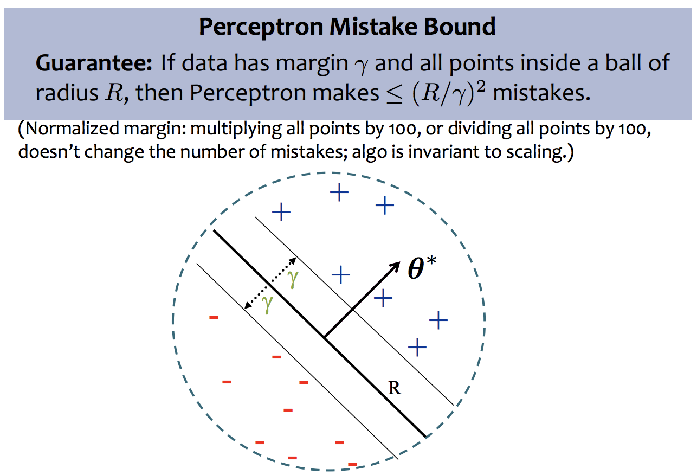

# 03 Perceptron

## 1. Linear Models for Classification

### 1.1 Basic ideas

Key idea of perceptron: try to learn the hyperplane separating two sets of data.

A vector $$\boldsymbol{a}$$is orthogonal to vector $$\boldsymbol{b}$$ iff $$\boldsymbol{a}^T \boldsymbol{b} = \boldsymbol{a} \cdot \boldsymbol{b} = 0$$

The $$l_2$$norm of vector $$\boldsymbol{a}$$is $$||\boldsymbol{a}||_2 = \sqrt{\boldsymbol{a} \cdot \boldsymbol{a}} = \sqrt{\sum_{i=1}^M a_i^2}$$

Vector projection of $$\boldsymbol{a}$$ onto $$\boldsymbol{b}$$ is $$ \boldsymbol{c} = (\frac{\boldsymbol{a}^T\boldsymbol{b}}{||\boldsymbol{b}||_2^2} )\boldsymbol{b}$$

A hyperplane is $$\mathcal{H} = \{\boldsymbol{x} | \boldsymbol{w}^T \boldsymbol{x} + b = 0\}$$

A half-spaces is the space separated by a hyperplane: $$\mathcal{H}_+ = {\boldsymbol{x} | \boldsymbol{w}^T \boldsymbol{x} + b > 0}$$ and $$\mathcal{H}_- = \{\boldsymbol{x} | \boldsymbol{w}^T \boldsymbol{x} + b < 0\}$$

### 1.2 Perceptron

The perceptron is $$h(\boldsymbol{x}) = \text{sign} (\boldsymbol{w}^T \boldsymbol{x} + b)$$, where sign\(x\) = 1 if x &gt;= 0 else -1

Note that $$0 = \boldsymbol{w}^T \boldsymbol{x}+b$$ is orthogonal to $$\boldsymbol{w}$$

## 2. Online Learning vs Batch Learning

### 2.1 Definition

Batch Learning: Learn from all the examples at once

Online Learning: Gradually learn as each example is received

### 2.2 Online Learning Examples

1. Stock market prediction \(what will the value of Alphabet Inc. be tomorrow?\)
2. Email classification \(distribution of both spam and regular mail changes over time, but the target function stays fixed - last year's spam still looks like spam\)
3. Recommendation systems. Examples: recommending movies; predicting whether a user will be interested in a new news article
4. Ad placement in a new market

### 2.3 Online Learning Steps

For i = 1, 2, 3...

* Receive an unlabeled instance $$\boldsymbol{x}^{(i)}$$
* Predict $$y' = h_{\boldsymbol{\theta}}(\boldsymbol{x}^{(i)})$$
* Receive the true label $$y^{(i)}$$
* Suffer loss if a mistake was made, $$y' \neq y^{(i)}$$
* Update parameters $$\boldsymbol{\theta}$$

Goal: Minimize the number of mistakes

### 2.4 \(Online\) Perceptron Algorithm

Initialize parameters: weights $$\boldsymbol{w} = [w_1, w_2, \cdots, w_M]^T = \boldsymbol{0}$$, bias $$b = 0$$.

for i = 1, 2, 3, ...

1. Receive next example $$(\boldsymbol{x}^{(i)}, y^{(i)})$$
2. Predict $$\hat{y} = \text{sign} (\boldsymbol{w}^T \boldsymbol{x^{(i)}} + b)$$
3. Switch on cases
   * If false negative, i.e. $$\hat{y} \neq y^{(i)} = 1$$, $$\boldsymbol{w} = \boldsymbol{w} + \boldsymbol{x}^{(i)}, b = b + 1$$
   * If false positive, i.e. $$\hat{y} \neq y^{(i)} = -1$$, $$\boldsymbol{w} = \boldsymbol{w} - \boldsymbol{x}^{(i)}, b = b - 1$$

Note: the hypothesis space of perceptron algorithm is all possible linear \(hyperplane\) decision boundaries: $$\mathcal{H} = \{ h(\cdot) ~|~ \exists \boldsymbol{w} \in \mathbb{R}^M, ~b \in R, ~\text{s.t.} ~h(\boldsymbol{x}) = \boldsymbol{w}^T \boldsymbol{x} + b \}$$

Why this algorithm works?

* for $$|\boldsymbol{w}|_2 = 1$$, $$\boldsymbol{w}^T \boldsymbol{x}$$ is the length of vector project of $$\boldsymbol{x}$$ onto $$\boldsymbol{w}$$
* wrongly predicted $$\boldsymbol{x}$$ corrects $$\boldsymbol{w}$$
* b shifts the zero points where $$\boldsymbol{w}$$ starts

Note: the inductive bias of perceptron algorithm is that

* decision boundary should be linear
* prefers to correct most recent mistakes

### 2.5 Perceptron Algorithm Example

### 2.6 Concise Form of Perceptron Algorithm

### 2.7 \(Batch\) Perceptron Algorithm

The Batch Perceptron Algorithm can be derived in two ways

1. By extending the online Perceptron algorithm to the batch setting \(as mentioned above\)
2. By applying Stochastic Gradient Descent \(SGD\) to minimize a so-called Hinge Loss on a linear separator

### 2.8 Extensions of Perceptron

* Voted Perceptron
  * generalizes better than \(standard\) perceptron
  * memory intensive \(keeps around every weight vector seen during training, so each one can vote\)
* Averaged Perceptron
  * empirically similar performance to voted perceptron
  * can be implemented in a memory efficient way \(running averages are efficient\)
* Kernel Perceptron
  * Choose a kernel K\(x’, x\)
  * Apply the kernel trick to Perceptron
  * Resulting algorithm is still very simple
* Structured Perceptron
  * Basic idea can also be applied when y ranges over an exponentially large set
  * Mistake bound does not depend on the size of that set

## 3. Analysis of Perceptron

### 3.1 Geometric Margin

### 3.2 Linear Separability

### 3.3 Analysis: Perceptron

Def: We say that the \(batch\) perceptron algorithm has converged if it stops making mistakes on the training data \(perfectly classifies the training data\)

Main Takeaway: For linearly separable data, if the perceptron algorithm cycles repeatedly through the data, it will converge in a finite \# of steps

## 4. Summary: Perceptron

* Perceptron is a linear classifier
* Simple learning algorithm: when a mistake is made, add / subtract the features
* Perceptron will converge if the data are linearly separable, it will not converge if the data are linearly inseparable
* For linearly separable and inseparable data, we can bound the number of mistakes \(geometric argument\)
* Extensions support nonlinear separators and structured prediction

## 5. Perceptron Learning Objectives

* Explain the difference between online learning and batch learning
* Implement the perceptron algorithm for binary classification \[CIML\]
* Determine whether the perceptron algorithm will converge based on properties of the dataset, and the limitations of the convergence guarantees
* Describe the inductive bias of perceptron and the limitations of linear models
* Draw the decision boundary of a linear model
* Identify whether a dataset is linearly separable or not
* Defend the use of a bias term in perceptron

