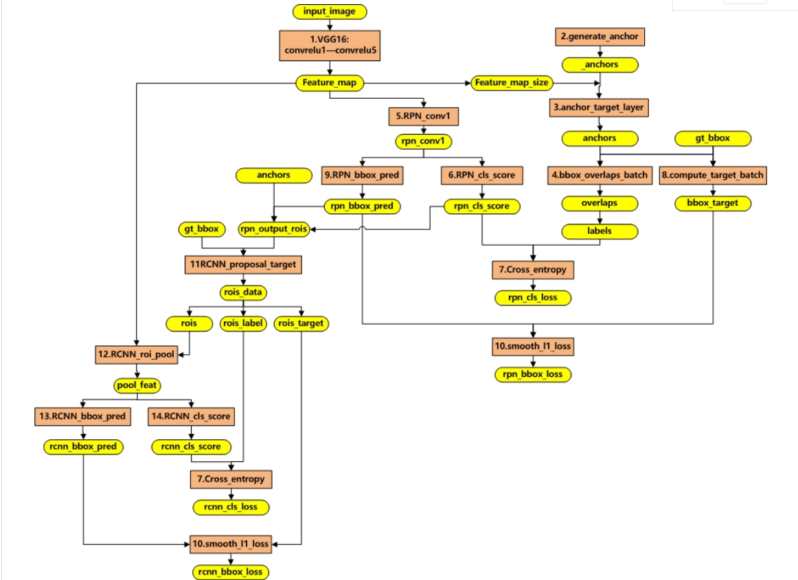

# Basics

## 1. Back Propagation

### 1.1 变量定义

上图是一个三层人工神经网络，layer1至layer3分别是输入层、隐藏层和输出层。定义如下变量：

* $$w_{jk}^l$$表示第$$(l-1)$$层的第$$k$$个神经元连接到第$$l$$层的第$$j$$个神经元的权重；
* $$b_j^l$$表示第$$l$$层的第$$j$$个神经元的偏置；
* $$z_j^l$$表示第$$l$$层的第$$j$$个神经元的输入，即$$z_j^l = b_j^l + \sum_k w_{jk}^l a_k^{l-1}$$
* $$a_j^l$$表示第$$l$$层的第$$j$$个神经元的输出，即$$a_j^l = \sigma(z_j^l) = \sigma(b_j^l + \sum_k w_{jk}^l a_k^{l-1})$$，其中$$\sigma$$表示激活函数。

### 1.2 代价函数

代价函数被用来计算ANN（Artificial Neural Network）输出值与实际值之间的误差。常用的代价函数是二次代价函数（Quadratic cost function）：

$$
C = \frac{1}{2n}\sum_x ||y(x)-a^L(x)||^2
$$

其中$$x$$表示输入的样本，$$y$$表示实际的分类，$$a^L$$表示预测的输出，$$L$$表示神经网络的最大层数。

### 1.3 公式及其推导

本节将介绍反向传播算法用到的4个公式，并进行推导。

首先，将第$$l$$层的第$$j$$个神经元中产生的错误（即实际值与预测值之间的误差）定义为$$\delta_j^l = \frac{\partial C}{\partial z_j^l}$$。本文将以一个输入样本为例进行说明，此时代价函数表示为$$C = \frac{1}{2} ||y-a^L||^2 = \frac{1}{2} \sum_j (y_j-a_j^L)^2$$。

#### 公式1：计算最后一层神经网络产生的错误

$$
\delta^L = \nabla_a C \odot \sigma'(z^L)
$$

其中，$$\odot$$表示Hadamard乘积，用于矩阵或向量之间点对点的乘法运算。公式1的推导过程如下：

$$
\delta_k^L = \frac{\partial C}{\partial z_k^L} = \frac{\partial C}{\partial a_k^L}\frac{\partial a_k^L}{\partial z_k^L} \Rightarrow
\delta^L = \frac{\partial C}{\partial a^L}\frac{\partial a^L}{\partial z^L} = \nabla_a C \odot \sigma'(z^L)
$$

#### 公式2：由后往前，计算每一层神经网络产生的错误

$$
\delta^l =((w^{l+1})^T\delta^{l+1}) \odot \sigma'(z^L)
$$

公式2的推导过程如下：

$$
\delta_k^l = \frac{\partial C}{\partial z_k^l} = \sum_j \frac{\partial C}{\partial z_j^{l+1}}\frac{\partial z_j^{l+1}}{\partial a_k^l}\frac{\partial a_k^l}{\partial z_k^l} = \sum_j \delta_j^{l+1} \frac{\partial(w_{jk}^{l+1}a_k^l + b_j^{l+1})}{\partial a_k^l} \sigma'(z_k^l)
$$

$$
= \sum_j \delta_j^{l+1} w_{jk}^{l+1} \sigma'(z_k^l) \Rightarrow \delta^l =((w^{l+1})^T\delta^{l+1}) \odot \sigma'(z^l)
$$

#### 公式3：计算权重的梯度

$$
\frac{\partial C}{\partial w^l} = \delta^l (a^{l-1})^T
$$

公式3的推导过程如下：

$$
\frac{\partial C}{\partial w_{jk}^l} = \frac{\partial C}{\partial z_j^l} \frac{\partial z_j^l}{\partial w_{jk}^l} = 
\delta_j^l \frac{\partial(w_{jk}^l a_k^{l-1} + b_j^l)}{\partial w_{jk}^l}= \delta_j^l a_k^{l-1} \Rightarrow \frac{\partial C}{\partial w^l} = \delta^l (a^{l-1})^T
$$

#### 公式4：计算偏置的梯度

$$
\frac{\partial C}{\partial b^l} = \delta^l
$$

公式4的推导过程如下：

$$
\frac{\partial C}{\partial b_{j}^l} = \frac{\partial C}{\partial z_j^l} \frac{\partial z_j^l}{\partial b_j^l} = 
\delta_j^l \frac{\partial(w_{jk}^l a_k^{l-1} + b_j^l)}{\partial b_j^l}= \delta_j^l \Rightarrow \frac{\partial C}{\partial b^l} = \delta^l
$$

### 1.4 反向传播算法伪代码

* 对于训练集中的每个样本$$x$$，设置输入层对应的激活值$$a_1$$
* 对于其他变量：
  * 前向传播：$$z^l = w^l a^{l-1} + b^l , a^l = \sigma (z^l)$$
  * 计算输出层产生的错误：$$\delta^L = \nabla_a C \odot \sigma'(z^L)$$
  * 反向传播错误：$$\delta^l =((w^{l+1})^T\delta^{l+1}) \odot \sigma'(z^L)$$
* 使用梯度下降训练参数：
  * $$w^l = w^l - \frac{\eta}{m}\sum_x \delta^{x,l} (a^{x,l-1})^T$$
  * $$b^l = b^l - \frac{\eta}{m}\sum_x \delta^{x,l}$$

## 2. Adam

## 3. Normalization

## 4. GANs

## 5. LSTM & GRU

# 6. Faster R-CNN

[详细分析](https://yifdu.github.io/2019/02/18/Object-Detection（四）/)

