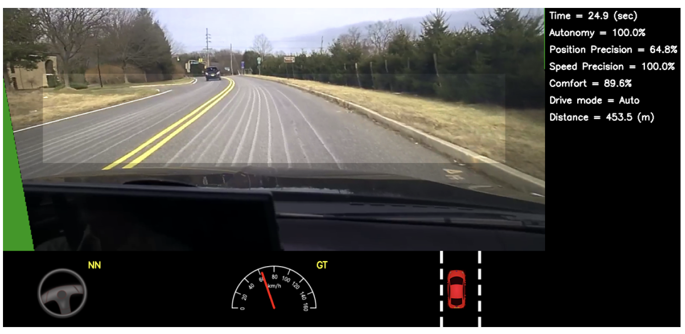

# General AV

### End to End Learning for Self-Driving Cars

Nvidia的End to End方法，支持了simulation。模拟的好处是，如果只对steering angle做regression，可能每次左偏一点点的平均误差很小，但是在实际开车时会有累积效应。所以可以用stereo camera去模拟偏移后的效果，然后连续地训练网络。

### Explaining How a Deep Neural Network Trained with End-to-End Learning Steers a Car

Nvidia上篇Paper的跟进，讲的是可以通过提weights的方式得到salient object mask，来看网络对什么内容感兴趣。

