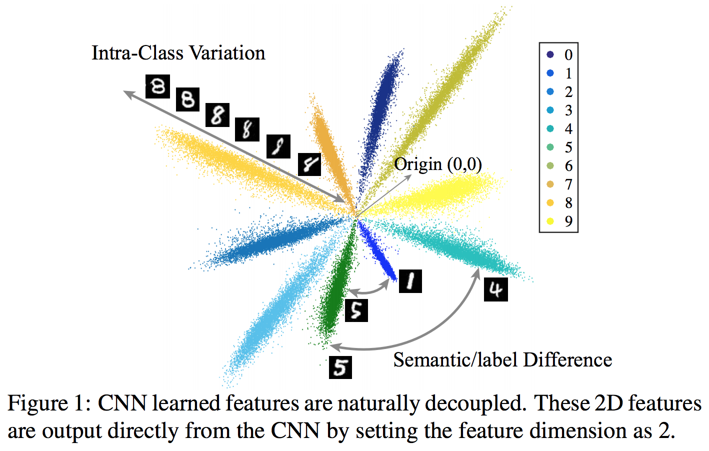

# Image Processing

## 1. Crafting a Toolchain for Image Restoration by Deep Reinforcement Learning

RL-Restore普适图像复原算法，商汤科技，Spotlight

### 简介

近期的一些图像复原工作（如VDSR、DnCNN等）证实了一个CNN网络可以处理多种失真类型或不同失真程度的降质图像，这为解决混合失真问题提供了新的思路。但是，这类算法均选用了复杂度较高的网络模型，带来了较大的计算开销。另外，这些算法的网络均使用同一结构处理所有图像，未考虑一些降质程度较低的图像可以使用更小的网络进行复原。针对现有图像复原CNN算法模型复杂，计算复杂度高的问题，本文提出的RL-Restore算法弥补了这些不足，以更加高效灵活的方式解决了复杂的图像复原问题。

### 算法

之前流行的图像复原理念认为解决复杂的图像复原问题需要一个大型的CNN，而本文提出了一种全新的解决方案，即使用多个小型CNN专家以协作的方式解决困难的真实图像复原任务。RL-Restore算法的主要思路是设计一系列基于小型CNN的复原工具，并根据训练数据学习如何恰当地组合使用它们。这是因为现实图像或多或少受到多种失真的影响，针对复杂失真的图像学习混合使用不同的小型CNN能够有效的解决现实图像的复原问题。不仅如此，因为该算法可以根据不同的失真程度选取不同大小的工具，相较于现有CNN模型，这一新方法使用的参数更少，计算复杂度更低。

RL-Restore算法的目标是对一张失真图像有针对性地选择一个工具链（即一系列小型CNN工具）进行复原，因而其该算法包含了两个基本组件：

* 一个包含多种图像复原小型CNN的工具箱；
* 一个可以在每一步决定使用何种复原工具的强化学习算法。

本文提出的工具箱中包含了12个针对不同降质类型的CNN（如表1所示）。每一种工具解决一种特定程度的高斯模糊、高斯噪声、JPEG失真，这些失真在图像复原领域中最为常见。针对轻微程度失真的复原工具CNN仅有3层，而针对严重程度失真的工具达到8层。为了增强复原工具的鲁棒性，本文在所有工具的训练数据中均加入了轻微的高斯噪声及JPEG失真。

本文解决的第二个挑战在于，没有一个已有的工具可以恰当的处理“中间结果”。例如，去模糊的工具可能也会放大噪声，导致后面已有的去噪工具无法有效处理新引入的未知失真。针对这些挑战，本文使用强化学习算法训练得到有效的工具选择策略，同时还提出联合训练算法对所有工具进行端到端的训练以解决有效复原“中间结果”的挑战。

### 网络结构

RL-Restore算法的框架（如图3所示）。对于一张输入图像，agent首先从工具箱中选择一个工具对它进行恢复。然后agent根据当前的状态（包括复原中间结果和之前工具的选择）来选取下一个动作（使用复原工具或停止），直到算法决定终止复原过程。

* 动作（action）：在每一个复原步骤 $$t$$ ，算法会输出一个估值向量 $$a_t$$ 一个动作。除了停止动作以外，其余每一个动作均代表使用某个复原工具。在本文中，工具箱内共包含12个工具，因而算法总共包含13个动作。
* 状态（state）：状态是算法可以观测到的信息，在步骤t的状态记为 $$S_t = \{I_t, \tilde{v_t}\}$$ ，其中 $$I_t$$ 是当前步骤的输入图像， $$\tilde{v_t} = v_{t-1}$$ 是前一步骤的动作估值向量，包含了前一步骤的决策信息。
* 回报（reward）：在强化学习中，算法的学习目标是最大化所有步骤的累积回报，因而回报是驱动算法学习的关键。本文希望确保图像质量在每一步骤都得到提升，因此设计了一个逐步的回报函数 $$r_t = P_{t+1} - P_t$$ ，其中 $$P_{t+1}$$ 和 $$P_t$$ 分别代表步骤t的输入图像和输出图像的PSNR，度量每个步骤中图像PSNR的变化。
* 结构：虚线框内的agent包含了三个模块（如图3所示）：
  * 特征提取器（Feature Extractor），包含了4个卷积层和1个全连接层，将输入图像转化为32维特征向量；
  * One-hot编码器（One-hot Encoder），其输入是前一步骤的动作估值向量，输出将其转换为对应的特征向量；
  * LSTM，其以前两个模块输出作为输入，这个模块不仅观测当前步骤的状态特征，还存储了历史状态的信息，该模块最后输出当前步骤的估值向量，用于复原工具的选取。
* 训练：每一个复原工具的训练均使用MSE损失函数，而agent的训练则使用deep Q-learning算法。由于LSTM具有记忆性，每一个训练样本均包含一条完整的工具链。

### 实验结果

本文与现有的VDSR和DnCNN图像复原算法相比，模型复杂度更低而复原性能更加优异。

## 2. Decoupled Networks

解耦神经网络DCNet，Spotlight

### 简介

长期以来，基于内积的卷积是CNN中的核心成分，也是学习视觉表征的关键所在。而 CNN 学得的特征天然能够解耦为特征范数（对应类内差异）和角度（对应语义差异），受此启发，我们提出了一个通用的解耦学习框架，对类内差异和语义差异分别进行建模。具体而言，我们首先将内积重新参数化为解耦形式，然后将其扩展至解耦卷积算子，并作为解耦神经网络的重要组成成分。我们展示了解耦卷积算子的多个有效实例，其中每个解耦算子都有很好的根据以及直观的几何解释。基于这些解耦算子，我们进一步提出直接从数据中学习算子。大量实验表明，这种解耦重新参数化操作极大地提升了模型性能，加快了模型的收敛速度，显著提升了模型的稳健性。

### 算法

如今，CNN 中通常利用内积来编码表示 patch x 和卷积核 w 之间的相似性。但内积公式 $$||w||_2||x||_2 \cos(\theta_{w, x})$$ 将语义差异（即类间差异）和类内差异耦合到同一个度量中。因此，当两个样本间的内积很大时，我们很难确定是由于两个样本间存在很大的语义/标签差异，还是由于存在很大的类内差异。如图 1 ，其中角度表示语义/标签差异，而特征范数（feature norm）则表示类内差异。特征范数越大，则预测越可信。

基于将内积解耦为范数和角度这一思路，我们通过将传统的基于内积的卷积算子 $$||w||_2||x||_2 \cos(\theta_{w, x})$$ 扩展至解耦算子，提出了一个全新的解耦神经网络 DCNet。我们将此类解耦算子定义为：某个范数函数 $$h(||w||_2, ||x||_2)$$ 与某个角度函数 $$g(\theta_{w, x})$$ 的乘积形式。解耦算子为更好地建模类内差异和语义差异提供了一个通用框架，原始的 CNN 等价于将 $$h(||w||_2, ||x||_2)$$ 设置为 $$||w||_2||x||_2$$ ，将 $$g(\theta_{w, x})$$ 设置为 $$cos(\theta_{w, x})$$ 。幅度函数（magnitude function）$$h $$建模类内差异，角度函数（angular function） $$g$$ 建模语义差异。

DCNet 共有以下四个优点：一，DCNet 不仅允许我们使用一些替代函数更好地建模类内差异和语义差异，还允许我们直接学习这些函数，而不是修复它们。二，通过使用有界幅度函数，DCNet 可以改善 \[14\] 中分析的问题，进而实现更快的收敛，同时取得和原始 CNN 相当甚至更好的准确率。三，DCNet 的一些实例展现出了面对对抗攻击时更强的稳健性：通过一个有界函数 h\(·\) 压缩各类别的特征空间，可以获得一定的稳健性。四，解耦算子具有很强的灵活性，且是架构不敏感的（architecture-agnostic），因此我们可以很轻松地将其引入各种网络架构，如 VGG、GooleNet 以及 ResNet。

具体而言，我们提出了两种不同的解耦卷积算子：有界算子和无界算子，并利用两种算子完成多个实例。结果显示，有界算子具有更快的收敛速度，且在对抗攻击中具有更好的稳健性；而无界算子则具有更好的表征能力。解耦算子可以是平滑或非平滑的，平滑与否会影响其表现。另外，我们针对解耦算子提出了一个全新的概念：算子半径（operator radius）。算子半径刻画了幅度函数 h\(·\) 对输入 \|\|x\|\| 的导数的重大变化。通过利用反向传播算法联合学习算子半径，我们还提出了可学习的解耦算子。最后，我们展示了多种通过改进标准反向传播算法优化解耦算子的替代方式。

## 3. Semi-parametric Image Synthesis

Oral

### 简介

根据大致的草图框架（语义布局法），深度神经网络现在可以直接合成真实效果的图片。参数模型（parametric models）的优点是具有高度的表现力，可进行端到端的训练。非参数模型（Non-parametric models）的优点是可以在测试时提取大型的真实图片数据集里的素材。集结这两种方法的优势，本文提出了SIMS（半参数模型）

### 算法

SIMS工作思路：

1. 先用大型真实图像数据集先训练非参数模型，相当于获得了一个合成素材库；
2. 然后基于语义布局（Semantic layout），把这些素材填充进去，就像一张图被分割成好几个版块之后，再往上打补丁充实细节。接缝的地方，深度网络会自行融合，并计算好版块之间物体的空间关系，进一步加强视觉的真实效果。

整体流程如图2，3所示，分为两大步：

其中，为了训练Synthesis Network，我们还需要如图4所示地处理训练集合产生training canvas：

### 实验结果

比CRN和Pix2Pix都要好一些，如下图所示。

## 4. High-Resolution Image Synthesis and Semantic Manipulation with Conditional GANs

Oral

### 简介

本文使用Conditional GAN，从Semantic图产生2048x1024的高分辨率图像。模型采用了一个新的对抗loss，以及多尺度的生成器和对抗器。除此之外，模型还有两个新的特色：一，引入了物体分割信息，使得可以对物体进行增删修改和更换；二，给定输入，模型可以产生多种不同的外观输出，用户可以交互地修改物体外观。模型相比CRN和pix2pix精度更高，且用户普遍认为我们的模型比以往的模型更真实。结果如下图所示。

### 算法

架构的设计思路基于pix2pix（结构如下图），但是有以下五个大的不同点：

#### 1. Coarse-to-fine generator

G1是1024x512的global G，G2是2048x1024的local G，结构如下图所示。如果需要更高精度的图像，可以再加G3、G4等等。G的架构和perceptual loss的模型基本一致。在训练时，先训练低精度的再训练高精度的，最后联合FT。之所以这么做的原因没有很好的解释，只是给了前人这么做的例子，推测一是方便训练，二是增加featurea maps有效信息量。

#### 2. Multi-scale discriminators

为了区分高精度的真实和合成图像，D必须有很大的感受野，这就要求网络很深或者大kernel，且要有大量内存。为了解决这一问题，文章使用了多尺度的D，一般选择三个：D1、D2、D3，输入分别down-sample到原大小、1/2、1/4（按边长计算）。每个D的结构完全相同，接收不同尺度的图像，这样尺度越小感受野越大，尺度越大效果越精细。

#### 3. Improved adversarial loss

除了正常的GAN loss之外，模型还给G加了一个feature maching loss，用于稳定训练：提取D的几个中间特征层Dk，最小化他们在给定真实和合成输入时的差距：

$$
\mathcal{L}_{FM}(G, D_k) = \mathbb{E}_{(\bm{s}, \bm{x})} \sum_{i=1}^T \frac{1}{N_i}[||D_k^{(i)}(\bm{s}, \bm{x}) - D_k^{(i)}(\bm{s}, G(\bm{s}))||_1]
$$

这个loss的灵感来于perceptual losses。这样整体的loss就变成了：

$$
\min_G\left(\left(\max_{D_1, D_2, D_3} \sum_{k=1, 2, 3} \mathcal{L}_{GAN}(G, D_k)\right) + \lambda \sum_{k=1, 2, 3} \mathcal{L}_{FM} (G, D_k)\right)
$$

文章测试时还提出了，对于真实和合成图像加上一个用VGG提取的perceptual loss，也可以小幅度提升结果。其原理类似feature maching loss，只不过是用一个单独的VGG提取。

#### 4. Instance Maps

现有的图片生成方法只使用了语义标签图（Semantic label maps）， 这样做无法区分同一标签的不同物体，本文模型同样考虑了物体图（Instance maps）。但是直接使用他们训练会有一个问题，即不同图片的物体量差异很大，不方便训练，所以模型只采用物体的边界。这样模型的语义输入就变成了one-hot表示的语义标签图+物体边界图。

#### 5. Instance-level Feature Embedding

以前的可控输出外观的模型有两个主要缺点，一是用户缺少控制力，二是只能控制全局的颜色和质地而非直接控制每个物体。为了实现物体级别的外观变化，模型在G加入了低维度的feature channel；通过控制这些feature，可以实现改变输出的外观。如下图所示模型训练一个编码器E，接受真实图像做输入，输出一个特征层；对特征层做instance-wise的平均池化，可以得到每个instance的特征，再把此特征和语义输入并连进入生成器G训练。

注意编码器在预测的时候是不需要的。在编码器E训练好之后，用它跑一遍所有的图片，然后对每一个语义类的特征，使用K-means聚类得到K个语义feature maps。这样在预测的时候，对每个语义，我们可以直接选择一种feature maps当作外观风格。

### 实验结果

在Cityscapes数据集上，像素准确度和平均IOU都远高于CRN和pix2pix。用户调查结果也偏爱本模型。视觉效果如下图所示。

## 5. Synthesizing Images of Humans in Unseen Poses

Oral

### 简介

本文提出了一个框架，输入带有人的图像和希望人转变的姿势，可以生成转变姿势后的图片。框架生成的结果可保持较高的分辨率，也可运用到视频级别的连续转换。

### 算法

框架如下图所示，需要的输入是原始图像、original pose和target pose，这里默认背景和人都不变。中心思想是前背景分离，对前景做重组，对背景做填补。

具体分步如下：

1. 预处理Pose Representation：人身体的pose用14个dots表示，在dots处还加入了高斯噪声，有利于regularization，且有利于网络更快学习到这个特征。
2. Source Image Segmentation：采用u-net，输入是original img（3通道）和pose（14通道）的concat，输出是10个身体部位的mask（10通道）和一个背景mask（1通道）。用这10个身体部位的mask可以得到10个身体部位的前景分割（30通道）。
3. Spatial Transformation：将分割后的前景部位和target pose对应起来，并作相应的旋转，放缩等。
4. Foreground Synthesis：同样使用u-net，输入为target pose（14通道）和旋转放缩好的身体部位（30通道），输出调整好的前景图和target mask。
5. Background Synthesis：根据背景mask，把原始图片非背景的部位变成高斯噪音，然后同样使用u-net生成填补后的背景图。

最终把调整好的前景图放在填补后的背景图前，即可得到最终合成图。

训练过程的loss分为两部分，都是比较最终合成图和ground-truth的target image的差距：第一个loss是VGG的feature loss，第二个是在模型后面加一个对抗器做一个GAN loss。实验证明这两个比简单的L1 loss要好，且结合起来二者更好。

【思考：这篇文章在loss上异常简单，也能说明模型本身还是比较易学习、较鲁棒的】

### 实验结果

网络既可以生成较高准确度的同类动作转换，也可以被运用到连续视频上，还可以在不同的动作集合上做延伸（即换用另一个训练集的target pose预测）。在loss的ablation比较中，文章采用了Gradient Magnitude Quartiles这么一个标准来比较loss的优劣，如下图所示，可以深入研究。

