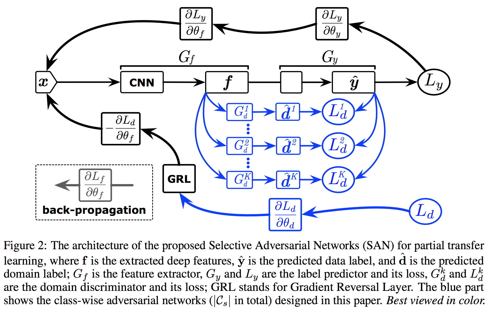

# Meta & Transfer Learning

## 1. Taskonomy: Disentangling Task Transfer Learning

Best Paper

### 简介

一个视觉任务的解决应该能够一定程度的解决另一个视觉任务，这启发我们不同的视觉任务应该拥有一个共通的structure，可以在不同任务间共用一些信息。本文提出了一个纯计算方法，在26个2D、2.5D和3D任务字典（task dictionary）里，以及语义任务的潜在空间（latent space），寻找迁移学习的方法。方法的结果是产生一个分类学（taxonomic）map。通过这个structure，我们有很多新发现，如可降低训练多任务所需要的数据标签量。另外作者也有自己的一篇[翻译解读](https://zhuanlan.zhihu.com/p/38425434)。

### 算法

整体结构如图2所示

其中模型使用的任务字典由26个常用的、广泛的视觉任务组成，见图3：

而训练流程则分为四步：

#### 1. Step I -  Task-Specific Modeling

对每个source task S，都独立训练一个相同架构的encoder-decoder网络，E负责学习表达信息，D负责翻译。这样我们对每个任务 s 的图像 I 以及期望的映射函数f，都能得到一个encoder $$E_s$$和 decoder $$D_s$$，使得 $$D_s(E_s(I)) = f(I)$$ 。

#### 2. Step II - Transfer Modeling

给定source task s的encoder $$E_s$$，我们需要得到一个transfer function $$D_{s \rightarrow t}$$，训练它的参数 $$\theta$$，使得转移后的结果逼近任务t的结果。具体公式为

$$
D_{s \rightarrow t}(I) = \arg\min_{\theta} \mathbb{E}[\mathcal{L}_t(D_{\theta}(E_s(I)), f(I))]
$$

其中 $$L_t$$ 是给定的Loss函数。这里有如下几个考量：

1. Accessibility：为了让迁移学习成功，source的潜在表达必须同时满足拥有足够能解出target的信息，且这些信息必须是accessible的。因此，transfer function必须被设计的足够小且只用少量数据训练，来保证迁移学习的信息是高度accessible的。
2. High-order transfer：可以同时使用多个source进行迁移学习，可选择最相关的多个任务。
3. Transitive transfer：经过实验得出，进行转移\(s -&gt; t -&gt; u\)和不进行转移\(v -&gt; u\)的效果差不多，所以本文不考虑转移学习。

【思考：感觉和stargan做的事情差不太多，虽然是迁移学习，但是transfer function和discriminator的作用相似，可以找一下大一统的方法】

#### 3. Step III - Ordinal Normalization using Analytic Hierarchy Process \(AHP\)

计算不同的source对一个target task的贡献度。计算方法如下，比较测试集中不同的source里，哪个的迁移效果更好。

$$
w_{i, j}' = \frac{\mathbb{E}_{I \in D_{test}}[D_{s_i \rightarrow t}(I) > D_{s_j \rightarrow t}(I)]}{\mathbb{E}_{I \in D_{test}}[D_{s_i \rightarrow t}(I) < D_{s_j \rightarrow t}(I)]}
$$

#### 4. Step IV - Computing the Global Taxonomy

给定转移层数（transfer order）和监督量（supervision budget），通过Boolean Integer Programming \(BIP\) 得到全局的最优关系图（taxonomies）。

### 实验结果

Encoder采用Resnet-50，Transfer Function采用两层的卷积网络，Decoder和Loss function因任务而异，所有网络用相同的超参数进行训练。可以得到不同transfer order和supervision budget下的taxonomies，下图为order = 4，budget = 8的结果：

进一步拓展还可以得到task similar tree，如图13所示

同时作者也测试了训练的结果。作者用训练好的网络，在MIT Places的场景分割和ImageNet的物体分类任务上分别FT，都得到了很高的相关系数（0.8以上的Spearman's rho），这说明框架的迁移学习能力很好。

## 2. Partial Transfer Learning with Selective Adversarial Networks

Spotlight

### 简介

目前迁移学习的方法，基本思想就是让 source domain 和 target domain 的数据分布尽量接近，主要有两种方法：一种是Kernel Embeddin，通过定义在两个数据集之间的距离，将这个距离最小化，代表性的工作是龙明盛团队在 ICML 2015 上提出的 Deep Adaptation Network ；另一种是用GAN，在 source domain 和 target domain 之间学习一个判别器，如果这个判别器不能将两个 domain 的特征/分布分开，那么这就是一个可以做迁移学习的特征，代表性的工作是 Yaroslav Ganin et al. 在 JMLR 2016 上提出的 Domain Adversarial Neural Network（DANN）。以上两种方法都是假设两个 domain 之间的 label space 是一样的，但是加入 source domain 与 target domain 的 label space 并不一样，那么在 Kernel Embedding 的方法中会将所有相关和不相关的 label space 都拉在一起，而在对抗方法中不一致的 label space 也将起到负作用。基于这样的考虑，龙明盛团队提出了 Selective Adversarial Networks（SAN），思想很简单，即在原有的对抗方法基础上，加入一系列能够判别某个类来源的判别器。

### 算法

框架如图2所示。这个网络大的框架与 DANN 类似：输入 x，通过一个 CNN 抽取出 feature；基于这些 feature 可以训练一个 G，对 source domain 进行分类，然后通过对抗来学习让 source domain 和 target domain 分不开的 feature。不同的是 source domain 的 label space 要大于 target domain，因此他们在 source 和 target 之间建立了多个判别器，每个判别器只做一件事情，即判断某各类是来自 source 还是来自 target，由此通过类加权的方式即可以选择出 source domain 中的正样本。这也是该网络取名为选择对抗网络（Selective Adversarial Networks）的原因。

总体的Loss由三部分组成，分别是source的分类loss，target的self-entropy loss（为了鼓励low-density separation），以及domain的分类loss：

### 实验结果

1. SNN在ImageNet等数据集的分类效果不错。
2. 与其他迁移学习模型相比（如RevGrad），在target domian中的classes比较少的时候，SNN不会因为训练量不足而有明显的精度下降，甚至可能有提升。
3. 使用SNN，不同的类能够清晰地区分开来，且source domain 和 target domain 中相似的类别能够有效地聚在一起。

## 3. Discriminative Learning of Latent Features for Zero-Shot Recognition

Oral

### 简介

Zero-shot learning （ZSL）针对的是完全没有训练过的测试样本，一般来讲，模型寻求将学习到的特征映射到另一个空间中，然后再对应到见过和没见过的属性或者标签上。目前的ZSL有这么几个问题：（1）在映射前，应当抽取图片的feature，传统上采用pretrainde model等方法仍不是针对ZSL特定抽取特征的最优解（2）现有的模型都是学习用户自定义的attribute，而忽略了latent representation（3）low-level信息和的空间是分离训练的，没有大一统的framework。本文提出了一个解决如上问题的框架，学习了已定义label的同时，也学习了latent attribute。

### 算法

Latent Discriminative Features Learning （LDF）模型框架如图2所示

模型由三个主网络构成：

* Image Feature Network \(FNet\)：目的是抽取图片的feature，可以采用VGG19或者GoogleNet的架构，与框架一起训练而不是采用预训练的参数。
* Zoom Network \(ZNet\)：目的是定位到能够增强提取的特征的辨识度的区域，这个区域同时也要与某一个已经定义好了的attribute对应。ZNet的输入是FNet最后一个卷积层的输出，输出一个被sigmod激活的位置表示（类似ROI的方法）。将这个位置表示和原始图片做element-wise multiplication就可以得到定位区域，然后再把它放大到与原始图片相同的尺寸，并进入到一个FNet的copy做进一步的特异性特征提取。
* Embedding Network \(ENet\)：ENet将图像特征映射到2k dim的空间中，1k是对应已经定义好的user-defined attribute（UA）；另1k则是对应latent attribute（LA），由模型自己学习。

**损失函数**：针对UA和LA，分别采用不同的loss：

* 对UA使用softmax loss，即图中 $$\mathcal{L_{att}}$$ ，使自定义分类正确；
* 对LA使用 triplet loss，即图中$$\mathcal{L_{lat}} = \max(0, m+d(\phi_{lat}(x_i), \phi_{lat}(x_k)) - d(\phi_{lat}(x_i), \phi_{lat}(x_j)))$$ ，其中m是超参数，d采用欧式距离。这个loss的目的是使同类i和k尽量接近，不同类的i和j量远离，从而学到latent attributes。

模型的总体loss是原始图片的 $$\mathcal{L_{att}} + \mathcal{L_{lat}}$$ 加上放大目标区域的 $$\mathcal{L_{att}} + \mathcal{L_{lat}}$$，即two-scale LDF loss。

**预测阶段**： 

* 预测未见过的图片的UA时，由于未预测类的UA也已经给定，所以直接找和图片的UA最接近的类就可以了
* 预测未见过的图片的LA时，由于未预测类的LA没有训练过，我们需要对每个未见过的类做一个projection：对于未见过的类u，首先通过regression，计算它和每个见过的类c的相似度。得到相似度之后，把类c们的特征做加权平均即可得到类u的latten representation了。
* 同UA一样，我们只要找和图片的LA最接近类就可以了。但是若LA和UA得到的类不一样怎么办呢？为了解决这一问题，在预测未见过的图片时，我们可以选择使得UA和LA分类的和最大的那一未见过的类。

### 实验结果

能够学到很discriminative的latent representation，且LA和UA都对于分类正确有很大帮助。

## 4. Feature Space Transfer for Data Augmentation

Oral

### 简介

本文提出了一个新的框架，FeATure TransfEr Network（FATTEN），通过改变物体的不同的pose来对feature trajectory建模，如图1所示。FATTEN能够抑制不连续或者不平滑的feature trajectory，且可以扩展到有大的pose差异的物体识别任务。

### 算法

模型框架如图2所示。为了避免网络只是单纯的match feature pairs，模型只是学习残差。同时，模型将appearance和pose分开训练，使得pose的学习可以全监督，且能够使对这两个属性的学习上更加平衡。

### 实验结果

在ModelNet数据集上，FATTEN能够在改变feature的pose的同时，稳定分类结果。在SUN-RGBD数据集上，FATTEN能够在one-shot的目标识别上获得很好的迁移学习效果。

